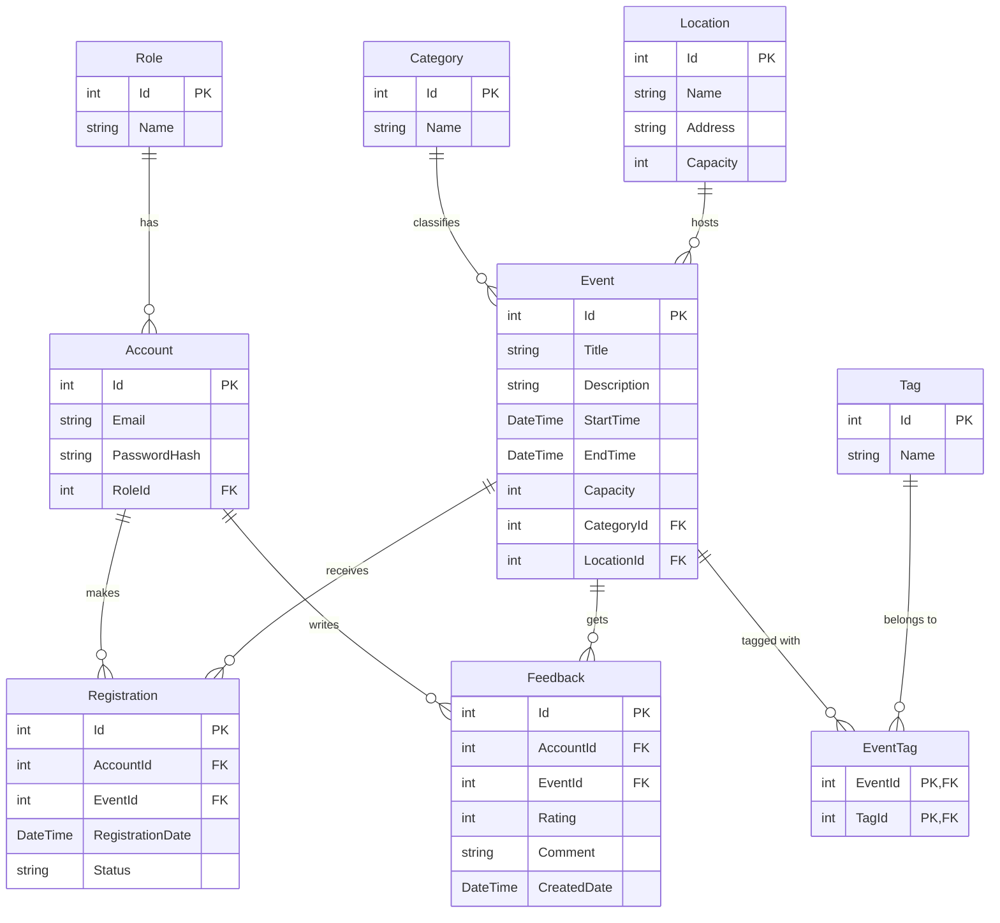

# Tài liệu Thiết kế Cơ sở Dữ liệu (Database Schema Design)

Tài liệu này chi tiết cấu trúc bảng và các mối quan hệ giữa **9 thực thể cốt lõi** trong cơ sở dữ liệu của **UniEvent Hub**.

---

## 1. Sơ đồ Quan hệ Thực thể (ERD Diagram)



---

## 2. Quy chuẩn Fluent API EF Core 8.0

### 2.1. Cấu hình Many-to-Many cho EventTag
Thực thể trung gian `EventTag` được cấu hình tường minh để cho phép lưu trữ thêm các thuộc tính mở rộng nếu cần thiết:
```csharp
builder.Entity<Event>()
    .HasMany(e => e.Tags)
    .WithMany(t => t.Events)
    .UsingEntity<EventTag>(
        l => l.HasOne<Tag>().WithMany().HasForeignKey(et => et.TagId),
        r => r.HasOne<Event>().WithMany().HasForeignKey(et => et.EventId)
    );
```

### 2.2. Indexes & Performance Optimizations
- **Unique Indexes:** Cấu hình unique index cho `Email` trong bảng `Account` và `Name` trong các bảng cấu hình như `Category`, `Tag`.
- **Foreign Key Cascade Delete:** Thiết lập `OnDelete(DeleteBehavior.Restrict)` cho các khóa ngoại liên quan đến `Event` và `Account` để tránh việc xóa dây chuyền mất mát dữ liệu quan trọng ngoài ý muốn.
