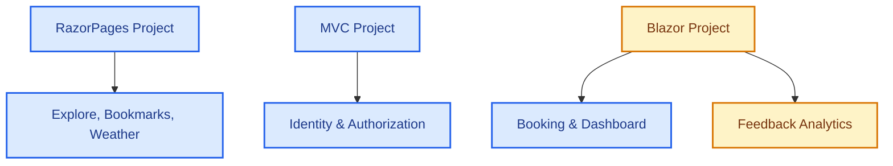

# UniEvent Hub - Memory Snapshots & Project Status

This file tracks the current state of **UniEvent Hub**. All AI agents **must** read and update this file before and after working to maintain project alignment and traceability.

---

## 1. COMPLETED MODULES

### 1.1. Architecture & Global Config
- **Environment**: Upgraded 100% to **.NET 8** and **C# 12**.
- **Shared Authentication**: SSO implemented via shared Cookie `.EventHub.Auth` using EF Core Data Protection (`Microsoft.AspNetCore.DataProtection.EntityFrameworkCore`) across MVC, RazorPages, and Blazor.

### 1.2. Razor Pages (Explore, Bookmarks & Event CRUD)
- **Explore & Search (`Pages/Index.cshtml` / `FE-03`)**: Form search (.search-card-minimal) with time filters (All, Upcoming, Ongoing, Past). Dynamic LED status dots, seats capacity urgency warnings, grayscale for past events, skeleton loader, and AJAX pagination.
- **Bookmarks (`FE-11`)**: `IBookmarkService` + `BookmarkService` (via `IRepository<Bookmark>`). Toggle AJAX bookmark on Index cards. Dedicated `/Bookmarks/Index` page (Student-only, Auth from Claims). Sidebar link added.
- **Weather Widget (`FE-08`)**: Integrated wttr.in weather lookup with 30-minute `IMemoryCache` + `SemaphoreSlim` (double-checked locking, Cache Stampede prevention). `NormalizeLocation` automatically extracts campus city from Venue address.
- **Event CRUD (`FE-02`)**: Complete Event CRUD. Uses DTOs (`EventCreateDTO`, `EventUpdateDTO`) to prevent over-posting. Categories and Tags assigned via checkboxes (Many-to-Many). Serviced via `IEventRepository.BuildSearchQuery()` with eager loading to prevent N+1 queries.
- **My Feedbacks (`/Events/MyFeedbacks`)**: Read-only dashboard for students to review submitted feedbacks.

### 1.3. Blazor Server (Live Systems)
- **Live Ticket Booking (`FE-04`)**: Real-time seat reservation. Integrated with `AuthenticationStateProvider` to retrieve authentic User IDs from the Identity cookie. Features premium Glassmorphism and real-time seat progress bar.
- **Live Dashboard (`FE-10`)**: Displays dynamic real-time seats progress connected via SignalR `ReceiveTicketUpdate`. Features SVG Area Trend Charts, pulse-green status badges, and a live activity log.
- **Feedback Analytics (`FE-07`)**: multi-criteria feedback statistics dashboard using PLINQ `.AsParallel()` on BLL. Includes detailed feedback list pop-up modal.

---

## 2. PENDING MODULES
- **Blazor (Feedback Analytics - Detail Reports)**: Further custom analytics reports if requested.

---

## 2.5. ⚠️ ARCHITECTURE VIOLATIONS — ACTION REQUIRED BY TEAM
> Phát hiện ngày 2026-06-29 bởi QuiNC (Antigravity audit). Build vẫn pass, nhưng cần fix trước khi vấn đáp.

### [ARCH-04] `AppDbContext` inject trực tiếp vào Presentation layer — **Toàn team**
Các PageModel/Component sau inject `AppDbContext` thay vì đi qua BLL Service:
- `Feedback.cshtml.cs`, `MyFeedbacks.cshtml.cs` → **MinhTC**
- `OrganizerDetails.cshtml.cs` → **TriLT**
- `Blazor/Components/Dashboard/DashboardComponent.razor`, `BookingComponent.razor` → **Khôi**

### [ARCH-05] `IMapper` inject ở Presentation — **TriLT**
`RazorPages/Pages/Follow/OrganizerDetails.cshtml.cs` inject `IMapper` trực tiếp — mapping phải thuộc BLL.

---

## 3. WORK LOG & ARCHITECTURE CONVENTIONS

### 3.1. Detailed Changes Log
- **2026-07-09 (Antigravity / QuiNC)**:
  - **FE-11 Bookmark/Wishlist + Fix ARCH-04**: Tạo `IBookmarkService` / `BookmarkService` (dùng `IRepository<Bookmark>` đúng pattern). Xóa `AppDbContext` khỏi `Index.cshtml.cs` — fix ARCH-04. Thêm AJAX toggle bookmark trên Grid & List card. Khôi phục trang `/Bookmarks/Index` với Auth thực từ Claims (`[Authorize(Roles="Student")]`). Thêm sidebar link Student. Fix CSS Safari compat (`-webkit-user-select`, `-webkit-backdrop-filter`, `line-clamp`). Fix `DependencyInjection.cs` dùng `AddBusinessLogicLayer` thay các method cũ bị xóa. Build: **0 errors**.
- **2026-06-29 (Antigravity)**:
  - **QuiNC - Architecture Refactor (ARCH-02, ARCH-03/FE-03, ARCH-06, ARCH-07)**: Removed `AddSignalR()` from `BLL/DependencyInjection.cs` (wrong layer) and moved to `Blazor/Program.cs`. Merged `SearchService.SearchEventsAsync()` into `EventService`, extended keyword search to scan `Category.Name` via `EventCategories.Any(ec => ec.Category.Name.Contains(keyword))`. Added `SearchEventsAsync` signature to `IEventService`. Deleted `ISearchService.cs` and `SearchService.cs`. Refactored `Index.cshtml.cs` to inject `IEventService`, `ICategoryService`, `ITagService` instead of `ISearchService` and raw `IRepository<T>`. Fixed `EventSearchViewModel` to use `CategoryDTO`/`TagDTO` instead of `DAL.Entities`. Build: **0 errors, 2 pre-existing warnings**.
- **2026-06-24 (Antigravity)**:
  - **QuiNC - Tách cấu trúc Dependency Injection (BLL)**: Tách `AddBusinessLogicLayer` thành các extension method độc lập (`AddCoreBusinessServices`, `AddWeatherServices`, `AddEmailServices`, `AddInfrastructureServices`) để dọn sạch cấu hình DI. Loại bỏ `services.AddSignalR()` khỏi tầng BLL để tránh phụ thuộc ngược vào Presentation Layer, và chuyển cấu hình này trực tiếp vào `Program.cs` của dự án Blazor.
  - **QuiNC - Cập nhật Backlog Guide (FE-03, FE-08)**: Cập nhật tài liệu `quinc-backlog-guide.md` khớp hoàn toàn với mã nguồn thực tế phục vụ ôn tập thi vấn đáp.
- **2026-06-14 to 2026-06-23**:
  - Tối ưu hóa Weather Widget với cơ chế Semaphore chống Cache Stampede.
  - Chuyển đổi mapping thủ công sang AutoMapper, cấu hình múi giờ Việt Nam (UTC+7).
  - Khắc phục Race Condition / Concurrency trong Đặt vé Live (Blazor Server Hub).
  - Tích hợp SSO Authentication chia sẻ cookie giữa MVC, RazorPages và Blazor Server.
  - Đồng bộ logic CRUD Event, Venue Capacity Limits và email background reminders.
- **2026-06-23 (Antigravity)**:
  - **QuiNC - Bảo vệ file appsettings.json & Luật Git Workflow (`FE-03`)**: Cấu hình quy tắc chặn tự ý sửa đổi file cấu hình và chuỗi kết nối, cùng với quy tắc bắt buộc phải chạy `git pull` trước khi `git push` và cấm sử dụng Force Push vào file quy chuẩn chung `01-token-and-docs.md`. Đồng thời thực hiện chạy lệnh `git update-index --assume-unchanged` trên cả 3 dự án (`Blazor`, `MVC`, `RazorPages`).
  - **QuiNC - Comments Translation (`FE-03`, `FE-08`)**: Translated all Vietnamese comments to English inside QuiNC's module files: `SearchService.cs`, `WeatherService.cs`, `Index.cshtml.cs`, `EventSearchViewModel.cs`, `Detail.cshtml.cs`, `Index.cshtml`, and `Detail.cshtml` to maintain academic whitepaper standards.
  - **Khôi - Live Ticket Booking, Dashboard & Q&A Optimization (`FE-04`, `FE-10`, `FE-15`)**: Thiết lập database transaction `Serializable` và bắt `DbUpdateConcurrencyException`/`DbUpdateException` trong `BookingService.cs` giải quyết triệt để race condition và chặn đặt vé lách luật multi-tab; Thêm Unique Index cho `Booking` trong cấu hình EF Core (`RelationshipsConfiguration.cs`); Tích hợp cơ chế tự động reconnect (automatic reconnect), timeout 10 giây và 2 nút điều hướng thoát điểm cụt (reload và explore) khi mất kết nối trong `BookingComponent.razor`; Bổ sung cơ chế Rate Limiting chống spam comment bằng cache dictionary thời gian trong `EventHub.cs`; Viết comments tiếng Việt chi tiết cho toàn bộ code trong `BookingComponent.razor` và `DashboardComponent.razor` chuẩn bị cho vấn đáp.
  - **LongNH - Auth, Navigation & Layout Fixes (`FE-01`, `FE-03`)**: Triển khai `CookieAuthenticationEvents.OnValidatePrincipal` kiểm tra trạng thái hoạt động trong DB ở cả 3 project (MVC, RazorPages, Blazor) nhằm Force Logout tức thì khi Admin khóa tài khoản (`IsActive = false`). Tạm thời vô hiệu hóa `Cookie.Domain` để xử lý dứt điểm lỗi đăng nhập không nhận Cookie trên môi trường `localhost`. Giải quyết dứt điểm lỗi "kẹt loading" do `NavigationException` trên trang `Home.razor` bằng thẻ `<meta refresh>` hỗ trợ Blazor SSR tĩnh. Xóa hoàn toàn các tab "Khám phá & Đặt vé" thừa thãi ở thanh Sidebar cả 3 dự án nhằm thống nhất điều hướng UX qua trang Explore.
  - **Thời tiết sự kiện & Dự báo (Event Weather Forecast - FE-08)**: Bổ sung method `GetWeatherForecastAsync` vào `WeatherService` để hỗ trợ dự báo thời tiết cho ngày diễn ra sự kiện. Thực hiện kiểm tra ngày diễn ra sự kiện theo giờ Việt Nam (UTC+7): nếu sự kiện nằm trong khoảng 3 ngày (hôm nay, ngày mai, ngày kia) sẽ truy vấn dữ liệu dự báo ngày từ API `wttr.in`; nếu ngoài 3 ngày sẽ hiển thị khung chờ mờ nhẹ (Glassmorphism skeleton) với thông điệp *"Dự báo thời tiết sẽ khả dụng trước ngày diễn ra sự kiện 3 ngày"* (Phương án A). Tích hợp hiển thị Widget dự báo này vào trang chi tiết sự kiện `Detail.cshtml`. Đồng thời, thiết kế lại toàn bộ trang `Detail.cshtml` sang dạng báo cáo học thuật tối giản (Split-Screen Report với `.whitepaper-sheet` và `.glass-action-panel`), loại bỏ các box card đơn lẻ, icon ở tiêu đề phần, và đồng bộ hiển thị danh mục/thẻ dạng văn bản báo cáo khoa học.
  - **TriLT - Fix Concurrency, Performance & SignalR Sync (FE-06, FE-07, Real-time Sync)**:
    - Triển khai transaction mức `Serializable` trong `EventReminderService` để cập nhật trạng thái reminders trước khi gửi, ngăn chặn hoàn toàn việc gửi trùng email trên môi trường multi-instance.
    - Chuyển đổi cơ chế thống kê feedback từ tính toán PLINQ trên RAM sang truy vấn gom nhóm `GroupBy` và tổng hợp (SQL Aggregate) trực tiếp dưới Database giúp loại bỏ nguy cơ tràn RAM.
    - Tích hợp phát tín hiệu SignalR broadcast `ReceiveEventPublished` when Admin approves/publishes events, updating Blazor Dashboard.
    - **FE-12 Event Follows**: Triển khai hoàn chỉnh tính năng theo dõi ban tổ chức dành cho Student. Tạo DTO `OrganizerDto`, Interface `IFollowService` và class `FollowService` tối ưu hóa đếm số lượng followers thông qua truy vấn SQL. Tạo các trang Razor Pages gồm `/Events/Organizers` (danh sách ban tổ chức sắp xếp theo độ phổ biến giảm dần, nút follow/unfollow), `/Events/OrganizerDetails` (chi tiết sự kiện của ban tổ chức), và `/Events/Followed` (ban tổ chức đã theo dõi & các sự kiện mới nhất). Cập nhật điều hướng sidebar của Student.
  - **MinhTC - Tách nghiệp vụ Duyệt Sự Kiện (Admin Approve)**: Bổ sung logic duyệt độc lập `ChangeEventStatusAsync` trong `EventService`, tạo luồng POST API chuyên biệt `?handler=ChangeStatus` trong giao diện List Event `Index.cshtml`. Giới hạn truy cập (RBAC) với `if (!User.IsInRole("Admin"))` để chặn Organizer tự duyệt. Tích hợp trực tiếp các nút Duyệt/Hủy vào Data Grid dành riêng cho role Admin, ngăn chặn triệt để lỗi Over-posting trạng thái từ Form Edit cũ.

### 3.2. Architectural & DI Conventions
- **Xem xét Tiêm Phụ thuộc (Option 1)**: Đang nghiên cứu chuyển đổi toàn bộ dịch vụ BLL đăng ký trực tiếp và hiển thị tường minh trong `Program.cs` của từng ứng dụng Web (RazorPages, MVC, Blazor) thay vì giấu trong hàm `AddBusinessLogicLayer` của BLL.
- **Vị trí của DTO**: Tất cả DTO (Data Transfer Objects) phải được khai báo tập trung trong dự án **BusinessObjects**, tuyệt đối không nằm ở tầng **BLL**.
- **Quy tắc Mapping**: Toàn bộ việc ánh xạ dữ liệu (Object Mapping) giữa Entity và DTO bắt buộc phải sử dụng **AutoMapper** trong tầng **BLL**, nghiêm cấm việc gán thủ công (manual mapping) trong các phương thức của Service.

### 3.3. Team Branch Status
- **`feature/trilt-email-worker`**: Local development for email background worker.
- **`feature/trilt-feedback`**: Local development for feedback reports.
- **`feature/trilt-follows`**: Local development for event follows.

---

## 4. CROSS-MODULE CONTRACTS

### 4.1. Venue Address & Weather Widget (MinhTC - FE-02/FE-05)
- Forms creating/editing Venues **must** provide a Campus selection dropdown. The selected value must be appended to the end of `Venue.Address` as `, [Campus Name]` to allow `FE-08 (Weather Widget)` to correctly parse and fetch weather data.

### 4.2. Navigation Flow & Authorization Routing (Global SSO)
- **SSO Authentication Cookie**: MVC, RazorPages, and Blazor share the cookie `.EventHub.Auth` using EF Core Data Protection.
- **Post-Login Redirection**: Following successful authentication, all roles (including `Student`) must be redirected to the Razor Pages application (`http://localhost:5129/`) to preserve a unified entry point.
- **Single Tab Navigation Flow**: Avoid opening Blazor modules (Dashboard or Ticket Booking) in new browser tabs. All links navigating between Razor Pages and Blazor must load on the same tab (no `target="_blank"`), utilizing relative paths or direct port mappings to prevent session breakages.
- **Role-based Sidebar Visibility**: Sidebar links for CRUD management must be strictly hidden from `Student` users and authorized only for `Admin` and `Organizer` roles across all three presentation apps.

