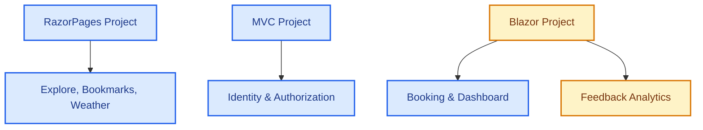

# UniEvent Hub - Memory Snapshots & Project Status

This file tracks the current state of **UniEvent Hub**. All AI agents **must** read and update this file before and after working to maintain project alignment and traceability.

---

## 1. COMPLETED MODULES

### 1.1. Architecture & Global Config
- **Environment**: Upgraded 100% to **.NET 8** and **C# 12**.
- **Shared Authentication**: SSO implemented via shared Cookie `.EventHub.Auth` using EF Core Data Protection (`Microsoft.AspNetCore.DataProtection.EntityFrameworkCore`) across MVC, RazorPages, and Blazor.

### 1.2. Razor Pages (Explore, Bookmarks & Event CRUD)
- **Explore & Search (`Pages/Index.cshtml` / `FE-03`)**: Form search (.search-card-minimal) with time filters (All, Upcoming, Ongoing, Past). Dynamic LED status dots, seats capacity urgency warnings, grayscale for past events, skeleton loader, and AJAX pagination.
- **Bookmarks (`FE-11`)**: Floating bookmark button (`.btn-bookmark-floating`) on events card (disabled for current sprint).
- **Weather Widget (`FE-08`)**: Integrated wttr.in weather lookup with 30-minute `IMemoryCache`. `NormalizeLocation` automatically extracts the campus city name from Venue address.
- **Event CRUD (`FE-02`)**: Complete Event CRUD. Uses DTOs (`EventCreateDTO`, `EventUpdateDTO`) to prevent over-posting. Categories and Tags assigned via checkboxes (Many-to-Many). Serviced via `IEventRepository.BuildSearchQuery()` with eager loading to prevent N+1 queries.
- **My Feedbacks (`/Events/MyFeedbacks`)**: Read-only dashboard for students to review submitted feedbacks.

### 1.3. Blazor Server (Live Systems)
- **Live Ticket Booking (`FE-04`)**: Real-time seat reservation. Integrated with `AuthenticationStateProvider` to retrieve authentic User IDs from the Identity cookie. Features premium Glassmorphism and real-time seat progress bar.
- **Live Dashboard (`FE-10`)**: Displays dynamic real-time seats progress connected via SignalR `ReceiveTicketUpdate`. Features SVG Area Trend Charts, pulse-green status badges, and a live activity log.
- **Feedback Analytics (`FE-07`)**: multi-criteria feedback statistics dashboard using PLINQ `.AsParallel()` on BLL. Includes detailed feedback list pop-up modal.

---

## 2. PENDING MODULES
- **Blazor (Feedback Analytics - Detail Reports)**: Further custom analytics reports if requested.

---

## 3. WORK LOG & TRACEABILITY

### 3.1. Detailed Changes Log

- **2026-06-29 (Antigravity / LongNH)**:
  - **Tái cấu trúc toàn diện kiến trúc 3 tầng (3-Layer Architecture Refactoring)**:
    - Xóa các file rác và template thừa (`BLL/Class1.cs`, `DAL/Class1.cs`, thư mục rỗng `DAL/Models/`, thư mục test `CascadeTest/`).
    - Quy tụ toàn bộ DTO về `BusinessObjects/DTOs`, xóa các DTO bị trùng lặp (`AuthDtos.cs`, `FeedbackDtos.cs` trong `BLL/DTOs`).
    - Sử dụng `git mv` di chuyển 12 file interface dịch vụ sang `BLL/Interfaces` (namespace `BLL.Interfaces`) và 5 file interface repository sang `DAL/Interfaces` (namespace `DAL.Interfaces`) giúp bảo toàn trọn vẹn lịch sử Git commit.
    - Cập nhật toàn bộ DI Container (`DependencyInjection.cs`), các tầng dịch vụ và presentation layers (`RazorPages`, `MVC`, `Blazor`) sử dụng namespace mới. Kiểm chứng build và startup runtime 100% thành công.
- **2026-06-30 (Antigravity)**:
  - **Chuẩn hóa cấu trúc Solution (`EventHub.sln`)**: Gỡ bỏ các thư mục ảo trung gian (`NestedProjects` và Solution Folders cũ), đưa cấu trúc cây project về dạng danh sách phẳng ngang hàng (`DAL`, `BLL`, `MVC`, `RazorPages`, `Blazor`) rõ ràng và trực quan trên Solution Explorer.
  - **Tái cấu trúc Modular DI (Feature-based Registration)**:
    - Chẻ nhỏ phương thức đăng ký DI `AddBusinessLogicLayer` trong `BLL/DependencyInjection.cs` thành các phương thức mở rộng cụm nghiệp vụ độc lập: `AddCoreBusinessServices`, `AddUserManagementServices`, `AddEventManagementServices`, `AddFeedbackManagementServices`, `AddLiveInteractiveServices`.
    - Cập nhật tường minh `Program.cs` tại 3 ứng dụng giao diện (`MVC`, `RazorPages`, `Blazor`) chỉ đăng ký chính xác những cụm dịch vụ BLL mà giao diện đó khai thác, phân định ranh giới nghiệp vụ rõ ràng và tối ưu hóa bộ nhớ container. Kiểm chứng build thành công 100%.
  - **MinhTC & LongNH - Chuẩn hóa Cascade Restrict & Xử lý Exception (`FE-05`, `FE-02`, `FE-09`)**:
    - Cấu hình chuẩn `DeleteBehavior.Restrict` trong `CompositeKeysConfiguration.cs` cho `EventCategory` và `EventTag` từ `Category` và `Tag`.
    - Cập nhật `VenueService.cs`, `EventService.cs`, `CategoryService.cs`, `TagService.cs` kiểm tra trước dữ liệu liên quan và bắt `DbUpdateException` trả về `InvalidOperationException` kèm thông báo tiếng Việt rõ ràng.
    - Cập nhật các PageModel `Venues/Delete`, `Events/Delete`, `Categories/Delete`, `Tags/Delete` bắt ngoại lệ `InvalidOperationException` (loại bỏ các khối catch `DbUpdateException` thừa) và hiển thị thông báo an toàn ra `TempData["ErrorMessage"]`.
    - Bổ sung phương thức `DeleteUserAsync` vào `UserService.cs` hỗ trợ Xóa mềm (`IsActive = false`) và ngăn chặn Xóa cứng tài khoản Organizer/Student khi có ràng buộc sự kiện hoặc vé đăng ký.
    - Xóa bỏ hoàn toàn thư mục cũ `SharedKeys/` không còn sử dụng do toàn bộ hệ thống đã chuyển sang lưu khóa bảo mật vào Database (`PersistKeysToDbContext<AppDbContext>()`).

- **2026-06-23 (Antigravity)**:
  - **QuiNC - Bảo vệ file appsettings.json & Luật Git Workflow (`FE-03`)**: Cấu hình quy tắc chặn tự ý sửa đổi file cấu hình và chuỗi kết nối, cùng với quy tắc bắt buộc phải chạy `git pull` trước khi `git push` và cấm sử dụng Force Push vào file quy chuẩn chung `01-token-and-docs.md`. Đồng thời thực hiện chạy lệnh `git update-index --assume-unchanged` trên cả 3 dự án (`Blazor`, `MVC`, `RazorPages`).
  - **QuiNC - Comments Translation (`FE-03`, `FE-08`)**: Translated all Vietnamese comments to English inside QuiNC's module files: `SearchService.cs`, `WeatherService.cs`, `Index.cshtml.cs`, `EventSearchViewModel.cs`, `Detail.cshtml.cs`, `Index.cshtml`, and `Detail.cshtml` to maintain academic whitepaper standards.
  - **Khôi - Live Ticket Booking, Dashboard & Q&A Optimization (`FE-04`, `FE-10`, `FE-15`)**: Thiết lập database transaction `Serializable` và bắt `DbUpdateConcurrencyException`/`DbUpdateException` trong `BookingService.cs` giải quyết triệt để race condition và chặn đặt vé lách luật multi-tab; Thêm Unique Index cho `Booking` trong cấu hình EF Core (`RelationshipsConfiguration.cs`); Tích hợp cơ chế tự động reconnect (automatic reconnect), timeout 10 giây và 2 nút điều hướng thoát điểm cụt (reload và explore) khi mất kết nối trong `BookingComponent.razor`; Bổ sung cơ chế Rate Limiting chống spam comment bằng cache dictionary thời gian trong `EventHub.cs`; Viết comments tiếng Việt chi tiết cho toàn bộ code trong `BookingComponent.razor` và `DashboardComponent.razor` chuẩn bị cho vấn đáp.
  - **LongNH - Auth, Navigation & Layout Fixes (`FE-01`, `FE-03`)**: Triển khai `CookieAuthenticationEvents.OnValidatePrincipal` kiểm tra trạng thái hoạt động trong DB ở cả 3 project (MVC, RazorPages, Blazor) nhằm Force Logout tức thì khi Admin khóa tài khoản (`IsActive = false`). Tạm thời vô hiệu hóa `Cookie.Domain` để xử lý dứt điểm lỗi đăng nhập không nhận Cookie trên môi trường `localhost`. Giải quyết dứt điểm lỗi "kẹt loading" do `NavigationException` trên trang `Home.razor` bằng thẻ `<meta refresh>` hỗ trợ Blazor SSR tĩnh. Xóa hoàn toàn các tab "Khám phá & Đặt vé" thừa thãi ở thanh Sidebar cả 3 dự án nhằm thống nhất điều hướng UX qua trang Explore.
  - **Thời tiết sự kiện & Dự báo (Event Weather Forecast - FE-08)**: Bổ sung method `GetWeatherForecastAsync` vào `WeatherService` để hỗ trợ dự báo thời tiết cho ngày diễn ra sự kiện. Thực hiện kiểm tra ngày diễn ra sự kiện theo giờ Việt Nam (UTC+7): nếu sự kiện nằm trong khoảng 3 ngày (hôm nay, ngày mai, ngày kia) sẽ truy vấn dữ liệu dự báo ngày từ API `wttr.in`; nếu ngoài 3 ngày sẽ hiển thị khung chờ mờ nhẹ (Glassmorphism skeleton) với thông điệp *"Dự báo thời tiết sẽ khả dụng trước ngày diễn ra sự kiện 3 ngày"* (Phương án A). Tích hợp hiển thị Widget dự báo này vào trang chi tiết sự kiện `Detail.cshtml`. Đồng thời, thiết kế lại toàn bộ trang `Detail.cshtml` sang dạng báo cáo học thuật tối giản (Split-Screen Report với `.whitepaper-sheet` và `.glass-action-panel`), loại bỏ các box card đơn lẻ, icon ở tiêu đề phần, và đồng bộ hiển thị danh mục/thẻ dạng văn bản báo cáo khoa học.
  - **TriLT - Fix Concurrency, Performance & SignalR Sync (FE-06, FE-07, Real-time Sync)**:
    - Triển khai transaction mức `Serializable` trong `EventReminderService` để cập nhật trạng thái reminders trước khi gửi, ngăn chặn hoàn toàn việc gửi trùng email trên môi trường multi-instance.
    - Chuyển đổi cơ chế thống kê feedback từ tính toán PLINQ trên RAM sang truy vấn gom nhóm `GroupBy` và tổng hợp (SQL Aggregate) trực tiếp dưới Database giúp loại bỏ nguy cơ tràn RAM.
    - Tích hợp phát tín hiệu SignalR broadcast `ReceiveEventPublished` khi Admin phê duyệt (Publish) sự kiện thành công và bổ sung listener tương ứng trên Blazor Dashboard giúp nạp tự động sự kiện mới mà không cần reload trang.
    - **FE-12 Event Follows**: Triển khai hoàn chỉnh tính năng theo dõi ban tổ chức dành cho Student. Tạo DTO `OrganizerDto`, Interface `IFollowService` và class `FollowService` tối ưu hóa đếm số lượng followers thông qua truy vấn SQL. Tạo các trang Razor Pages gồm `/Events/Organizers` (danh sách ban tổ chức sắp xếp theo độ phổ biến giảm dần, nút follow/unfollow), `/Events/OrganizerDetails` (chi tiết sự kiện của ban tổ chức), và `/Events/Followed` (ban tổ chức đã theo dõi & các sự kiện mới nhất). Cập nhật điều hướng sidebar của Student.
  - **MinhTC - Tách nghiệp vụ Duyệt Sự Kiện (Admin Approve)**: Bổ sung logic duyệt độc lập `ChangeEventStatusAsync` trong `EventService`, tạo luồng POST API chuyên biệt `?handler=ChangeStatus` trong giao diện List Event `Index.cshtml`. Giới hạn truy cập (RBAC) với `if (!User.IsInRole("Admin"))` để chặn Organizer tự duyệt. Tích hợp trực tiếp các nút Duyệt/Hủy vào Data Grid dành riêng cho role Admin, ngăn chặn triệt để lỗi Over-posting trạng thái từ Form Edit cũ.

  - **MinhTC - Fix Logic Anomalies (FE-05, FE-13)**: Khắc phục các lỗi logic cho phân hệ Event CRUD: Xóa trường `Status` khỏi tính năng Edit Event (Chống Over-posting), xử lý `DbUpdateException` khi xóa `Venue`, `Category`, `Tag` đang được sử dụng (thông báo lỗi thay vì crash), cập nhật `CategoryService` và `TagService` tự động `.Trim()` và kiểm tra trùng lặp tên. Thêm logic xác thực sức chứa (Capacity Limits) khi Cập nhật Địa điểm (Venue) và Cập nhật Sự kiện (Event) để đảm bảo Sức chứa mới không được nhỏ hơn số lượng đã đăng ký hiện tại, hiển thị lỗi qua `ModelState`.
- **2026-06-22 (Antigravity)**:
  - **Tài liệu hóa Edge Cases & Phân chia lỗi logic**: Biên soạn tài liệu phân tích chi tiết các kịch bản lỗi logic, UX edge cases và phân chia cụ thể cho các thành viên trong nhóm phục vụ giai đoạn kiểm thử và hoàn thiện.
  - **QuiNC - Fix Weather & AJAX Search Edge Cases (`FE-08`, `FE-03`)**: Sửa lỗi `NormalizeLocation` tránh crash khi đầu vào địa chỉ thiếu `, [Campus Name]`; giải quyết triệt để Cache Stampede bằng `SemaphoreSlim` (Double-checked locking pattern) trong `WeatherService.cs`; và tích hợp `AbortController` hủy các AJAX request tìm kiếm thừa khi người dùng spam click nhanh trên trang Explore (`Index.cshtml`).
  - **QuiNC - Tối ưu luồng điều hướng Blazor (`FE-03`)**: Tối ưu hóa trải nghiệm Student bằng cách chuyển hướng tự động trang `/events` bên Blazor (`Home.razor`) và cập nhật liên kết Sidebar (`NavMenu.razor`) trỏ trực tiếp về trang Explore chính của Razor Pages (`http://localhost:5129/`) để tránh trùng lặp giao diện xem danh sách sự kiện.
  - **QuiNC - Explore AutoMapper Conversion (`FE-03`)**: Chuyển đổi thành công phần map dữ liệu thủ công (`.Select` tay) trong BLL `SearchService.cs` sang sử dụng **AutoMapper** tự động. Cập nhật cấu hình map tương ứng trong `EventProfile.cs` (gồm lấy VenueName, OrganizerName, danh sách TagNames từ bảng liên kết, số lượng vé đã đặt `BookedCount` và sức chứa tối đa `MaxCapacity`).
  - **Đồng bộ múi giờ Việt Nam (UTC+7)**: Cấu hình AutoMapper trong `EventProfile.cs` tự động cộng thêm 7 tiếng khi chuyển đổi từ Entity lên DTO (`EventDTO`, `EventCardDTO`, `EventUpdateDTO`), và tự động trừ đi 7 tiếng khi map từ DTO tạo mới/cập nhật xuống Database để dữ liệu lưu trữ vẫn chuẩn UTC nhưng giao diện hiển thị đúng giờ Việt Nam.
  - **Cấu hình Connection String**: Chuyển đổi chuỗi kết nối `"EventHub"` trong cả 3 dự án (`MVC`, `RazorPages`, `Blazor`) từ LocalDB/Server cũ sang Server SQL Developer local mặc định (`Server=.`) theo yêu cầu của anh QuiNC để chạy mượt mà trên máy của anh.
  - **Tối ưu hóa launchBrowser**: Cập nhật file `launchSettings.json` của 3 dự án, tắt tự động mở trình duyệt ở RazorPages và Blazor (đặt thành `false`), chỉ để `true` ở dự án MVC để khi khởi động chỉ mở duy nhất tab đăng nhập của MVC, hạn chế rác tab trình duyệt.
  - **Đồng nhất Giao diện & Layout**: Loại bỏ các thẻ bao bọc `.app-container` và `.app-content` dư thừa trong `Home.razor` và `BookingComponent.razor` để giao diện Blazor tích hợp đồng nhất với thanh điều hướng (sidebar) toàn hệ thống giống như bên RazorPages/MVC.
- **2026-06-21 (Antigravity)**:
  - **TriLT - Feedback (`FE-07`) & Email Worker (`FE-06`)**:
    - Created detailed feedback modal in Blazor `FeedbackAnalyticsComponent.razor`.
    - Created student's read-only feedback history `MyFeedbacks` page in Razor Pages.
    - Optimized feedback average calculations using PLINQ `.AsParallel()` in `FeedbackAnalyticsService`.
    - Upgraded `EventReminderService` (BLL) to dispatch emails concurrently using TPL `Parallel.ForEachAsync`.
    - Fixed LINQ translation issue in `EventReminderRepository` (DAL) by utilizing SQL-translatable time filter. Added `IsCanReminder` tracking flag in DB.
  - **MinhTC - Event CRUD (`FE-02`)**:
    - Removed CRUD Organizer (deleted folder `/Pages/Organizers`, services, and DTOs).
    - Built Razor Pages Event CRUD with dynamic checkboxes for Category & Tag updates (Many-to-Many). Protected queries using `EventCreateDTO` and `EventUpdateDTO`.
  - **Access Control & Logouts**:
    - Unified Sidebar Layout across MVC, RazorPages, and Blazor to restrict Student role permissions.
    - Created local RazorPages `Logout.cshtml` page to support local cookie invalidation.

- **2026-06-20 (Antigravity / MinhTC)**:
  - Reconfigured Blazor routing: Live Dashboard to `/` (default) and event bookings to `/events`.
  - **MinhTC - CRUD Category, Tag, Venue (`FE-05`)**:
    - Created CRUD Razor Pages and DTOs (`CategoryDTO`, `TagDTO`, `VenueDTO`).
    - Appended chosen Campus to Venue Address suffix in `VenueCreateDTO`/`VenueUpdateDTO` for weather lookup.

- **2026-06-17 (Antigravity)**:
  - Resolved Blazor Server WebSocket disconnection issue by downgrading `Microsoft.AspNetCore.SignalR.Client` from 9.0 to 8.0.* to match SDK .NET 8.
  - Added test automation script `test.js` using Puppeteer.
  - Designed premium Dark Mode Deep Tech layout for Live Dashboard, featuring SVG Area Chart.
  - Rewrote `BookingComponent.razor` using Cascading Authentication State for real claims.

- **2026-06-17 (quinc)**:
  - Removed Bookmark UI and deleted `BookmarkService.cs` DI configurations to match backlog.

- **2026-06-16 (Antigravity / LongNH)**:
  - **LongNH - Identity & SSO (`FE-01`)**:
    - Configured Cookie Authentication, AccountController, and BCrypt password hashing.
    - Set up shared EF Core Data Protection keys in BLL/MVC to enable SSO.
  - Integrated wttr.in weather API with 30-min `IMemoryCache` for Weather Widget.

- **2026-06-29 (Antigravity / LongNH)**:
  - Hoàn tất kế hoạch chuẩn hóa kiến trúc 3-Layer (BLL, DAL, Presentation).
  - Dọn dẹp rác & file thừa: Xóa `BLL/Class1.cs`, `DAL/Class1.cs`, thư mục rỗng `DAL/Models/` và test ngoài luồng `CascadeTest/`.
  - Quy tụ DTO: Xóa DTO trùng lặp `BLL/DTOs/AuthDtos.cs`, `FeedbackDtos.cs`, refactor toàn bộ sang `using BusinessObjects.DTOs;`.
  - Phân tách Interface: Dùng `git mv` chuyển các interface sang `BLL/Interfaces/` (`namespace BLL.Interfaces;`) và `DAL/Interfaces/` (`namespace DAL.Interfaces;`).
  - Chuẩn hóa bộ xử lý file: Xử lý đọc/ghi với `[System.Text.Encoding]::UTF8` bảo toàn tuyệt đối phông chữ tiếng Việt trên toàn bộ giải pháp.

- **2026-06-14 (Antigravity / MinhTC / QuiNC)**:
  - Setup core PRN222 architectural rules (3-Layer structure, connection safety, async/await).
  - **MinhTC**: Created Organizer CRUD Razor Pages.
  - **QuiNC**: Added status dots and urgencies to Explore list UI (`FE-03`).

### 3.2. Team Branch Status
- **`feature/trilt-email-worker`**: Local development for email background worker.
- **`feature/trilt-feedback`**: Local development for feedback reports.
- **`feature/trilt-follows`**: Local development for event follows.

---

## 4. CROSS-MODULE CONTRACTS

### 4.1. Venue Address & Weather Widget (MinhTC - FE-02/FE-05)
- Forms creating/editing Venues **must** provide a Campus selection dropdown. The selected value must be appended to the end of `Venue.Address` as `, [Campus Name]` to allow `FE-08 (Weather Widget)` to correctly parse and fetch weather data.

### 4.2. Navigation Flow & Authorization Routing (Global SSO)
- **SSO Authentication Cookie**: MVC, RazorPages, and Blazor share the cookie `.EventHub.Auth` using EF Core Data Protection.
- **Post-Login Redirection**: Following successful authentication, all roles (including `Student`) must be redirected to the Razor Pages application (`http://localhost:5129/`) to preserve a unified entry point.
- **Single Tab Navigation Flow**: Avoid opening Blazor modules (Dashboard or Ticket Booking) in new browser tabs. All links navigating between Razor Pages and Blazor must load on the same tab (no `target="_blank"`), utilizing relative paths or direct port mappings to prevent session breakages.
- **Role-based Sidebar Visibility**: Sidebar links for CRUD management must be strictly hidden from `Student` users and authorized only for `Admin` and `Organizer` roles across all three presentation apps.

