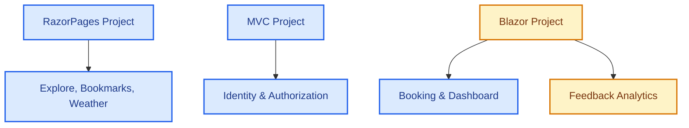

# UniEvent Hub - Memory Snapshots & Project Status

This file tracks the current state of **UniEvent Hub**. All AI agents **must** read and update this file before and after working to maintain project alignment and traceability.

---

## 1. COMPLETED MODULES

### 1.1. Architecture & Global Config
- **Environment**: Upgraded 100% to **.NET 8** and **C# 12**.
- **Shared Authentication**: SSO implemented via shared Cookie `.EventHub.Auth` using EF Core Data Protection (`Microsoft.AspNetCore.DataProtection.EntityFrameworkCore`) across MVC, RazorPages, and Blazor.

### 1.2. Razor Pages (Explore, Bookmarks & Event CRUD)
- **Explore & Search (`Pages/Index.cshtml` / `FE-03`)**: Form search (.search-card-minimal) with time filters (All, Upcoming, Ongoing, Past). Dynamic LED status dots, seats capacity urgency warnings, grayscale for past events, skeleton loader, and AJAX pagination.
- **Bookmarks (`FE-11`)**: Floating bookmark button (`.btn-bookmark-floating`) on events card (disabled for current sprint).
- **Weather Widget (`FE-08`)**: Integrated wttr.in weather lookup with 30-minute `IMemoryCache`. `NormalizeLocation` automatically extracts the campus city name from Venue address.
- **Event CRUD (`FE-02`)**: Complete Event CRUD. Uses DTOs (`EventCreateDTO`, `EventUpdateDTO`) to prevent over-posting. Categories and Tags assigned via checkboxes (Many-to-Many). Serviced via `IEventRepository.BuildSearchQuery()` with eager loading to prevent N+1 queries.
- **My Feedbacks (`/Events/MyFeedbacks`)**: Read-only dashboard for students to review submitted feedbacks.

### 1.3. Blazor Server (Live Systems)
- **Live Ticket Booking (`FE-04`)**: Real-time seat reservation. Integrated with `AuthenticationStateProvider` to retrieve authentic User IDs from the Identity cookie. Features premium Glassmorphism and real-time seat progress bar.
- **Live Dashboard (`FE-10`)**: Displays dynamic real-time seats progress connected via SignalR `ReceiveTicketUpdate`. Features SVG Area Trend Charts, pulse-green status badges, and a live activity log.
- **Feedback Analytics (`FE-07`)**: multi-criteria feedback statistics dashboard using PLINQ `.AsParallel()` on BLL. Includes detailed feedback list pop-up modal.

---

## 2. PENDING MODULES
- **Blazor (Feedback Analytics - Detail Reports)**: Further custom analytics reports if requested.

---

## 3. WORK LOG & TRACEABILITY

### 3.1. Detailed Changes Log

- **2026-06-22 (Antigravity)**:
  - **Đồng nhất Giao diện & Layout**: Loại bỏ các thẻ bao bọc `.app-container` và `.app-content` dư thừa trong `Home.razor` và `BookingComponent.razor` để giao diện Blazor tích hợp đồng nhất với thanh điều hướng (sidebar) toàn hệ thống giống như bên RazorPages/MVC.
  - **Việt hóa & Emoji Clean-up**: Dịch toàn bộ các chuỗi giao diện, tiêu đề, và log trạng thái (ví dụ: `SUCCESS` -> `THÀNH CÔNG`) trong các trang `DashboardComponent.razor` và `FeedbackAnalyticsComponent.razor` sang tiếng Việt. Loại bỏ tất cả emoji trang trí ở tiêu đề và cảnh báo.
  - **Logic Đặt vé hết hạn**: Đồng bộ kiểm tra logic thời gian kết thúc sự kiện (`EndTime < DateTime.UtcNow`) từ BLL `BookingService.cs` lên giao diện hiển thị cảnh báo trực quan của `BookingComponent.razor` và khóa hoàn toàn quyền đăng ký vé.
  - **Khắc phục lỗi SignalR 302**: Cho phép truy cập ẩn danh đối với route `/eventhub` để tránh lỗi chuyển hướng xác thực cookie, giúp biểu đồ hoạt động trực tuyến tự động vẽ đường cong tiến trình.

- **2026-06-21 (Antigravity)**:
  - **TriLT - Feedback (`FE-07`) & Email Worker (`FE-06`)**:
    - Created detailed feedback modal in Blazor `FeedbackAnalyticsComponent.razor`.
    - Created student's read-only feedback history `MyFeedbacks` page in Razor Pages.
    - Optimized feedback average calculations using PLINQ `.AsParallel()` in `FeedbackAnalyticsService`.
    - Upgraded `EventReminderService` (BLL) to dispatch emails concurrently using TPL `Parallel.ForEachAsync`.
    - Fixed LINQ translation issue in `EventReminderRepository` (DAL) by utilizing SQL-translatable time filter. Added `IsCanReminder` tracking flag in DB.
  - **MinhTC - Event CRUD (`FE-02`)**:
    - Removed CRUD Organizer (deleted folder `/Pages/Organizers`, services, and DTOs).
    - Built Razor Pages Event CRUD with dynamic checkboxes for Category & Tag updates (Many-to-Many). Protected queries using `EventCreateDTO` and `EventUpdateDTO`.
  - **Access Control & Logouts**:
    - Unified Sidebar Layout across MVC, RazorPages, and Blazor to restrict Student role permissions.
    - Created local RazorPages `Logout.cshtml` page to support local cookie invalidation.

- **2026-06-20 (Antigravity / MinhTC)**:
  - Reconfigured Blazor routing: Live Dashboard to `/` (default) and event bookings to `/events`.
  - **MinhTC - CRUD Category, Tag, Venue (`FE-05`)**:
    - Created CRUD Razor Pages and DTOs (`CategoryDTO`, `TagDTO`, `VenueDTO`).
    - Appended chosen Campus to Venue Address suffix in `VenueCreateDTO`/`VenueUpdateDTO` for weather lookup.

- **2026-06-17 (Antigravity)**:
  - Resolved Blazor Server WebSocket disconnection issue by downgrading `Microsoft.AspNetCore.SignalR.Client` from 9.0 to 8.0.* to match SDK .NET 8.
  - Added test automation script `test.js` using Puppeteer.
  - Designed premium Dark Mode Deep Tech layout for Live Dashboard, featuring SVG Area Chart.
  - Rewrote `BookingComponent.razor` using Cascading Authentication State for real claims.

- **2026-06-17 (quinc)**:
  - Removed Bookmark UI and deleted `BookmarkService.cs` DI configurations to match backlog.

- **2026-06-16 (Antigravity / LongNH)**:
  - **LongNH - Identity & SSO (`FE-01`)**:
    - Configured Cookie Authentication, AccountController, and BCrypt password hashing.
    - Set up shared EF Core Data Protection keys in BLL/MVC to enable SSO.
  - Integrated wttr.in weather API with 30-min `IMemoryCache` for Weather Widget.

- **2026-06-14 (Antigravity / MinhTC / QuiNC)**:
  - Setup core PRN222 architectural rules (3-Layer structure, connection safety, async/await).
  - **MinhTC**: Created Organizer CRUD Razor Pages.
  - **QuiNC**: Added status dots and urgencies to Explore list UI (`FE-03`).

### 3.2. Team Branch Status
- **`feature/trilt-email-worker`**: Local development for email background worker.
- **`feature/trilt-feedback`**: Local development for feedback reports.
- **`feature/trilt-follows`**: Local development for event follows.

---

## 4. CROSS-MODULE CONTRACTS

### 4.1. Venue Address & Weather Widget (MinhTC - FE-02/FE-05)
- Forms creating/editing Venues **must** provide a Campus selection dropdown. The selected value must be appended to the end of `Venue.Address` as `, [Campus Name]` to allow `FE-08 (Weather Widget)` to correctly parse and fetch weather data.

### 4.2. Navigation Flow & Authorization Routing (Global SSO)
- **SSO Authentication Cookie**: MVC, RazorPages, and Blazor share the cookie `.EventHub.Auth` using EF Core Data Protection.
- **Post-Login Redirection**: Following successful authentication, all roles (including `Student`) must be redirected to the Razor Pages application (`http://localhost:5129/`) to preserve a unified entry point.
- **Single Tab Navigation Flow**: Avoid opening Blazor modules (Dashboard or Ticket Booking) in new browser tabs. All links navigating between Razor Pages and Blazor must load on the same tab (no `target="_blank"`), utilizing relative paths or direct port mappings to prevent session breakages.
- **Role-based Sidebar Visibility**: Sidebar links for CRUD management must be strictly hidden from `Student` users and authorized only for `Admin` and `Organizer` roles across all three presentation apps.

