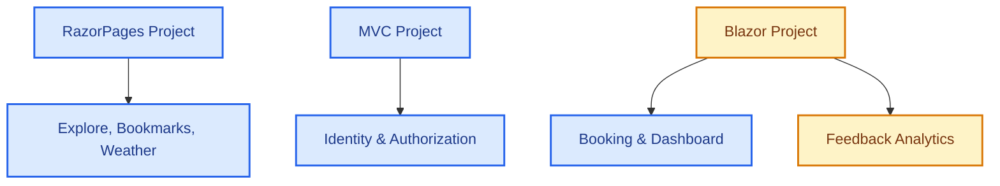

# UniEvent Hub - Memory Snapshots & Project Status

This file tracks the current state of **UniEvent Hub**. All AI agents **must** read and update this file before and after working to maintain project alignment and traceability.

---

## 1. COMPLETED MODULES

### 1.1. Architecture & Global Config
- **Environment**: Upgraded 100% to **.NET 8** and **C# 12**.
- **Shared Authentication**: SSO implemented via shared Cookie `.EventHub.Auth` using EF Core Data Protection (`Microsoft.AspNetCore.DataProtection.EntityFrameworkCore`) across MVC, RazorPages, and Blazor.
- **Account Lockout & Force Logout (`FE-09` / Task 4)**: Real-time enforcement using `CookieAuthenticationEvents.OnValidatePrincipal` to automatically log out users whose accounts are locked (`IsActive = false`) on any active page request across all applications (MVC, RazorPages, Blazor).

### 1.2. Razor Pages (Explore, Bookmarks & Event CRUD)
- **Explore & Search (`Pages/Index.cshtml` / `FE-03`)**: Form search (.search-card-minimal) with time filters (All, Upcoming, Ongoing, Past). Dynamic LED status dots, seats capacity urgency warnings, grayscale for past events, skeleton loader, and AJAX pagination.
- **Bookmarks (`FE-11`)**: `IBookmarkService` + `BookmarkService` (via `IRepository<Bookmark>`). Toggle AJAX bookmark on Index cards. Dedicated `/Bookmarks/Index` page (Student-only, Auth from Claims). Sidebar link added.
- **Weather Widget (`FE-08`)**: Integrated wttr.in weather lookup with 30-minute `IMemoryCache` + `SemaphoreSlim` (double-checked locking, Cache Stampede prevention). `NormalizeLocation` automatically extracts campus city from Venue address.
- **Event CRUD (`FE-02`)**: Complete Event CRUD. Uses DTOs (`EventCreateDTO`, `EventUpdateDTO`) to prevent over-posting. Categories and Tags assigned via checkboxes (Many-to-Many). Serviced via `IEventRepository.BuildSearchQuery()` with eager loading to prevent N+1 queries.
- **My Feedbacks (`/Events/MyFeedbacks`)**: Read-only dashboard for students to review submitted feedbacks.

### 1.3. Blazor Server (Live Systems)
- **Live Ticket Booking (`FE-04`)**: Real-time seat reservation. Integrated with `AuthenticationStateProvider` to retrieve authentic User IDs from the Identity cookie. Features premium Glassmorphism and real-time seat progress bar.
- **Live Dashboard (`FE-10`)**: Displays dynamic real-time seats progress connected via SignalR `ReceiveTicketUpdate`. Features SVG Area Trend Charts, pulse-green status badges, and a live activity log.
- **Feedback Analytics (`FE-07`)**: multi-criteria feedback statistics dashboard using PLINQ `.AsParallel()` on BLL. Includes detailed feedback list pop-up modal.

---

## 2. PENDING MODULES
- **Blazor (Feedback Analytics - Detail Reports)**: Further custom analytics reports if requested.

---

## 2.5. ⚠️ ARCHITECTURE VIOLATIONS — ACTION REQUIRED BY TEAM
> Phát hiện ngày 2026-06-29 bởi QuiNC (Antigravity audit). Build vẫn pass, nhưng cần fix trước khi vấn đáp.

### [ARCH-04] `AppDbContext` inject trực tiếp vào Presentation layer — **Toàn team**
Các PageModel/Component sau inject `AppDbContext` thay vì đi qua BLL Service:
- `Feedback.cshtml.cs`, `MyFeedbacks.cshtml.cs` → **MinhTC**
- `OrganizerDetails.cshtml.cs` → **TriLT**
- `Blazor/Components/Dashboard/DashboardComponent.razor`, `BookingComponent.razor` → **Khôi**

### [ARCH-05] `IMapper` inject ở Presentation — **TriLT**
`RazorPages/Pages/Follow/OrganizerDetails.cshtml.cs` inject `IMapper` trực tiếp — mapping phải thuộc BLL.

---

## 3. WORK LOG & ARCHITECTURE CONVENTIONS

### 3.1. Detailed Changes Log
- **2026-07-20 (Antigravity / Agent)**:
  - **Sửa lỗi logic tạo Sự kiện (FE-02)**:
    - Bổ sung 2 vòng check Overlap (trùng thời gian) tại `EventService.cs` (`CreateEventAsync`, `UpdateEventAsync`): Check không cho phép 1 địa điểm tổ chức 2 sự kiện cùng lúc, và check không cho phép 1 Organizer tổ chức 2 sự kiện ở 2 nơi khác nhau cùng lúc. Sử dụng công thức giao điểm thời gian `(e.StartTime < dto.EndTime && e.EndTime > dto.StartTime)`.
    - Fix UI lỗi bảo mật trên `Create.cshtml`: Bọc các thẻ Dropdown của `OrganizerId` và `Status` bằng `@if (User.IsInRole("Admin"))`. Đối với Organizer, hệ thống tự động gán `Status` thành "Draft" và ép `OrganizerId` theo Claim token ở tầng `Create.cshtml.cs` để ngăn chặn giả mạo nhà tổ chức và tự ý duyệt sự kiện.

- **2026-07-20 (Antigravity / QuiNC)**:
  - **Tái cấu trúc và tối giản hóa phân hệ QuiNC (`FE-03`, `FE-08`, `FE-11`)**:
    - **`WeatherService.cs`**: Gỡ bỏ locks `SemaphoreSlim` phức tạp. Đơn giản hóa hàm check `NormalizeLocation` khỏi hardcode địa chỉ AI, làm sạch logic mapping khung giờ dự báo wttr.in dễ hiểu cho đồ án môn học.
    - **`BookmarkService.cs`**: Xóa bỏ dependency chéo `AppDbContext`, chuyển hẳn sang dùng `IRepository<Bookmark>`. Viết lại truy vấn LINQ bằng Projection `.Select()` trực tiếp sang DTO để loại bỏ code Include lồng nhau.
    - **`Index.cshtml`**: Tinh giản Javascript Debounce và AJAX search, comment tiếng Việt rõ ràng để dễ thuyết minh vấn đáp.
    - Đảm bảo biên dịch thành công 100% không lỗi.

- **2026-07-20 (Antigravity / LongNH)**:
  - **Account Lockout & Force Logout System (`FE-09` / Task 4)**: Cập nhật tài liệu phân công (`TASK_DIVISION.md`) và trạng thái bộ nhớ (`memory-snapshots.md`) để đồng bộ trạng thái "Done" cho hệ thống Khóa tài khoản và Buộc đăng xuất tức thì, khẳng định tính sẵn sàng và tính độc lập của phân hệ quản trị MVC Admin Control Panel.

- **2026-07-14 (Antigravity / TriLT)**:
  - **Tạo tài liệu thiết kế hệ thống (Class Diagram & Integrated Communication Diagram)**:
    - Phát triển script PowerShell tự động sinh file `.drawio` cho Class Diagram phần mềm (`class_diagram.drawio`) bao gồm đầy đủ cấu trúc 3 tầng (Presentation, BLL, DAL) với liên kết kế thừa/hiện thực hóa chuẩn UML.
    - Phát triển script PowerShell tự động sinh file `.drawio` cho Sơ đồ truyền thông tích hợp (`integrated_communication_diagram.drawio`) biểu diễn sự tương tác của toàn bộ phân hệ (Auth, Booking, Event Management, Feedback) mà không dùng sequence numbers theo đúng chuẩn thiết kế COMET.
    - Đã kiểm chứng khả năng tương thích và hiển thị trực quan thành công trên draw.io.

- **2026-07-14 (Antigravity / MinhTC)**:
  - **Khắc phục và bổ sung cấu hình DI (`BLL/DependencyInjection.cs`) cho các ứng dụng Presentation (`MVC`, `RazorPages`, `Blazor`)**:
    - Bổ sung `services.AddSignalR()` trực tiếp vào `AddBusinessLogicLayer` nhằm tự đáp ứng dependency `IHubContext<EventHub>` cho `BookingService` và `EventService`, triệt tiêu ngoại lệ `InvalidOperationException` -> `AggregateException` khi khởi chạy các ứng dụng.
    - Đăng ký service `services.AddScoped<IEventRequestService, EventRequestService>()` vào `AddBusinessLogicLayer` để giải quyết dependency cho các PageModel của module Ý tưởng sự kiện (`Requests/IndexModel`, `Requests/ProcessModel`, `Requests/CreateModel`).
  - **Dùng skill `clean-architecture-crud-refactor` kiểm tra & chuẩn hóa trọn vẹn 2 module `Venues` và `Student Idea / Requests` trong `RazorPages`**:
    - **Module `Venues` (`RazorPages/Pages/Venues`)**:
      - Chuẩn hóa cấu trúc try-catch 2 tầng tại `Create.cshtml.cs`, `Edit.cshtml.cs`, và `Delete.cshtml.cs`: loại bỏ việc bắt lẻ các ngoại lệ `InvalidOperationException` tại từng tầng UI, thay bằng việc bắt các ngoại lệ HTTP giao thức (`KeyNotFoundException` -> `NotFound()`) ở tầng 1 và bắt chung ngoại lệ nghiệp vụ (`Exception ex`) ở tầng 2 để hiển thị an toàn qua `ModelState` (trên form Create/Edit) hoặc `TempData["ErrorMessage"]` (trên trang Delete). Đảm bảo mọi ngoại lệ validation/nghiệp vụ từ BLL (`VenueService`) đều được phản ánh đầy đủ, tránh sập ứng dụng (HTTP 500) và lộ Stack Trace.
    - **Module `Student Idea / Requests` (`FE-13`)**:
      - Loại bỏ vi phạm Data Access (`CA-ERR-02`) tại `Index.cshtml.cs`: dời toàn bộ logic truy vấn và lọc dữ liệu bằng LINQ `.Where(...)` xuống tầng dịch vụ. Bổ sung tham số `string? statusFilter = null` vào chữ ký phương thức `GetAllRequestsAsync` và `GetRequestsByStudentIdAsync` tại `IEventRequestService` và `EventRequestService`, thực thi lọc trực tiếp trên `IQueryable` ở tầng Database trước khi `ToListAsync()`.
      - Loại bỏ vi phạm UI Logic (`CA-WARN-02`) tại `Index.cshtml`: đóng gói toàn bộ trạng thái hiển thị và màu sắc giao diện (`StatusDisplayName`, `StatusBadgeClass`, `StatusIconClass`) thành computed properties trong `EventRequestDTO` (`BusinessObjects/DTOs/EventRequestDTOs.cs`). Triệt tiêu hoàn toàn khối `if/else` phân định màu badge và icon bên trong View HTML.
      - Bổ sung cấu trúc try-catch 2 tầng chuẩn mực vào `Create.cshtml.cs` và `Process.cshtml.cs` để bảo vệ các thao tác gửi ý tưởng và phê duyệt ý tưởng.
    - Kiểm chứng `dotnet build` thành công `0 Error(s)` và chạy kiểm toán tĩnh `check_clean_arch.ps1` trên cả `RazorPages/Pages/Venues` lẫn `RazorPages/Pages/Requests` đạt `0` vi phạm (`0 Violations Found`).

- **2026-07-13 (Antigravity / QuiNC / MinhTC)**:
  - **Đóng gói Agent Skill chuẩn hóa Clean Architecture cho các phân hệ CRUD (`clean-architecture-crud-refactor`)**:
    - Xây dựng script PowerShell tự động quét mã nguồn `.agents/skills/clean-architecture-crud-refactor/scripts/check_clean_arch.ps1` theo các bộ quy tắc (Rule IDs: `CA-ERR-01`, `CA-ERR-02`, `CA-ERR-03`, `CA-WARN-01`, `CA-WARN-02`, `CA-CLEAN-01`), xuất báo cáo kiểm toán chi tiết dưới định dạng Markdown và JSON vào `.agents/docs/reports/`.
    - Biên soạn bộ tài liệu hướng dẫn và checklist chuẩn hóa kiến trúc `SKILL.md` tại `.agents/skills/clean-architecture-crud-refactor/SKILL.md`, xác định rõ quy trình 3 bước (Quét tự động -> Phân cấp xử lý 3 mức độ -> Kiểm chứng và Rollback Guard với `dotnet build` + `git restore`), kèm các mẫu trước/sau (Canonical Before/After Patterns) cho `DTO` computed properties và `Service` layer.
    - Chạy thử nghiệm thành công script quét trên phân hệ `RazorPages/Pages/Events`, xác nhận cơ chế nhận diện đúng vi phạm màu sắc UI (`CA-WARN-02` tại `Detail.cshtml.cs`) và xác nhận 0 vi phạm Data Access (`CA-ERR-01`/`02`), bảo đảm phân hệ Events tuân thủ 100% Clean Architecture.
    - Dùng skill `clean-architecture-crud-refactor` rà soát & chuẩn hóa toàn diện 2 module `Categories` và `Tags` trong `RazorPages`: Cập nhật regex `CA-WARN-01` trong `check_clean_arch.ps1` để nhận diện các ngoại lệ có tiền tố `System.`. Chuẩn hóa toàn bộ cấu trúc bắt lỗi trong các PageModel (`Create.cshtml.cs`, `Edit.cshtml.cs`, `Delete.cshtml.cs`) từ việc bắt lẻ `catch (System.InvalidOperationException ex)` sang bắt chung `catch (Exception ex)` (sau `KeyNotFoundException`) nhằm đảm bảo mọi ngoại lệ nghiệp vụ/validation từ BLL (`CategoryService`, `TagService`) đều được chuyển tải trọn vẹn ra giao diện, đạt 100% kiểm toán Clean Architecture (`0` vi phạm).

- **2026-07-09 (Antigravity / QuiNC)**:
  - **FE-11 Bookmark/Wishlist + Fix ARCH-04**: Tạo `IBookmarkService` / `BookmarkService` (dùng `IRepository<Bookmark>` đúng pattern). Xóa `AppDbContext` khỏi `Index.cshtml.cs` — fix ARCH-04. Thêm AJAX toggle bookmark trên Grid & List card. Khôi phục trang `/Bookmarks/Index` với Auth thực từ Claims (`[Authorize(Roles="Student")]`). Thêm sidebar link Student. Fix CSS Safari compat (`-webkit-user-select`, `-webkit-backdrop-filter`, `line-clamp`). Fix `DependencyInjection.cs` dùng `AddBusinessLogicLayer` thay các method cũ bị xóa. Build: **0 errors**.

- **2026-07-01 (Antigravity / MinhTC)**:
  - **Tách triệt để nghiệp vụ khỏi tầng FE (Event CRUD - `FE-02`)**:
    - Loại bỏ logic kiểm tra thời gian sự kiện (`StartTime >= EndTime`) bị lặp lại ở tầng giao diện (`Create.cshtml.cs` và `Edit.cshtml.cs`).
    - Gỡ bỏ việc tiêm trực tiếp `AppDbContext` và logic truy vấn dữ liệu/tính toán ranh giới thời tiết tại trang chi tiết (`Detail.cshtml.cs`).
    - Tối giản hóa xử lý lỗi (`try-catch`) trong `Create.cshtml.cs` và `Edit.cshtml.cs`: loại bỏ việc tầng FE phải tự phân loại từng exception (`ArgumentException`, `InvalidOperationException`) để ánh xạ vào từng field cụ thể, thay bằng bắt lỗi chung (`catch (Exception)`) và hiển thị qua `ModelState summary`. Ràng buộc dữ liệu field-level hoàn toàn do `IValidatableObject` đảm nhiệm trước khi gọi BLL.
    - Bổ sung `GetEventEntityByIdAsync` vào `IEventService`/`EventService` và `.ThenInclude(ec => ec.Category)` vào `EventRepository`, đảm bảo toàn bộ nghiệp vụ được tập trung duy nhất tại tầng dịch vụ (BLL), tuân thủ tuyệt đối Clean Architecture.
    - Triệt tiêu hoàn toàn các khối kiểm tra `if` mang tính logic khỏi `Detail.cshtml.cs` và `Detail.cshtml`: chuyển logic kiểm tra rỗng địa điểm cho `WeatherService`, chuyển logic bóc tách user claim cho `FeedbackAnalyticsService`, đồng thời đóng gói toàn bộ trạng thái hiển thị (`StatusText`, `StatusClass`, `RemainingSeats`, `FillRate`) thành getter property trong `DetailModel`. Giao diện FE không còn bất kỳ phép tính toán nghiệp vụ nào.
    - Quét và dọn sạch toàn bộ các trang CRUD Events (`Index`, `Create`, `Edit`, `Detail`, `Delete`): bổ sung các computed properties (`StatusDisplayName`, `StatusBadgeClass`) trực tiếp vào `EventDTO`, triệt tiêu hoàn toàn các khối `switch/case` phân loại màu sắc và tên trạng thái khỏi `Index.cshtml` và `Delete.cshtml`. Chuẩn hóa cơ chế bắt lỗi chung `catch (Exception)` trong `Delete.cshtml.cs` để bảo đảm mọi ngoại lệ nghiệp vụ từ BLL (`EventService`) đều được chuyển tải nguyên vẹn lên UI.
  - **MinhTC - Triển khai Quản lý & Duyệt Ý tưởng Sự kiện (`FE-13` - Event Requests)**:
    - Tạo tập DTO `EventRequestDTO`, `EventRequestCreateDTO`, `EventRequestProcessDTO` trong `BusinessObjects/DTOs/EventRequestDTOs.cs` với ràng buộc validation đầy đủ, sử dụng `[BindProperty]` chống Over-posting.
    - Tạo cấu hình AutoMapper `EventRequestProfile.cs` (quy đổi múi giờ UTC+7 cho thời gian gửi).
    - Xây dựng giao tiếp tầng nghiệp vụ `IEventRequestService` và `EventRequestService` trong BLL, tích hợp vào DI Container (`AddEventManagementServices`).
    - Triển khai nhóm Razor Pages `Pages/Requests/`:
      - `Index.cshtml`: Hiển thị danh sách ý tưởng theo phân quyền (Student xem đề xuất cá nhân, Admin/Organizer xem toàn bộ kèm bộ lọc trạng thái Pending/Approved/Rejected).
      - `Create.cshtml`: Trang cho sinh viên gửi ý tưởng mới (quyền `Student`).
      - `Process.cshtml`: Trang xử lý phê duyệt ý tưởng cho ban tổ chức (quyền `Admin,Organizer`).
    - Cập nhật Sidebar navigation (`_Layout.cshtml`) hiển thị liên kết "Ý tưởng sự kiện" / "Duyệt ý tưởng sự kiện" tương ứng theo role. Kiểm chứng build thành công 100%.

- **2026-06-30 (Antigravity)**:
  - **Chuẩn hóa cấu trúc Solution (`EventHub.sln`)**: Gỡ bỏ các thư mục ảo trung gian (`NestedProjects` và Solution Folders cũ), đưa cấu trúc cây project về dạng danh sách phẳng ngang hàng (`DAL`, `BLL`, `MVC`, `RazorPages`, `Blazor`) rõ ràng và trực quan trên Solution Explorer.
  - **Tái cấu trúc Modular DI (Feature-based Registration)**:
    - Chẻ nhỏ phương thức đăng ký DI `AddBusinessLogicLayer` trong `BLL/DependencyInjection.cs` thành các phương thức mở rộng cụm nghiệp vụ độc lập: `AddCoreBusinessServices`, `AddUserManagementServices`, `AddEventManagementServices`, `AddFeedbackManagementServices`, `AddLiveInteractiveServices`.
    - Cập nhật tường minh `Program.cs` tại 3 ứng dụng giao diện (`MVC`, `RazorPages`, `Blazor`) chỉ đăng ký chính xác những cụm dịch vụ BLL mà giao diện đó khai thác, phân định ranh giới nghiệp vụ rõ ràng và tối ưu hóa bộ nhớ container. Kiểm chứng build thành công 100%.
  - **Khắc phục lỗi DI cho `EventService` (RazorPages / BLL DI)**: Bổ sung `services.AddSignalR()` vào `AddEventManagementServices` trong `BLL/DependencyInjection.cs` để giải quyết dependency `IHubContext<EventHub>` cho `EventService` khi chạy RazorPages.
  - **Khắc phục lỗi xác thực thời gian sự kiện (`FE-02` - MinhTC)**: Bổ sung xác thực `StartTime < EndTime` cho `EventCreateDTO` và `EventUpdateDTO` (`IValidatableObject`), ném ngoại lệ `ArgumentException` tại tầng `EventService` và xử lý hiển thị lỗi trên form tại các PageModel `Events/Create` và `Events/Edit`.
  - **MinhTC & LongNH - Chuẩn hóa Cascade Restrict & Xử lý Exception (`FE-05`, `FE-02`, `FE-09`)**:
    - Cấu hình chuẩn `DeleteBehavior.Restrict` trong `CompositeKeysConfiguration.cs` cho `EventCategory` và `EventTag` từ `Category` và `Tag`.
    - Cập nhật `VenueService.cs`, `EventService.cs`, `CategoryService.cs`, `TagService.cs` kiểm tra trước dữ liệu liên quan và bắt `DbUpdateException` trả về `InvalidOperationException` kèm thông báo tiếng Việt rõ ràng.
    - Cập nhật các PageModel `Venues/Delete`, `Events/Delete`, `Categories/Delete`, `Tags/Delete` bắt ngoại lệ `InvalidOperationException` (loại bỏ các khối catch `DbUpdateException` thừa) và hiển thị thông báo an toàn ra `TempData["ErrorMessage"]`.
    - Bổ sung phương thức `DeleteUserAsync` vào `UserService.cs` hỗ trợ Xóa mềm (`IsActive = false`) và ngăn chặn Xóa cứng tài khoản Organizer/Student khi có ràng buộc sự kiện hoặc vé đăng ký.
    - Xóa bỏ hoàn toàn thư mục cũ `SharedKeys/` không còn sử dụng do toàn bộ hệ thống đã chuyển sang lưu khóa bảo mật vào Database (`PersistKeysToDbContext<AppDbContext>()`).

- **2026-06-23 (Antigravity)**:
  - **QuiNC - Bảo vệ file appsettings.json & Luật Git Workflow (`FE-03`)**: Cấu hình quy tắc chặn tự ý sửa đổi file cấu hình và chuỗi kết nối, cùng với quy tắc bắt buộc phải chạy `git pull` trước khi `git push` và cấm sử dụng Force Push vào file quy chuẩn chung `01-token-and-docs.md`. Đồng thời thực hiện chạy lệnh `git update-index --assume-unchanged` trên cả 3 dự án (`Blazor`, `MVC`, `RazorPages`).
  - **QuiNC - Comments Translation (`FE-03`, `FE-08`)**: Translated all Vietnamese comments to English inside QuiNC's module files: `SearchService.cs`, `WeatherService.cs`, `Index.cshtml.cs`, `EventSearchViewModel.cs`, `Detail.cshtml.cs`, `Index.cshtml`, and `Detail.cshtml` to maintain academic whitepaper standards.
  - **Khôi - Live Ticket Booking, Dashboard & Q&A Optimization (`FE-04`, `FE-10`, `FE-15`)**: Thiết lập database transaction `Serializable` và bắt `DbUpdateConcurrencyException`/`DbUpdateException` trong `BookingService.cs` giải quyết triệt để race condition và chặn đặt vé lách luật multi-tab; Thêm Unique Index cho `Booking` trong cấu hình EF Core (`RelationshipsConfiguration.cs`); Tích hợp cơ chế tự động reconnect (automatic reconnect), timeout 10 giây và 2 nút điều hướng thoát điểm cụt (reload và explore) khi mất kết nối trong `BookingComponent.razor`; Bổ sung cơ chế Rate Limiting chống spam comment bằng cache dictionary thời gian trong `EventHub.cs`; Viết comments tiếng Việt chi tiết cho toàn bộ code trong `BookingComponent.razor` và `DashboardComponent.razor` chuẩn bị cho vấn đáp.
  - **LongNH - Auth, Navigation & Layout Fixes (`FE-01`, `FE-03`)**: Triển khai `CookieAuthenticationEvents.OnValidatePrincipal` kiểm tra trạng thái hoạt động trong DB ở cả 3 project (MVC, RazorPages, Blazor) nhằm Force Logout tức thì khi Admin khóa tài khoản (`IsActive = false`). Tạm thời vô hiệu hóa `Cookie.Domain` để xử lý dứt điểm lỗi đăng nhập không nhận Cookie trên môi trường `localhost`. Giải quyết dứt điểm lỗi "kẹt loading" do `NavigationException` trên trang `Home.razor` bằng thẻ `<meta refresh>` hỗ trợ Blazor SSR tĩnh. Xóa hoàn toàn các tab "Khám phá & Đặt vé" thừa thãi ở thanh Sidebar cả 3 dự án nhằm thống nhất điều hướng UX qua trang Explore.
  - **Thời tiết sự kiện & Dự báo (Event Weather Forecast - FE-08)**: Bổ sung method `GetWeatherForecastAsync` vào `WeatherService` để hỗ trợ dự báo thời tiết cho ngày diễn ra sự kiện. Thực hiện kiểm tra ngày diễn ra sự kiện theo giờ Việt Nam (UTC+7): nếu sự kiện nằm trong khoảng 3 ngày (hôm nay, ngày mai, ngày kia) sẽ truy vấn dữ liệu dự báo ngày từ API `wttr.in`; nếu ngoài 3 ngày sẽ hiển thị khung chờ mờ nhẹ (Glassmorphism skeleton) với thông điệp *"Dự báo thời tiết sẽ khả dụng trước ngày diễn ra sự kiện 3 ngày"* (Phương án A). Tích hợp hiển thị Widget dự báo này vào trang chi tiết sự kiện `Detail.cshtml`. Đồng thời, thiết kế lại toàn bộ trang `Detail.cshtml` sang dạng báo cáo học thuật tối giản (Split-Screen Report với `.whitepaper-sheet` và `.glass-action-panel`), loại bỏ các box card đơn lẻ, icon ở tiêu đề phần, và đồng bộ hiển thị danh mục/thẻ dạng văn bản báo cáo khoa học.
  - **TriLT - Fix Concurrency, Performance & SignalR Sync (FE-06, FE-07, Real-time Sync)**:
    - Triển khai transaction mức `Serializable` trong `EventReminderService` để cập nhật trạng thái reminders trước khi gửi, ngăn chặn hoàn toàn việc gửi trùng email trên môi trường multi-instance.
    - Chuyển đổi cơ chế thống kê feedback từ tính toán PLINQ trên RAM sang truy vấn gom nhóm `GroupBy` và tổng hợp (SQL Aggregate) trực tiếp dưới Database giúp loại bỏ nguy cơ tràn RAM.
    - Tích hợp phát tín hiệu SignalR broadcast `ReceiveEventPublished` when Admin approves/publishes events, updating Blazor Dashboard.
    - **FE-12 Event Follows**: Triển khai hoàn chỉnh tính năng theo dõi ban tổ chức dành cho Student. Tạo DTO `OrganizerDto`, Interface `IFollowService` và class `FollowService` tối ưu hóa đếm số lượng followers thông qua truy vấn SQL. Tạo các trang Razor Pages gồm `/Events/Organizers` (danh sách ban tổ chức sắp xếp theo độ phổ biến giảm dần, nút follow/unfollow), `/Events/OrganizerDetails` (chi tiết sự kiện của ban tổ chức), và `/Events/Followed` (ban tổ chức đã theo dõi & các sự kiện mới nhất). Cập nhật điều hướng sidebar của Student.
  - **MinhTC - Tách nghiệp vụ Duyệt Sự Kiện (Admin Approve)**: Bổ sung logic duyệt độc lập `ChangeEventStatusAsync` trong `EventService`, tạo luồng POST API chuyên biệt `?handler=ChangeStatus` trong giao diện List Event `Index.cshtml`. Giới hạn truy cập (RBAC) với `if (!User.IsInRole("Admin"))` để chặn Organizer tự duyệt. Tích hợp trực tiếp các nút Duyệt/Hủy vào Data Grid dành riêng cho role Admin, ngăn chặn triệt để lỗi Over-posting trạng thái từ Form Edit cũ.

### 3.2. Architectural & DI Conventions
- **Xem xét Tiêm Phụ thuộc (Option 1)**: Đang nghiên cứu chuyển đổi toàn bộ dịch vụ BLL đăng ký trực tiếp và hiển thị tường minh trong `Program.cs` của từng ứng dụng Web (RazorPages, MVC, Blazor) thay vì giấu trong hàm `AddBusinessLogicLayer` của BLL.
- **Vị trí của DTO**: Tất cả DTO (Data Transfer Objects) phải được khai báo tập trung trong dự án **BusinessObjects**, tuyệt đối không nằm ở tầng **BLL**.
- **Quy tắc Mapping**: Toàn bộ việc ánh xạ dữ liệu (Object Mapping) giữa Entity và DTO bắt buộc phải sử dụng **AutoMapper** trong tầng **BLL**, nghiêm cấm việc gán thủ công (manual mapping) trong các phương thức của Service.

### 3.3. Team Branch Status
- **`feature/trilt-email-worker`**: Local development for email background worker.
- **`feature/trilt-feedback`**: Local development for feedback reports.
- **`feature/trilt-follows`**: Local development for event follows.

---

## 4. CROSS-MODULE CONTRACTS

### 4.1. Venue Address & Weather Widget (MinhTC - FE-02/FE-05)
- Forms creating/editing Venues **must** provide a Campus selection dropdown. The selected value must be appended to the end of `Venue.Address` as `, [Campus Name]` to allow `FE-08 (Weather Widget)` to correctly parse and fetch weather data.

### 4.2. Navigation Flow & Authorization Routing (Global SSO)
- **SSO Authentication Cookie**: MVC, RazorPages, and Blazor share the cookie `.EventHub.Auth` using EF Core Data Protection.
- **Post-Login Redirection**: Following successful authentication, all roles (including `Student`) must be redirected to the Razor Pages application (`http://localhost:5129/`) to preserve a unified entry point.
- **Single Tab Navigation Flow**: Avoid opening Blazor modules (Dashboard or Ticket Booking) in new browser tabs. All links navigating between Razor Pages and Blazor must load on the same tab (no `target="_blank"`), utilizing relative paths or direct port mappings to prevent session breakages.
- **Role-based Sidebar Visibility**: Sidebar links for CRUD management must be strictly hidden from `Student` users and authorized only for `Admin` and `Organizer` roles across all three presentation apps.

