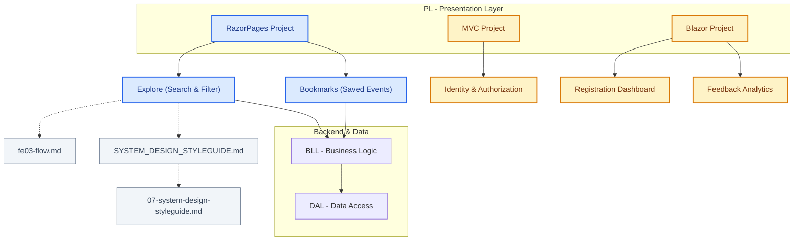

# UniEvent Hub - Memory Snapshots & Project Status (AI-Optimized)

Tài liệu này lưu trữ bản đồ trạng thái thực tế của dự án **UniEvent Hub**. Tất cả các Agent AI khi làm việc **bắt buộc** phải đọc file này trước tiên để tránh quét mã nguồn lặp lại gây lãng phí token và thời gian.

---

## 1. PHÂN HỆ ĐÃ HOÀN THÀNH (COMPLETED MODULES)

### 1.1. Kiến trúc chung & Cấu hình Luật (System Architecture & Rules)
- **Môi trường:** Đã đồng bộ 100% sang **.NET 8** và **C# 12** trên toàn bộ cấu hình, rules và tài liệu.
- **Tài liệu hệ thống:**
  - **[Design Style Guide](../../SYSTEM_DESIGN_STYLEGUIDE.md)**: Định nghĩa Design Tokens (Royal Blue & Amber), Layout, cấu trúc DOM thẻ `.card-minimal` và các quy tắc tương phản/accessibility.
  - **[Styleguide Rules cho AI](../rules/07-system-design-styleguide.md)**: Luật thiết kế giao diện bắt buộc cho AI Agent.
  - **[FE-03 Explore Search & Filter Flow](fe03-flow.md)**: Đặc tả chi tiết luồng Search & Filter của trang Explore.
  - **[File CSS Toàn cục (site.css)](../../RazorPages/wwwroot/css/site.css)**: CSS style sheet chính của dự án.
  - **[Layout chính của dự án (_Layout.cshtml)](../../RazorPages/Pages/Shared/_Layout.cshtml)**: Khung chứa sidebar và content body.

### 1.2. Phân hệ Razor Pages (Explore & Bookmarks)
- **Trang chủ / Explore (`Pages/Index.cshtml` & `Pages/Index.cshtml.cs`):**
  - Đã tích hợp Form tìm kiếm thu gọn (.search-card-minimal) và bộ lọc thời gian (All, Upcoming, Ongoing, Past).
  - Tự động hiển thị dấu chấm LED (`status-upcoming`/`ongoing`/`past`) trên ảnh thẻ sự kiện.
  - Hiển thị mức độ khẩn cấp số lượng vé (`seats-urgency-low` và `seats-urgency-soldout`) dựa theo dung lượng.
  - Hiệu ứng làm mờ và chuyển grayscale (`.is-past`) cho sự kiện đã kết thúc khi render.
  - Phân trang giữ nguyên tham số lọc URL thông qua `asp-route-*` tag helpers.
- **Trang đã lưu Bookmarks (`Pages/Bookmarks/Index.cshtml` & `Pages/Bookmarks/Index.cshtml.cs`):**
  - Hiển thị danh sách sự kiện đã được Bookmark bởi Account hiện tại.
  - Cho phép click bookmark nhanh qua nút bookmark nổi (`.btn-bookmark-floating`).

---

## 2. PHÂN HỆ CHƯA HOÀN THÀNH (PENDING MODULES - PROJECT SCAFFOLD ONLY)

### 2.1. Phân hệ MVC (Identity)
- **Trạng thái:** Mới chỉ là khung Project thô tạo từ dotnet template.
- **File thực tế:** Chỉ có duy nhất `HomeController.cs` mặc định. Chưa triển khai AccountController, Login/Register Views hay phân quyền Role chi tiết.

### 2.2. Phân hệ Blazor (Registration Dashboard & Feedback Analytics)
- **Trạng thái:** Mới chỉ là khung Project thô tạo từ dotnet template.
- **File thực tế:** Chỉ có các component mặc định (`Home.razor`, `Counter.razor`, `Weather.razor`). Chưa cài đặt MudBlazor, chưa tạo dashboard quản lý đăng ký hay các biểu đồ phân tích phản hồi.

---

## 3. NHẬT KÝ THAY ĐỔI & LỊCH SỬ COMMIT (WORK LOG & COMMIT HISTORY)

### 3.1. Các commit gần nhất của QuiNC / quinc-fptu
- **Nhánh `feature/quinc-bookmark`**:
  - `acac6ab`: compact search form, style active toggle, dim past events.
  - `a18638e`: refactor: override hover styling for List View cards to prevent lime line highlight and lift animation.
  - `6786d94`: refactor: compact search card padding and optimize list view card horizontal layout.
  - `004735d`: refactor: simplify time filter - select Tất cả displays all events including past ones, remove redundant switch UI.
  - `012ae32`: feat: add indicator dots to status badges and quota warnings to remaining seats.
- **Nhánh `feature/quinc-search`**:
  - `deee61e`: feat: add search filter with date range and skeleton load.
  - `2477759`: feat: seed test events, wire DbInitializer on startup.
  - `195dd37`: feat: add search & filter events (FE-03).
- **Nhánh `feature/quinc-weather`**:
  - `07f1a7d`: docs: add team task division plan for UniEvent Hub.
  - `6230cd6`: Configure EventHub solution, add projects, rename Blazer to Blazor, rename RazerPages.csproj to RazorPages.csproj.

### 3.2. Cập nhật của Agent (Antigravity)
- **2026-06-16**:
  - Triển khai thành công tính năng Live Ticket Booking (FE-04) cho user KhôiTH.
  - Cập nhật `Event` entity để thêm `RegisteredCount`, cấu hình Optimistic Concurrency cho chức năng Booking.
  - Thêm `IBookingService`, SignalR `EventHub` và `BookingComponent` trong Blazor.
- `c0d1141` $\rightarrow$ `7fb8c84` $\rightarrow$ `c0d1141`: feat: configure system styleguide, setup rules and sync workspace to .NET 8 (Gom tất cả các bước cấu hình thiết kế, đồng bộ .NET 8, hướng dẫn Codegraph, và tài liệu luồng fe03-flow thành 1 commit duy nhất).
- **2026-06-14**: 
  - Cập nhật file `.agents/rules/00-prn222-compliance.md` tuân thủ các quy tắc cốt lõi của môn PRN222 (Kiến trúc 3-Layer, Bảo mật Connection String, Kiểm soát Transaction/UoW, và Async/Await triệt để).
  - Thêm file `.agents/rules/08-agent-skills-workflows.md` định nghĩa quy tắc ánh xạ và tự động nạp (load) các file skill và workflow dựa trên tác vụ được yêu cầu.

### 3.3. Các nhánh của thành viên khác (Trí Lê / trilt-*)
- **Nhánh `feature/trilt-email-worker`**: Đang phát triển cục bộ (Commit mới nhất trên remote trùng với base `b91939f`). Phụ trách Worker Service gửi mail.
- **Nhánh `feature/trilt-feedback`**: Đang phát triển cục bộ (Commit mới nhất trên remote trùng với base `b91939f`). Phụ trách Blazor Feedback Analytics.
- **Nhánh `feature/trilt-follows`**: Đang phát triển cục bộ (Commit mới nhất trên remote trùng với base `b91939f`). Phụ trách chức năng Follows.
