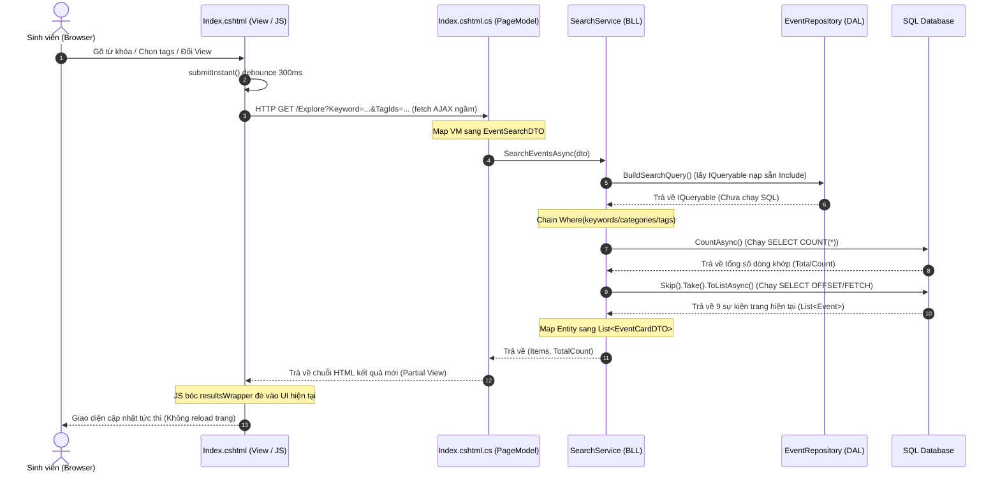
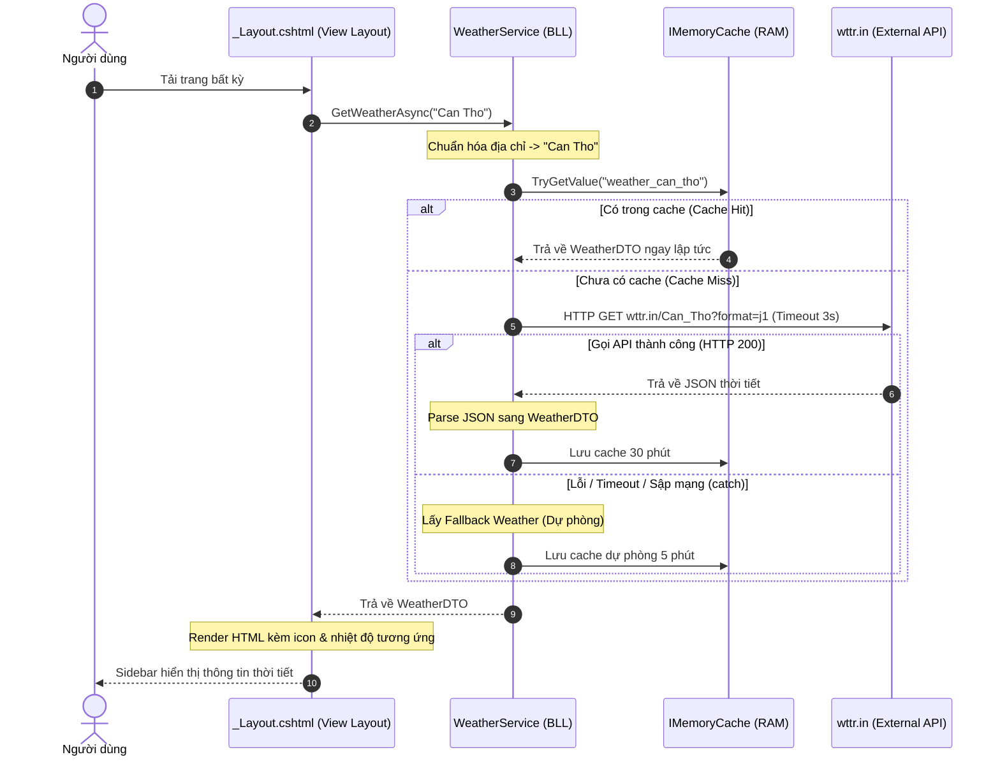

# Hướng Dẫn Vấn Đáp Môn Học (Backlog QuiNC)

> Đọc cái này trước khi lên bảng bị thầy hỏi. Giải thích được lý do tại sao code như vậy là qua môn ngon lành.

---

## 📂 Mấy file mình đã sửa/tạo mới

* **Tầng hiển thị (UI/Razor Pages)**
  - `Index.cshtml`: Giao diện Tìm kiếm, mấy cái nút lọc Tags, Category, Thời gian với phân trang AJAX (chạy ngầm không load lại trang).
  - `Index.cshtml.cs`: PageModel nhận request từ form, map sang DTO rồi gọi Service lấy data về.
  - `EventSearchViewModel.cs`: ViewModel chứa mấy thông tin lọc để giữ trạng thái form với lưu kết quả trả về.
  - `_Layout.cshtml`: Sidebar chứa Weather Widget hiện thời tiết.

* **Tầng logic (BLL)**
  - `SearchService.cs`: Chỗ xử lý filter động, phân trang Skip/Take với sắp xếp kết quả.
  - `WeatherService.cs`: Gọi API wttr.in, chuẩn hóa địa chỉ với cache 30 phút.

* **Tầng DB (DAL)**
  - `EventRepository.cs`: Viết câu BuildSearchQuery có Include sẵn để tránh lỗi N+1 query.

* **DTOs**
  - `EventSearchDTO.cs`, `EventCardDTO.cs`, `WeatherDTO.cs`: Mấy file trung gian để truyền data qua lại giữa các tầng cho chuẩn.

---

## 🎯 Chi Tiết 4 Chức Năng & Luồng Xử Xử Lý (Giải thích kiểu thực tế)

### Chức năng 1: Giao diện Explore Events (Grid vs List)
* **Ý tưởng**: Cho sinh viên chuyển đổi nhanh giữa xem dạng Lưới (Grid) hoặc Danh sách (List) ngay trên trang, có thêm hiệu ứng chấm LED trạng thái (sắp diễn ra, đang diễn ra) với đổi màu xám nếu sự kiện đã kết thúc để giao diện trông xịn hơn.
* **Flow chạy qua các file**:
  1. **Index.cshtml (Giao diện)**: Khi bấm đổi View, gọi hàm JS `changeView` để nhét chữ "Grid" hoặc "List" vào hidden input, rồi gọi AJAX fetch dữ liệu mới.
  2. **Index.cshtml.cs (PageModel)**: Nhận cái ViewType đó qua binding, gọi Service lấy đúng dữ liệu rồi trả về.
  3. **Index.cshtml (JS nhận kết quả)**: Lấy HTML mới đè vào khu vực `#resultsWrapper` để đổi giao diện mà không bị reload lại cả trang web.
* **Code cốt lõi**:
  ```javascript
  function changeView(viewType) {
      document.getElementById('viewTypeInput').value = viewType;
      submitInstant(); // Gọi AJAX gửi request ngầm lên server lấy HTML mới
  }
  ```

---

### Chức năng 2: Tìm kiếm & Lọc Đa Điều Kiện (Multi-tag)
* **Ý tưởng**: Cho sinh viên lọc sự kiện theo từ khóa, category, thời gian và nhiều tags cùng lúc. Lọc Tag dùng logic OR, tức là sự kiện chỉ cần dính 1 trong các tag được chọn là hiện lên.
* **Flow chạy qua các file**:
  1. **Index.cshtml.cs (PageModel)**: Tự động gom mấy cái tham số lọc trên URL (Keyword, TagIds, CategoryId) bỏ vào DTO.
  2. **SearchService.cs (BLL)**: Nhận DTO rồi nối (chain) thêm các điều kiện `Where` vào câu query `IQueryable`.
  3. **EventRepository.cs (DAL)**: Chạy câu query dưới SQL để lấy đúng kết quả đã lọc.
* **Code cốt lõi**:
  ```csharp
  // Lọc Multi-tag bằng logic OR (Dùng Any kết hợp Contains)
  if (searchDto.TagIds.Count > 0)
  {
      // Dùng Any để EF dịch thành EXISTS dưới SQL, chạy rất nhanh vì chỉ cần khớp 1 tag là xong
      query = query.Where(e => e.EventTags.Any(et => searchDto.TagIds.Contains(et.TagId)));
  }
  ```

---

### Chức năng 3: Phân trang phía Server (Server-Side Pagination)
* **Ý tưởng**: Lên Explore chỉ hiện 9 sự kiện một trang thôi để DB chạy cho nhẹ. Khi chuyển trang thì dùng AJAX gọi ngầm để không bị load lại trang, đồng thời dùng `.Include()` nạp trước data liên quan để tránh bị lỗi N+1 Query.
* **Flow chạy qua các file**:
  1. **EventRepository.cs (DAL)**: Include sẵn Venue, Tags, Organizer từ đầu để lúc map DTO không bị EF Core gọi DB lẻ tẻ thêm N lần nữa.
  2. **SearchService.cs (BLL)**: Chạy câu Count trước để biết tổng số lượng chia trang, xong rồi dùng Skip/Take để lấy đúng 9 sự kiện của trang đó.
  3. **Index.cshtml (Giao diện)**: JS hứng HTML mới, đè kết quả lên màn hình và dùng `history.pushState` đổi link trên URL để sinh viên tiện bookmark hay share link.
* **Code cốt lõi**:
  ```csharp
  // DAL: Include sẵn từ đầu để chặn N+1 query (1 câu SQL JOIN là lấy hết data liên quan luôn)
  public IQueryable<Event> BuildSearchQuery() {
      return _dbSet.AsNoTracking() // Dùng AsNoTracking vì trang này chỉ đọc, không cần EF theo dõi thay đổi làm gì cho nặng máy
          .Include(e => e.Venue)
          .Include(e => e.Organizer)
          .Include(e => e.Bookings)
          .Include(e => e.EventTags).ThenInclude(et => et.Tag);
  }

  // BLL: Skip/Take phân trang dưới SQL
  var totalCount = await query.CountAsync(); // Chạy câu SELECT COUNT(*) để đếm tổng sự kiện
  var skip = (searchDto.PageNumber - 1) * EventSearchDTO.PageSize; // Tính số sự kiện cần bỏ qua
  var events = await query.Skip(skip).Take(EventSearchDTO.PageSize).ToListAsync(); // Chỉ lấy đúng 9 bản ghi đem lên RAM
  ```

---

### Chức năng 4: Tích hợp API thời tiết (Weather Widget)
* **Ý tưởng**: Lấy thời tiết thực tế từ API wttr.in hiện lên sidebar. Cần chuẩn hóa địa chỉ Venue (ví dụ "Ninh Kiều, Cần Thơ" thành "Can Tho" cho API wttr.in nó hiểu). Dùng IMemoryCache để lưu thời tiết 30 phút, phòng trường hợp gọi API ngoài liên tục là bị nó chặn (rate limit) hoặc làm chậm trang web của mình.
* **Flow chạy qua các file**:
  1. **_Layout.cshtml (Giao diện)**: Inject `IWeatherService` rồi gọi `GetWeatherAsync("Can Tho")` lúc render layout trang web.
  2. **WeatherService.cs (BLL)**: 
     - Nhận địa điểm, làm sạch lấy tên thành phố không dấu bằng hàm `NormalizeLocation`.
     - Check Cache xem có thời tiết thành phố này chưa. Có rồi thì trả về luôn (mất chưa đầy 1ms).
     - Chưa có cache thì gọi API wttr.in, đặt Timeout tối đa 3 giây để API ngoài sập cũng không làm treo trang web của mình.
     - API chạy ngon thì lưu cache 30 phút. API sập thì chạy vào `catch`, lấy dữ liệu giả lập (Fallback data) hiển thị đại lên widget cho đẹp và lưu cache ngắn 5 phút để hệ thống vẫn mượt.
* **Code cốt lõi**:
  ```csharp
  // Bước 1: Check cache nhanh không cần lock để tăng tốc độ đọc
  if (_cache.TryGetValue(cacheKey, out WeatherDTO? cachedWeather)) return cachedWeather;

  // Bước 2: Dùng SemaphoreSlim khóa luồng (chỉ cho phép 1 luồng gọi API ngoài tại một thời điểm - chống Cache Stampede)
  await _weatherSemaphore.WaitAsync();
  try {
      // Re-check cache sau khi lock để tránh trường hợp luồng trước vừa cập nhật cache xong
      if (_cache.TryGetValue(cacheKey, out cachedWeather)) return cachedWeather;

      _httpClient.Timeout = TimeSpan.FromSeconds(3); // Giới hạn chờ 3 giây, tránh treo trang khi API sập
      string url = $"https://wttr.in/{Uri.EscapeDataString(normalized)}?format=j1";
      var response = await _httpClient.GetAsync(url);
      if (response.IsSuccessStatusCode) {
          // Parse JSON, map dữ liệu và lưu cache trong 30 phút
          _cache.Set(cacheKey, weather, TimeSpan.FromMinutes(30));
          return weather;
      }
  } catch {
      // API lỗi hoặc mất mạng thì dùng dữ liệu giả lập dự phòng cho widget vẫn chạy đẹp
  } finally {
      _weatherSemaphore.Release(); // Giải phóng Semaphore
  }

  var fallback = GetFallbackWeather(normalized);
  _cache.Set(cacheKey, fallback, TimeSpan.FromMinutes(5)); // Cache ngắn 5 phút
  return fallback;
  ```

---

## 🚀 Chi tiết luồng chạy qua từng file & Giải thích code

### 📊 Sơ đồ tuần tự (Sequence Diagram)

#### 1. Luồng Tìm Kiếm, Lọc & Phân Trang


#### 2. Luồng Tiện Ích Thời Tiết (Weather Widget)


---

### 1. Luồng Search, Filter & Phân Trang (Explore Page)

* **Bước 1: Trình duyệt gửi request ngầm (`Index.cshtml`)**
  - **Tên File**: `Index.cshtml`
  - **Logic chạy**: Khi mình gõ từ khóa hoặc chọn filter, JavaScript sẽ tự động đọc dữ liệu form, đổi link trên thanh URL (để sau này bookmark được) và gọi `fetch` để lấy HTML mới đè vào chỗ danh sách cũ mà không làm reload cả trang.
  - **Code & Giải thích**:
    ```javascript
    function submitInstant() {
        const formData = new FormData(form);
        const params = new URLSearchParams();
        for (const [key, value] of formData.entries()) {
            if (value) params.append(key, value); // Chỉ append mấy cái field có nhập/chọn thôi cho URL nó ngắn gọn
        }
        const newUrl = `${window.location.pathname}?${params.toString()}`;
        
        window.history.pushState({ path: newUrl }, '', newUrl); // Thay đổi URL trình duyệt ngầm, không reload trang

        fetch(newUrl) // Gửi request lên server
            .then(response => response.text()) // Nhận kết quả dạng text HTML
            .then(html => {
                const parser = new DOMParser();
                const doc = parser.parseFromString(html, 'text/html');
                // Lấy đúng phần danh sách kết quả mới (resultsWrapper) đè vào chỗ cũ để cập nhật UI
                document.getElementById('resultsWrapper').innerHTML = doc.getElementById('resultsWrapper').innerHTML;
            });
    }
    ```

* **Bước 2: PageModel nhận tham số URL (`Index.cshtml.cs`)**
  - **Tên File**: `Index.cshtml.cs`
  - **Logic chạy**: ASP.NET Core tự động bind các tham số trên URL vào object `SearchVm`. Sau đó, mình map sang DTO rồi truyền xuống BLL.
  - **Code & Giải thích**:
    ```csharp
    [BindProperty(SupportsGet = true)] // SupportsGet = true để tự lấy param từ URL gán vào object này
    public EventSearchViewModel SearchVm { get; set; } = new();

    public List<Guid> BookmarkedEventIds { get; set; } = new();

    public async Task<IActionResult> OnGetAsync(CancellationToken cancellationToken)
    {
        if (!ModelState.IsValid)
            return Page();

        // Lấy danh sách bookmark nếu sinh viên đã đăng nhập và có role Student
        if (CurrentStudentId.HasValue && User.IsInRole("Student"))
        {
            BookmarkedEventIds = await _context.Bookmarks
                .Where(b => b.StudentId == CurrentStudentId.Value)
                .Select(b => b.EventId)
                .ToListAsync(cancellationToken);
        }

        try
        {
            SearchVm.Categories = (await _categoryRepo.GetAllAsync(cancellationToken)).ToList();
            SearchVm.Tags = (await _tagRepo.GetAllAsync(cancellationToken)).ToList();
        }
        catch (Exception ex)
        {
            _logger.LogError(ex, "Không load được danh sách category/tag trên trang chủ");
        }

        var searchDto = new EventSearchDTO
        {
            Keyword = SearchVm.Keyword,
            CategoryId = SearchVm.CategoryId,
            TagIds = SearchVm.TagIds,
            TimeFilter = SearchVm.TimeFilter,
            StartDate = SearchVm.StartDate,
            EndDate = SearchVm.EndDate,
            PageNumber = SearchVm.PageNumber,
            SortBy = SearchVm.SortBy
        };

        // Gọi Service ở tầng BLL
        var (items, totalCount) = await _searchService.SearchEventsAsync(searchDto, cancellationToken);

        // Đổ data nhận được vào ViewModel để trang View đọc và hiển thị
        SearchVm.Results = items;
        SearchVm.TotalCount = totalCount;
        SearchVm.PageNumber = Math.Clamp(SearchVm.PageNumber, 1, Math.Max(1, SearchVm.TotalPages));
        return Page();
    }
    ```

* **Bước 3: Service xử lý logic lọc & phân trang (`SearchService.cs`)**
  - **Tên File**: `SearchService.cs`
  - **Logic chạy**: Service lấy câu truy vấn gốc từ Repo, sau đó chain thêm các `Where` tương ứng nếu người dùng có chọn filter. Cuối cùng chạy Count lấy tổng số lượng rồi Skip/Take để lấy đúng trang hiện tại.
  - **Code & Giải thích**:
    ```csharp
    public async Task<(List<EventCardDTO> Items, int TotalCount)> SearchEventsAsync(EventSearchDTO searchDto, CancellationToken cancellationToken)
    {
        var query = _eventRepo.BuildSearchQuery(); // Lấy câu truy vấn có nạp sẵn liên kết (chống N+1)

        // Chỉ hiển thị sự kiện đã xuất bản (Published)
        query = query.Where(e => e.Status == "Published");

        // Chỉ lọc từ khóa nếu người dùng có nhập từ khóa thực tế
        var keyword = searchDto.Keyword?.Trim();
        if (!string.IsNullOrEmpty(keyword))
            query = query.Where(e => e.Title.Contains(keyword) || e.Description.Contains(keyword));

        // Lọc category
        if (searchDto.CategoryId.HasValue && searchDto.CategoryId > 0)
            query = query.Where(e => e.EventCategories.Any(ec => ec.CategoryId == searchDto.CategoryId));

        // Lọc multi-tag: Logic OR, chỉ cần sự kiện dính 1 trong các tag được chọn là ok
        if (searchDto.TagIds.Count > 0)
            query = query.Where(e => e.EventTags.Any(et => searchDto.TagIds.Contains(et.TagId)));

        // Lọc theo khoảng thời gian TimeFilter (Upcoming, Ongoing, Past)
        var now = DateTime.UtcNow;
        query = searchDto.TimeFilter switch
        {
            "Upcoming" => query.Where(e => e.StartTime > now),
            "Ongoing" => query.Where(e => e.StartTime <= now && e.EndTime >= now),
            "Past" => query.Where(e => e.EndTime < now),
            _ => query
        };

        // Lọc theo ngày bắt đầu/kết thúc cụ thể
        if (searchDto.StartDate.HasValue)
            query = query.Where(e => e.StartTime >= searchDto.StartDate.Value);

        if (searchDto.EndDate.HasValue)
        {
            var endOfDay = searchDto.EndDate.Value.Date.AddDays(1).AddTicks(-1);
            query = query.Where(e => e.StartTime <= endOfDay);
        }

        // Đếm tổng số lượng sự kiện khớp để hiển thị tổng số và tính số trang
        var totalCount = await query.CountAsync(cancellationToken);

        // Sắp xếp kết quả
        query = searchDto.SortBy switch
        {
            "DateDesc" => query.OrderByDescending(e => e.StartTime),
            "NameAsc" => query.OrderBy(e => e.Title),
            "NameDesc" => query.OrderByDescending(e => e.Title),
            "Popularity" => query.OrderByDescending(e => e.Bookings.Count),
            _ => query.OrderBy(e => e.EndTime < now)
                      .ThenBy(e => e.StartTime > now)
                      .ThenBy(e => e.StartTime)
        };

        // Phân trang: Bỏ qua mấy trang trước và chỉ lấy đúng PageSize (ví dụ: 9) sự kiện cho trang này
        var skip = (searchDto.PageNumber - 1) * EventSearchDTO.PageSize;
        var events = await query.Skip(skip).Take(EventSearchDTO.PageSize).ToListAsync(cancellationToken);

        // Map sang DTO gọn nhẹ để gửi ngược lại lên UI bằng AutoMapper
        var items = _mapper.Map<List<EventCardDTO>>(events);

        return (items, totalCount);
    }
    ```

* **Bước 4: Repository nạp trước dữ liệu (`EventRepository.cs`)**
  - **Tên File**: `EventRepository.cs`
  - **Logic chạy**: Repo chỉ xây dựng câu query thôi chứ chưa chạy xuống DB (vì trả về `IQueryable`). Mình dùng `AsNoTracking` để tăng tốc và dùng `Include` để nạp sẵn dữ liệu liên quan.
  - **Code & Giải thích**:
    ```csharp
    public IQueryable<Event> BuildSearchQuery()
    {
        return _dbSet
            .AsNoTracking() // Trang này chỉ hiển thị, không cập nhật gì nên tắt tracking cho EF Core chạy nhanh hơn
            .Include(e => e.Venue) // Nạp trước Venue để lấy tên địa điểm hiển thị trên Card
            .Include(e => e.Organizer) // Nạp trước Organizer để lấy tên người tổ chức
            .Include(e => e.Bookings) // Nạp trước Bookings để tính xem còn vé hay hết chỗ
            .Include(e => e.EventTags).ThenInclude(et => et.Tag) // JOIN bảng EventTags -> Tags để lấy tên tag
            .Include(e => e.EventCategories);
    }
    ```

---

### 2. Luồng Weather Widget (Sidebar)

* **Bước 1: Layout gọi lấy thời tiết (`_Layout.cshtml`)**
  - **Tên File**: `_Layout.cshtml`
  - **Logic chạy**: Bất cứ trang nào load lên cũng gọi qua Layout chung này để lấy thời tiết hiện lên sidebar.
  - **Code & Giải thích**:
    ```html
    @inject BLL.Services.IWeatherService WeatherService
    @{
        // Gọi thẳng BLL lấy thời tiết Cần Thơ làm mặc định lúc render layout
        var campusWeather = await WeatherService.GetWeatherAsync("Can Tho");
    }
    ...
    @if (campusWeather != null) {
        <!-- Có dữ liệu thời tiết thì vẽ giao diện sidebar -->
        <div class="sidebar-weather-card">
            <span>@campusWeather.Temperature.ToString("0")°C</span>
            <i class="bi @campusWeather.WeatherIconClass"></i>
            <div>@campusWeather.Condition</div>
        </div>
    }
    ```

* **Bước 2: Service xử lý cache và gọi wttr.in (`WeatherService.cs`)**
  - **Tên File**: `WeatherService.cs`
  - **Logic chạy**: Service nhận địa điểm, chuẩn hóa lấy tên thành phố chuẩn không dấu, check xem cache có chưa. Nếu chưa có cache thì gọi API wttr.in, giới hạn chờ tối đa 3 giây để tránh làm đơ web của mình khi API ngoài bị sập. Nếu lỗi thì dùng fallback data.
  - **Code & Giải thích**:
    ```csharp
    public async Task<WeatherDTO?> GetWeatherAsync(string location)
    {
        string normalized = NormalizeLocation(location); // Tách dấu phẩy, bỏ chữ TP., Tỉnh...
        string cacheKey = $"weather_{normalized.ToLower().Replace(" ", "_")}";

        // Check cache trong RAM: Có thì lấy luôn cho nhanh, đỡ tốn công gọi API ngoài
        if (_cache.TryGetValue(cacheKey, out WeatherDTO? cachedWeather)) return cachedWeather;

        try {
            _httpClient.Timeout = TimeSpan.FromSeconds(3); // API ngoài sập thì tối đa 3 giây là tự ngắt để tránh treo web
            string url = $"https://wttr.in/{Uri.EscapeDataString(normalized)}?format=j1";
            var response = await _httpClient.GetAsync(url);
            
            if (response.IsSuccessStatusCode) {
                var jsonString = await response.Content.ReadAsStringAsync();
                var weather = ParseWeatherFromJson(jsonString, normalized); // Đọc JSON map sang DTO
                
                _cache.Set(cacheKey, weather, TimeSpan.FromMinutes(30)); // Gọi API thành công thì lưu cache 30 phút
                return weather;
            }
        }
        catch {
            // Lỗi mạng, API sập... sẽ nhảy vào catch
        }

        // Tự phục hồi: Trả về thời tiết giả lập ngẫu nhiên hợp lý và cache ngắn 5 phút
        var fallback = GetFallbackWeather(normalized);
        _cache.Set(cacheKey, fallback, TimeSpan.FromMinutes(5));
        return fallback;
    }
    ```

---

## 💬 Tổng Hợp Các Câu Hỏi Thầy Hay Hỏi Khi Chấm Bài

1. **Tại sao không dùng `AsTracking` hoặc tại sao repository lại dùng `AsNoTracking`?**
   * *Trả lời*: Trang Khám phá sự kiện chỉ hiển thị dữ liệu để đọc (Read-only) chứ không có tác vụ cập nhật/chỉnh sửa DB trực tiếp. Sử dụng `AsNoTracking` giúp EF Core không mất tài nguyên theo dõi sự thay đổi của đối tượng trong bộ nhớ, cải thiện hiệu năng và giảm RAM đáng kể.

2. **Truy vấn N+1 là gì và giải quyết như thế nào trong bài này?**
   * *Trả lời*: N+1 xảy ra khi ta lấy ra danh sách N sự kiện, nhưng mỗi sự kiện khi render lại phải gọi DB thêm 1 lần để lấy thông tin Venue hoặc Tags tương ứng (tổng cộng phát sinh N+1 câu query). Ta giải quyết triệt để bằng cách dùng `.Include(e => e.Venue).Include(e => e.EventTags).ThenInclude(et => et.Tag)` ngay trong repository để gom tất cả thông tin cần thiết vào 1 câu lệnh SQL JOIN duy nhất.

3. **Tại sao bộ lọc Tag lại dùng logic OR (`Any` + `Contains`) mà không dùng AND?**
   * *Trả lời*: Theo nghiệp vụ thực tế của SV, khi tích chọn các tag như "Công nghệ" và "Hội thảo", SV muốn tìm các sự kiện thuộc một trong hai nhóm này (chọn cái nào cũng được). Do đó, chỉ cần sự kiện có chứa ít nhất một tag trong danh sách được chọn là hiển thị (Logic OR).

4. **Tại sao gọi API thời tiết ngoài mà lại không dùng `try/catch` bắt lỗi ném ra ngoài (throw)?**
   * *Trả lời*: Thời tiết chỉ là tính năng bổ sung (Widget). Nếu dịch vụ thời tiết bên thứ ba sập hoặc mất kết nối mạng, trang web chính vẫn phải hoạt động bình thường. Ta dùng `try-catch` nội bộ và trả về dữ liệu giả làm (Fallback data) để trang web không bị crash lỗi 500.

5. **Giải thích AJAX một cách đơn giản, ứng dụng như thế nào trong bài?**
   * *Trả lời*: AJAX (Asynchronous JavaScript and XML) là kỹ thuật gửi và nhận dữ liệu ngầm giữa Trình duyệt và Server mà **không cần load lại toàn bộ trang web**.
     - Khi sinh viên gõ tìm kiếm hoặc bấm phân trang, JS sẽ gọi hàm `fetch(newUrl)` gửi request ngầm lên PageModel.
     - PageModel xử lý xong chỉ trả về phần HTML danh sách sự kiện mới. JS nhận được sẽ dùng `innerHTML` đè đè phần HTML này vào khu vực chứa kết quả (`#resultsWrapper`). Nhờ thế giao diện cập nhật ngay lập tức và giữ nguyên trạng thái cuộn trang.

6. **Cache Stampede là gì và SemaphoreSlim giúp ích gì trong WeatherService?**
   * *Trả lời*: 
     - **Cache Stampede** (Bão Cache) xảy ra khi dữ liệu cache hết hạn ngay tại thời điểm có nhiều người dùng truy cập trang web đồng thời. Khi đó, tất cả các luồng xử lý đều thấy cache trống và đồng loạt gửi request tới API ngoài (wttr.in), làm treo ứng dụng hoặc bị API ngoài chặn.
     - **SemaphoreSlim** đóng vai trò là một chiếc **khóa cửa (Lock)**. Khi cache trống, chỉ cho phép đúng 1 luồng duy nhất đi qua cửa để gọi API ngoài wttr.in và nạp lại Cache. Các luồng khác phải xếp hàng đợi. Khi luồng đầu tiên làm xong và nhả khóa, các luồng sau sẽ check lại cache (Double-checked locking) và lấy trực tiếp dữ liệu từ cache RAM luôn, không gọi ra API ngoài nữa.

7. **AutoMapper dùng để làm gì và tại sao lại cần thiết?**
   * *Trả lời*: 
     - AutoMapper là thư viện giúp tự động sao chép (map) dữ liệu từ Entity (các bảng dưới DB) sang DTO (Data Transfer Object - vật chứa data gọn nhẹ để truyền lên UI).
     - Việc dùng AutoMapper giúp tránh việc phải viết code gán thủ công từng thuộc tính (`dto.Title = event.Title; ...`) cho hàng loạt đối tượng, giúp code ngắn gọn hơn nhiều, hạn chế sai sót và tránh lỗi tham chiếu vòng (Circular Dependency) giữa các tầng.
