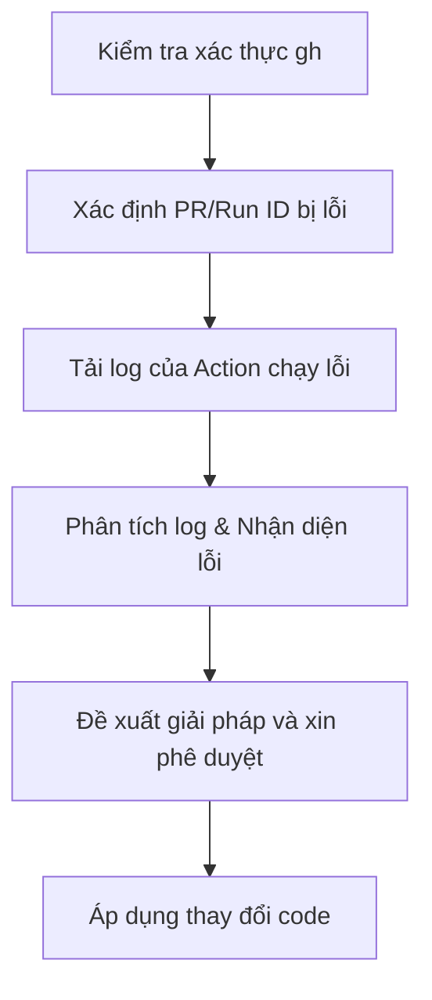

# Skill: GitHub Actions CI Fixer

---
name: github-ci-fixer
description: Tự động hóa quy trình chẩn đoán và khắc phục lỗi GitHub Actions CI check trên các Pull Request.
---

## 1. Tổng quan (Overview)
Kỹ năng này sử dụng GitHub CLI (`gh`) để kiểm tra các check bị lỗi, tải log từ GitHub Actions, phân tích nguyên nhân và đề xuất phương án sửa đổi.

## 2. Yêu cầu hệ thống (Prerequisites)
- Cài đặt GitHub CLI và thực hiện đăng nhập qua: `gh auth login` với các quyền `repo` và `workflow`.
- Kiểm tra trạng thái xác thực bằng: `gh auth status`.

## 3. Quy trình xử lý lỗi CI/CD (Workflow)



### Bước 1: Xác định PR hoặc Branch hiện tại
```bash
gh pr view --json number,url,state
```

### Bước 2: Liệt kê các Check đang chạy hoặc bị lỗi
```bash
gh pr checks
```

### Bước 3: Tải Logs của Workflow bị lỗi
Sử dụng Run ID thu được từ danh sách check để tải log chi tiết:
```bash
gh run view <run-id> --log-failed
```

### Bước 4: Nhận diện lỗi phổ biến
- **Lỗi Biên dịch (Build Errors):** Thiếu package, sai phiên bản SDK .NET 9.
- **Lỗi Kiểm thử (Failed Tests):** Kiểm thử bất định (flaky tests), thiếu cấu hình DB môi trường test.
- **Lỗi Phân tích Tĩnh (Linter/Format):** Code không tuân thủ quy tắc định dạng dotnet format.

### Bước 5: Đề xuất sửa đổi
- Phác thảo kế hoạch khắc phục lỗi ngắn gọn.
- Chỉ thực hiện thay đổi mã nguồn hoặc file workflow sau khi nhận được sự đồng ý rõ ràng từ User.
- Đối với các dịch vụ CI bên ngoài (ví dụ: Buildkite, CircleCI), chỉ ghi nhận URL báo cáo lỗi và không cố tự động sửa đổi.
