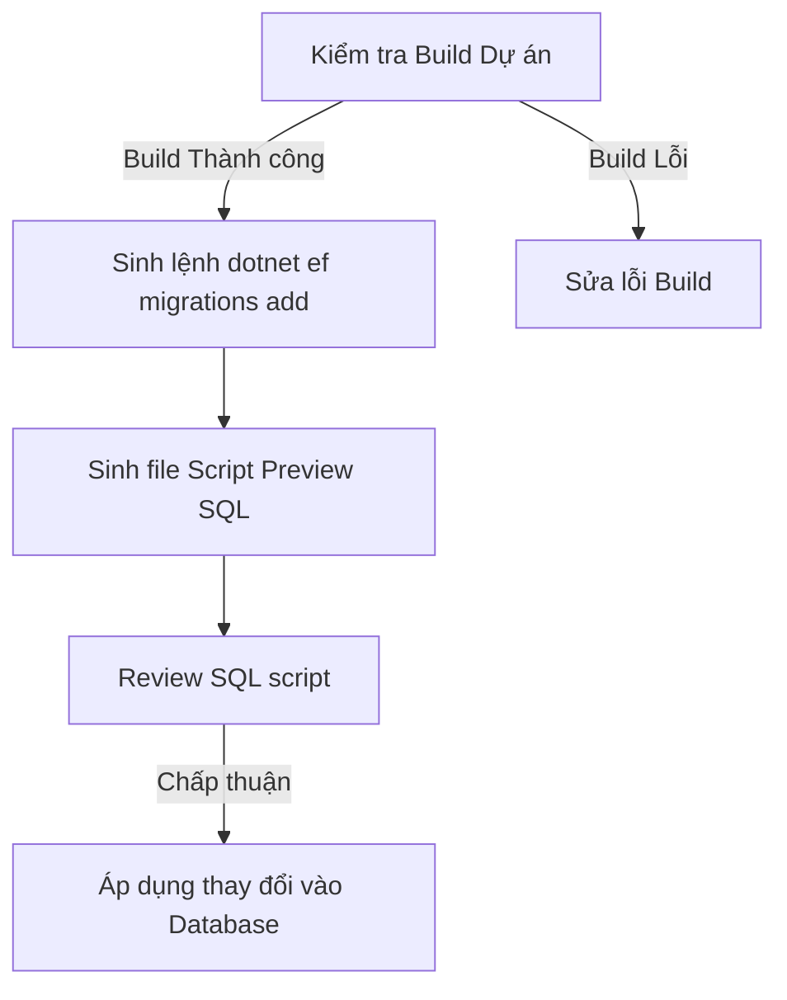

# Quy trình Migration Cơ sở Dữ liệu (EF Core Migration Workflow)

Quy trình quản lý các thay đổi cơ sở dữ liệu và đồng bộ hóa qua Entity Framework Core Migrations.

## Các bước thực hiện Migration



### Bước 1: Kiểm tra Build dự án (Build Check)
Trước khi sinh migration, bắt buộc kiểm tra xem dự án có biên dịch thành công không:
```bash
dotnet build
```
Nếu có lỗi build, phải khắc phục triệt để trước khi chuyển sang bước tiếp theo.

### Bước 2: Sinh lệnh tạo Migration (Create Migration)
Chạy lệnh CLI của EF Core để sinh file migration mới:
```bash
dotnet ef migrations add <MigrationName> --project <DALProjectPath> --startup-project <PLProjectPath>
```
*Lưu ý: Thay thế `<MigrationName>` bằng tên mô tả ngắn gọn định dạng PascalCase (ví dụ: `AddEventTagTable`).*

### Bước 3: Sinh file Script SQL Preview (SQL Preview Generation)
Để kiểm tra các câu lệnh SQL thực tế sẽ được chạy trên SQL Server, sinh file script preview:
```bash
dotnet ef migrations script -o .agents/docs/previews/migration-preview.sql --project <DALProjectPath> --startup-project <PLProjectPath>
```
Kiểm tra kỹ file SQL này để đảm bảo không có câu lệnh nguy hiểm (ví dụ: DROP TABLE ngoài ý muốn) hoặc sai sót về kiểu dữ liệu.
