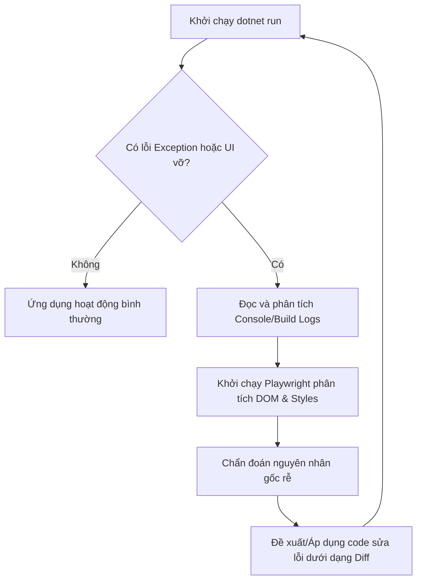

# Workflow: Vibe Coding Auto-Healing

Quy trình tự động phát hiện, chẩn đoán và khắc phục lỗi khi chạy ứng dụng (Auto-Healing) trong chế độ "Vibe Coding" mà không cần làm phiền hay hỏi ý kiến User.

---

## 1. Trực quan hóa Luồng Tự Chữa Lành (Auto-Healing Loop)

---

## 2. Các Bước Thực Hiện Chi Tiết

### Bước 1: Giám sát Console & Build Logs (Inspection)
- Khi thực hiện lệnh `dotnet run` hoặc `dotnet build` mà xuất hiện lỗi ngoại lệ (Exception) hoặc dừng đột ngột:
  - Agent bắt buộc phải chụp lại toàn bộ log lỗi từ cửa sổ terminal hoặc log file.
  - Tuyệt đối không dừng lại để hỏi User về chi tiết lỗi này.

### Bước 2: Kiểm tra Giao diện bằng Playwright (DOM & UI Audit)
- Nếu lỗi liên quan đến giao diện người dùng (ví dụ: giao diện Kinetic Glass bị vỡ layout, sai CSS):
  - Agent sử dụng tool `@modelcontextprotocol/server-playwright` khởi chạy trình duyệt ngầm.
  - Điều hướng vào URL của trang web (Localhost).
  - Phân tích cấu trúc DOM, truy xuất styles bị lỗi, kiểm tra console log của trình duyệt để xác định lỗi JavaScript hoặc lỗi tải tài nguyên (404/500).

### Bước 3: Chẩn đoán & Đề xuất Khắc phục (Diagnosis & Fix)
- Xác định nguyên nhân gốc rễ (ví dụ: thiếu DI, cấu hình Fluent API sai, CSS selector sai).
- **TUYỆT ĐỐI** không viết lại hay sinh lại toàn bộ file mã nguồn.
- Chỉ đề xuất hoặc sửa đổi trực tiếp phần code bị lỗi kèm theo comment phân tách rõ ràng dạng git diff hoặc thay đổi cục bộ (`// ... existing code ...`).
