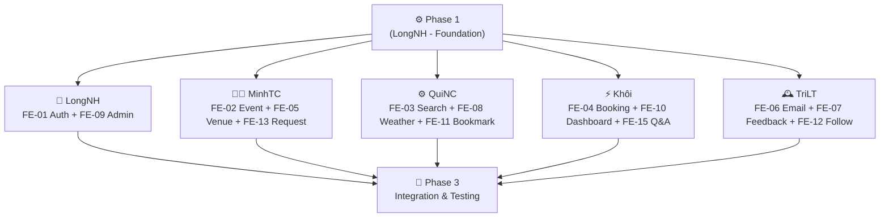

# 🎯 UniEvent Hub — Kế Hoạch Phân Công Nhiệm Vụ

> **Tech Stack:** ASP.NET Core 8.0 · EF Core · MVC · Razor Pages · Blazor · SignalR · TPL · PLINQ  
> **Kiến trúc:** 3-Layer (DAL → BLL → PL) · Repository Pattern · Unit of Work · DI

---

## 📅 GIAI ĐOẠN 1 — FOUNDATION (Làm trước, cả nhóm phụ thuộc)

> [!IMPORTANT]
> **LongNH (Nhóm trưởng)** phải hoàn thành giai đoạn này trước khi cả nhóm bắt đầu làm song song.

| # | Việc cần làm | Ghi chú kỹ thuật |
|---|---|---|
| 1 | Định nghĩa đầy đủ 15 Entity trong `DAL` | Theo schema tại `UNIEVENT_LAUNCHPAD.md` |
| 2 | Cấu hình `[Timestamp] RowVersion` cho Entity `Event` | Phục vụ Optimistic Concurrency của **Khôi** |
| 3 | Cấu hình `DeleteBehavior.Restrict` (Venue → Events) | Phục vụ **MinhTC** xử lý Exception ở Service |
| 4 | Xây dựng `IRepository<T>` & `BaseRepository<T>` | Cả nhóm kế thừa, không chọc thẳng vào DbContext |
| 5 | Đăng ký DI tổng (DbContext, Repositories, Services) | File cấu hình tập trung, mọi thành viên dùng chung |
| 6 | Chạy Migration đầu tiên + Seed Data mẫu | User, Category, Tag, Venue để cả nhóm có dữ liệu test |
| 7 | Push lên nhánh `develop` | Cả nhóm `git pull` về làm việc |

---

## 📅 GIAI ĐOẠN 2 — PARALLEL DEVELOPMENT (Làm song song)

> [!NOTE]
> Sau khi Giai đoạn 1 xong, mỗi thành viên tạo nhánh riêng từ `develop` và làm đồng thời.

---

### 👑 LongNH — Nhóm trưởng | MVC Identity & Admin
**Nhánh:** `feature/longnh-auth` & `feature/longnh-admin`

```
DAL/  → (Đã xong từ Phase 1)
BLL/  → UserService, AdminService
MVC/  → AccountController, AdminController + Razor Views
```

| Task | Công nghệ chính | Chi tiết |
|---|---|---|
| **FE-01** Identity & Auth | ASP.NET Core MVC · Cookie/JWT | Đăng ký, Đăng nhập, phân quyền RBAC · `[Authorize(Roles="Admin")]` | Done |
| **FE-09** Admin Control Panel | MVC Controller + View | Dashboard user/event · Khóa tài khoản · Force logout qua Unit of Work | Done |

---

### 👨‍💻 MinhTC — Organizer Core | Razor Pages
**Nhánh:** `feature/minhtc-event-crud` & `feature/minhtc-venue` & `feature/minhtc-request`

```
DAL/  → IEventRepository, IVenueRepository (kế thừa BaseRepository)
BLL/  → EventService, VenueService, EventRequestService
RazorPages/ → Pages/Events/, Pages/Venues/, Pages/Requests/
```

| Task | Công nghệ chính | Chi tiết |
|---|---|---|
| **FE-02** Event CRUD | Razor Pages · AutoMapper | `.cshtml` + `.cshtml.cs` · Map Entity ↔ DTO · Gọi qua `IEventService` |
| **FE-05** Venue Limits | Razor Pages | Sức chứa tối đa · Bắt Exception từ `DeleteBehavior.Restrict` ở PageModel |
| **FE-13** Event Requests | Razor Pages | Duyệt ý tưởng (Pending → Approved) · `[BindProperty]` chống Over-posting |

---

### ⚙️ QuiNC — Query Optimization | Razor Pages
**Nhánh:** `feature/quinc-search` & `feature/quinc-weather` & `feature/quinc-bookmark`

```
DAL/  → Bổ sung query methods vào EventRepository
BLL/  → SearchService, WeatherService (IMemoryCache), BookmarkService
RazorPages/ → Pages/Explore/, Pages/Bookmarks/
```

| Task | Công nghệ chính | Chi tiết |
|---|---|---|
| **FE-03** Search & Filter | Razor Pages · LINQ | `.Include().ThenInclude()` chống N+1 Query · Phân trang `.Skip().Take()` ở BLL |
| **FE-08** Weather Widget | `HttpClient` · `IMemoryCache` | Gọi API thời tiết bên thứ 3 · Cache 30 phút để tối ưu |
| **FE-11** Bookmark | Razor Page Handlers | `OnPostToggleBookmarkAsync` · Thêm/xóa nguyên tử qua Service |

---

### ⚡ Khôi — Real-time Master | Blazor & SignalR
**Nhánh:** `feature/khoi-booking` & `feature/khoi-dashboard` & `feature/khoi-qa`

```
DAL/  → BookingRepository, CommentRepository
BLL/  → BookingService (Concurrency), SignalR Hub, RateLimiter
Blazor/ → Components/Booking/, Components/Dashboard/, Components/QA/
```

| Task | Công nghệ chính | Chi tiết |
|---|---|---|
| **FE-04** Live Ticket Booking | Blazor · Optimistic Concurrency | Bắt `DbUpdateConcurrencyException` · Thông báo hết vé real-time về UI |
| **FE-10** Live Dashboard | Blazor · SignalR Hub | WebSocket payload siêu nhẹ: `{ EventId, RemainingSeats }` |
| **FE-15** Live Q&A Hub | Blazor · SignalR Hub | Broadcast bình luận · Rate Limiting chặn spam comment ở BLL |

---

### 🕰️ TriLT — Parallel Programming | Worker Service
**Nhánh:** `feature/trilt-email-worker` & `feature/trilt-feedback` & `feature/trilt-follows`

```
DAL/  → ReminderRepository, FeedbackRepository, FollowRepository
BLL/  → FeedbackAnalyticsService (PLINQ), FollowService
Worker/ → EmailReminderWorker (BackgroundService)
```

| Task | Công nghệ chính | Chi tiết |
|---|---|---|
| **FE-06** Email Reminders | `BackgroundService` · TPL | `Parallel.ForEachAsync` / `Task.WhenAll` gửi 1000 mail song song |
| **FE-07** Feedback + Metrics | PLINQ · Blazor/MVC | `.AsParallel()` tính điểm đa tiêu chí trên nhiều luồng CPU |
| **FE-12** Follows System | Razor/MVC · `.CountAsync()` | Tính số Followers bằng query, không load toàn bộ dữ liệu vào RAM |

---

## 🛠️ GIAI ĐOẠN 3 — INTEGRATION & TESTING

> [!TIP]
> Sau khi mỗi feature branch được merge vào `develop`, cả nhóm cùng thực hiện Integration Test.

- [ ] Merge tất cả feature branches vào `develop` (qua Pull Request)
- [ ] Test luồng đặt vé end-to-end (MVC Auth → Razor Pages Event → Blazor Booking → SignalR Dashboard)
- [ ] Test gửi email Background (kích hoạt Worker, kiểm tra log)
- [ ] Test PLINQ Feedback (so sánh hiệu năng vs vòng lặp thường)
- [ ] Merge `develop` → `main` và demo final

---

## 🔀 QUY TRÌNH GIT WORKFLOW

> [!WARNING]
> **Không commit trực tiếp lên `main` hoặc `develop`.** Mọi thay đổi phải qua Pull Request.

### Naming Convention

```
feature/[tên]-[tên-task]
Ví dụ:
  feature/longnh-auth
  feature/minhtc-event-crud
  feature/quinc-weather
  feature/khoi-booking
  feature/trilt-email-worker
```

### Daily Workflow (Quy trình hàng ngày)

```bash
# 🌅 Đầu buổi — Đồng bộ code mới nhất từ develop
git checkout develop
git pull origin develop
git checkout feature/[tên-nhánh-của-bạn]
git merge develop          # Lấy code mới từ develop vào nhánh cá nhân

# 🌙 Cuối buổi — Push code lên
git add .
git commit -m "feat: [mô tả ngắn gọn việc đã làm]"
git push origin feature/[tên-nhánh-của-bạn]
```

### Pull Request Rules

| Rule | Mô tả |
|---|---|
| 👑 **LongNH duyệt PR** | Nhóm trưởng review code trước khi merge vào `develop` |
| ✅ **Build phải xanh** | `dotnet build` không có lỗi |
| 📝 **Có mô tả PR** | Ghi rõ task nào, làm gì, test ra sao |
| 🚫 **Không force push** | Không dùng `git push --force` lên `develop` hay `main` |

---

## 📊 PHÂN CẤP PHỤ THUỘC KỸ THUẬT


