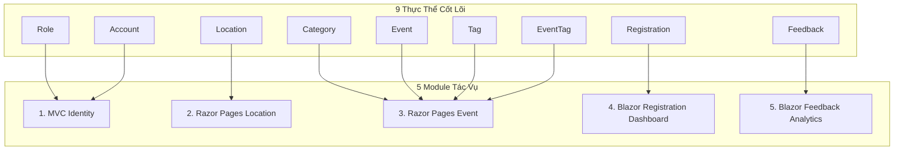

# UniEvent Hub Workspace Launchpad

Hệ thống workspace đã được khởi tạo thành công và sẵn sàng cho quá trình Scaffolding dự án Greenfield **UniEvent Hub** dưới sự quản lý của Senior .NET 9 Architect & AI Workspace Optimizer.

---

## 1. Sơ đồ Ánh xạ Thực thể (Entity-to-Module Mapping)

Hệ thống bao gồm **9 thực thể cốt lõi** được tổ chức và phân chia thành **5 module/tác vụ chính**:



### Chi tiết phân bổ thực thể:
| STT | Phân hệ Module | Công nghệ chính | Thực thể liên quan | Mô tả tác vụ |
|:---|:---|:---|:---|:---|
| **1** | MVC (Identity) | ASP.NET Core MVC & ASP.NET Core Identity | `Role`, `Account` | Quản lý định danh, xác thực và phân quyền người dùng hệ thống. |
| **2** | Razor Pages (Location) | Razor Pages | `Location` | Quản lý địa điểm tổ chức sự kiện (sức chứa, tiện ích). |
| **3** | Razor Pages (Event) | Razor Pages, EF Core Many-to-Many | `Event`, `Category`, `Tag`, `EventTag` | Quản lý sự kiện, danh mục và các thẻ gắn kèm. |
| **4** | Blazor Dashboard | Blazor (MudBlazor) & SignalR | `Registration` | Bảng điều khiển thời gian thực giám sát lượt đăng ký tham gia sự kiện. |
| **5** | Blazor Analytics | Blazor (MudBlazor) & PLINQ | `Feedback` | Phân tích và xử lý phản hồi/đánh giá quy mô lớn. |

---

## 2. 3 Lệnh Mẫu Bắt Đầu (Launch Commands)

Hãy sao chép các lệnh dưới đây để bắt đầu phát triển:

### Lệnh 1: Dựng khung Project ASP.NET Core 9.0
Sử dụng `dotnet-template-mcp` để sinh cấu trúc giải pháp (Solution) theo chuẩn Clean Architecture:
```text
@dotnet-template-mcp create-solution --name UniEventHub --template clean-arch-net9 --output ./
```

### Lệnh 2: Sinh kiến trúc ERD mẫu từ Database
Sử dụng `SqlAugur` chế độ Read-Only để phân tích cấu trúc bảng hiện tại và vẽ sơ đồ ERD cho 9 thực thể:
```text
@SqlAugur generate-erd --connection-string "Server=localhost;Database=UniEventHubDb;Trusted_Connection=True;TrustServerCertificate=True;" --read-only true
```

### Lệnh 3: Tạo thực thể đầu tiên bằng EF Core
Thực hiện thiết lập thực thể `Role` và `Account` đầu tiên, đồng thời khởi chạy quy trình Migration:
```text
@workspace Hãy bắt đầu dựng thực thể Role và Account theo quy trình scaffold-module.md và chuẩn bị chạy migration đầu tiên.
```
