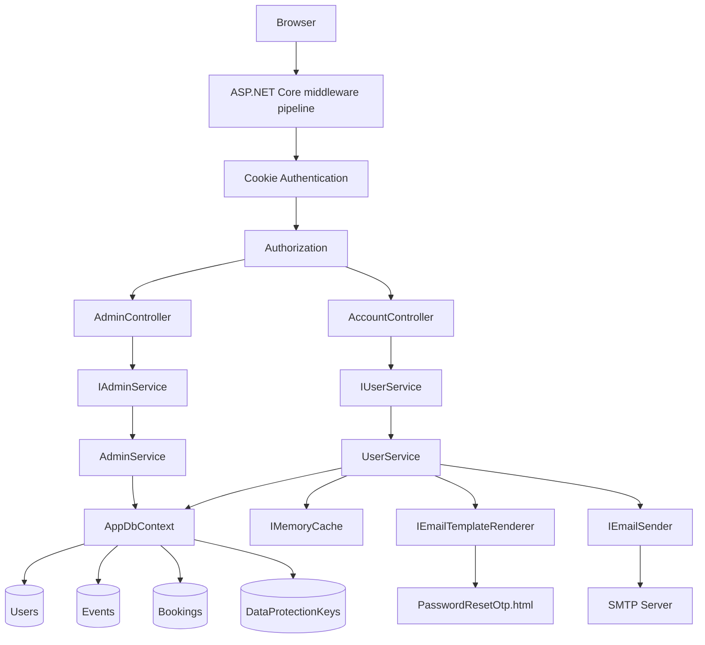

# Hướng dẫn vấn đáp MVC — Nguyễn Hoàng Long

> Phạm vi: **FE-01 Identity & Authentication** và **FE-09 Admin Control Panel** trong project `MVC`, cùng các contract/service/entity/configuration trực tiếp phục vụ hai chức năng này ở `BLL` và `DAL`.
>
> Tài liệu giải thích theo **code đang chạy hiện tại**. `RazorPages` không thuộc phạm vi phân tích. Khi MVC chuyển hướng sang cổng khác, tài liệu chỉ giải thích URL đầu ra, không phân tích code của ứng dụng đích.

---

## 1. Câu trả lời 30 giây khi giảng viên hỏi “Em làm phần gì?”

Em phụ trách hai nhóm chức năng:

1. **FE-01 — Identity & Auth**: đăng ký tài khoản Student, đăng nhập bằng cookie, đăng xuất, phân quyền theo role, giữ `returnUrl`, quên mật khẩu bằng OTP và kiểm tra lại trạng thái tài khoản đang đăng nhập.
2. **FE-09 — Admin Control Panel**: dashboard thống kê, danh sách user có phân trang, tạo Student/Organizer, đổi role, khóa/mở khóa tài khoản và làm cookie của tài khoản bị khóa mất hiệu lực trong tối đa khoảng 5 phút.

Kiến trúc thực tế:

```text
Browser
  -> MVC View (.cshtml)
  -> MVC Controller
  -> BLL Interface
  -> BLL Service
  -> AppDbContext (EF Core)
  -> SQL Server
```

Controller **không inject `AppDbContext`**, không viết LINQ truy vấn DB và không dùng entity DAL. Controller chỉ điều phối HTTP, model binding, `ModelState`, cookie và redirect. Nghiệp vụ cùng truy vấn dữ liệu nằm trong `UserService`/`AdminService`.

---

## 2. Sơ đồ dependency tổng thể



### Quy tắc phụ thuộc

- `MVC` biết `BLL` qua interface/DTO.
- `BLL` dùng `DAL.Data.AppDbContext` để truy vấn EF Core theo kiến trúc hiện tại của solution.
- `DAL` chứa entity, DbContext, model configuration và migrations.
- `MVC/Program.cs` được phép gọi registration của DAL vì đây là **Composition Root** — nơi ghép toàn bộ dependency của ứng dụng.
- Vi phạm sẽ xảy ra nếu `AccountController`, `AdminController` hoặc View inject `AppDbContext`/repository và tự query DB; code hiện tại không làm vậy.

---

## 3. Danh sách toàn bộ file liên quan

### 3.1. Điểm vào, DI và pipeline

| File | Vai trò |
|---|---|
| `MVC/MVC.csproj` | Khai báo project web, reference BLL/DAL, EF tooling và User Secrets. |
| `MVC/Program.cs` | Composition Root: đăng ký DAL, BLL, auth, MVC, rate limit; dựng middleware pipeline. |
| `MVC/Configurations/ServiceExtensions.cs` | Cookie authentication, global authorization, force logout, rate limit, tạo claims principal. |
| `MVC/Configurations/PortalOptions.cs` | Bind và kiểm tra URL các portal; ghép URL an toàn. |
| `BLL/DependencyInjection.cs` | Ánh xạ interface BLL sang implementation và đăng ký cache/email/options. |
| `DAL/DependencyInjection.cs` | Đăng ký `AppDbContext`, SQL Server, Data Protection key persistence và DB initializer. |
| `MVC/appsettings.json` | Connection string và SMTP không chứa mật khẩu; file local bị Git ignore. |
| `MVC/appsettings.Development.json` | URL portal ở môi trường Development. |
| `MVC/Properties/launchSettings.json` | Port chạy MVC và biến `ASPNETCORE_ENVIRONMENT`. |

### 3.2. FE-01 — Auth

| File | Vai trò |
|---|---|
| `MVC/Controllers/AccountController.cs` | GET/POST Login, Register, Logout, AccessDenied, ForgotPassword, ResetPassword. |
| `MVC/ViewModels/LoginViewModel.cs` | Input của form Login. |
| `MVC/ViewModels/RegisterViewModel.cs` | Input của form Register. |
| `MVC/ViewModels/ForgotPasswordViewModel.cs` | Input email để xin OTP. |
| `MVC/ViewModels/ResetPasswordViewModel.cs` | Input email, OTP, mật khẩu mới và xác nhận. |
| `BLL/Interfaces/IUserService.cs` | Contract nghiệp vụ user/auth. |
| `BLL/Services/UserService.cs` | Validation nghiệp vụ, BCrypt, EF queries, OTP cache, đổi mật khẩu. |
| `BLL/DTOs/AuthDtos.cs` | DTO đi giữa MVC và BLL, principal DTO và service result. |
| `BLL/ApplicationRoles.cs` | Hằng role dùng thống nhất. |
| `BLL/Interfaces/IEmailSender.cs` | Contract gửi email. |
| `BLL/Services/EmailSender.cs` | Gửi SMTP. |
| `BLL/Interfaces/IEmailTemplateRenderer.cs` | Contract render email template. |
| `BLL/Services/EmailTemplateRenderer.cs` | Đọc embedded HTML, cache template và encode dữ liệu. |
| `BLL/Settings/EmailSettings.cs` | Strongly typed SMTP options. |
| `BLL/EmailTemplates/PasswordResetOtp.html` | Nội dung email OTP; không phải MVC browser View. |
| `MVC/Views/Account/*.cshtml` | Giao diện các bước auth. |

### 3.3. FE-09 — Admin

| File | Vai trò |
|---|---|
| `MVC/Controllers/AdminController.cs` | Dashboard, phân trang user, khóa/mở khóa, đổi role, tạo user. |
| `MVC/ViewModels/AdminViewModels.cs` | ViewModel dashboard/list/form và computed UI properties. |
| `BLL/Interfaces/IAdminService.cs` | Contract nghiệp vụ admin. |
| `BLL/Services/AdminService.cs` | EF queries thống kê/phân trang và cập nhật user. |
| `BLL/DTOs/AdminDtos.cs` | DTO dashboard, user list và generic paged result. |
| `MVC/Views/Admin/Index.cshtml` | Dashboard thống kê. |
| `MVC/Views/Admin/Users.cshtml` | Bảng user, phân trang, form action và modal tạo user. |

### 3.4. Dữ liệu và file hỗ trợ chung

| File | Vai trò |
|---|---|
| `DAL/Data/AppDbContext.cs` | DbContext và các `DbSet`; triển khai `IDataProtectionKeyContext`. |
| `DAL/Entities/User.cs` | Entity user với role, trạng thái, hash mật khẩu và navigation. |
| `DAL/Entities/Event.cs` | Admin dashboard đếm event; navigation dùng đếm event của organizer. |
| `DAL/Entities/Booking.cs` | Admin dashboard đếm booking; navigation dùng đếm booking của user. |
| `DAL/Data/DbInitializer.cs` | Migration/seed tài khoản dev. |
| `DAL/Migrations/20260616141335_AddPasswordHashToUser.cs` | Tạo cột `PasswordHash`. |
| `DAL/Migrations/20260617083057_AddDataProtectionKeys.cs` | Tạo bảng lưu key mã hóa cookie. |
| `MVC/Views/_ViewImports.cshtml` | Import namespace và bật MVC Tag Helpers cho toàn bộ View. |
| `MVC/Views/_ViewStart.cshtml` | Chọn `_Layout` mặc định. |
| `MVC/Views/Shared/_Layout.cshtml` | Đọc claims, ẩn/hiện menu theo role, form logout và tải JS/CSS. |
| `MVC/Views/Shared/_Alerts.cshtml` | Hiển thị `TempData` thành alert. |
| `MVC/Views/Shared/_ValidationScriptsPartial.cshtml` | Client validation bằng jQuery Unobtrusive. |
| `MVC/wwwroot/js/site.js` | Confirm form, modal validation, sidebar, alert timeout và UTC → local time. |
| `MVC/wwwroot/css/auth.css` | CSS riêng cho màn hình auth; không chứa nghiệp vụ. |
| `MVC/wwwroot/css/site.css` | Layout/admin/shared CSS; không phải lớp business. |

---

## 4. Dependency Injection cực kỳ chi tiết

### 4.1. DI là gì trong project này?

Thay vì controller tự viết:

```csharp
var service = new UserService(new AppDbContext(...), ...);
```

ứng dụng đăng ký trước:

```csharp
services.AddScoped<IUserService, UserService>();
```

Sau đó controller chỉ yêu cầu interface trong constructor:

```csharp
public AccountController(IUserService userService, ...)
```

ASP.NET Core DI container tự tìm registration, tạo `UserService`, tiếp tục tạo các dependency của `UserService`, rồi truyền object hoàn chỉnh vào controller.

### 4.2. Chuỗi tạo `AccountController`

Khi request cần `AccountController`, container giải dependency như sau:

```text
AccountController
├─ IUserService
│  └─ UserService
│     ├─ AppDbContext
│     │  └─ DbContextOptions<AppDbContext> + SQL Server connection
│     ├─ ILogger<UserService>
│     ├─ IEmailSender
│     │  └─ EmailSender
│     │     ├─ IOptions<EmailSettings>
│     │     └─ ILogger<EmailSender>
│     ├─ IEmailTemplateRenderer
│     │  └─ EmailTemplateRenderer
│     └─ IMemoryCache
├─ ILogger<AccountController>
└─ IOptions<PortalOptions>
```

### 4.3. Chuỗi tạo `AdminController`

```text
AdminController
└─ IAdminService
   └─ AdminService
      ├─ AppDbContext
      └─ ILogger<AdminService>
```

### 4.4. Lifetime

| Dependency | Lifetime | Ý nghĩa |
|---|---|---|
| `AppDbContext` | Scoped | Một context cho một HTTP request; theo dõi entity và `SaveChanges` trong request đó. |
| `IUserService → UserService` | Scoped | Một service instance cho một request, dùng cùng scoped DbContext. |
| `IAdminService → AdminService` | Scoped | Một service instance cho một request. |
| `IEmailSender → EmailSender` | Scoped | Được tạo trong scope request khi `UserService` được resolve. |
| `IEmailTemplateRenderer` | Singleton | Một instance toàn app; an toàn vì không giữ state thay đổi theo user. |
| `IMemoryCache` | Singleton | OTP tồn tại trong memory của process, dùng chung giữa requests trong cùng instance. |
| `IOptions<PortalOptions>` | Options singleton abstraction | Đọc cấu hình đã bind/validate. |
| `ILogger<T>` | Do framework quản lý | Logger typed theo class. |

### 4.5. Tại sao `ValidatePrincipalAsync` dùng `RequestServices`?

`ValidatePrincipalAsync` là callback static được gắn khi cấu hình cookie, không phải controller có constructor injection. Khi callback chạy, nó đang nằm trong một HTTP request nên lấy scoped `IUserService` từ:

```csharp
context.HttpContext.RequestServices.GetRequiredService<IUserService>()
```

Đây là một trường hợp Service Locator được framework callback buộc phải dùng; dependency vẫn lấy từ DI container và đúng request scope.

---

## 5. `MVC/Program.cs` — giải thích từng dòng

| Dòng | Giải thích |
|---|---|
| 1 | Import namespace BLL để gọi extension `AddBusinessLogicLayer`. |
| 2 | Import các extension/config type của MVC. |
| 4 | File-scoped namespace `MVC`. |
| 6–8 | Khai báo entry class và `Main`; `async` vì development startup có await DB initialization. |
| 10 | Tạo `WebApplicationBuilder`; framework nạp configuration, logging, environment và DI container. |
| 12 | Gọi DAL registration: `AppDbContext`, SQL Server và repositories dùng chung. Đây là composition, chưa query DB. |
| 13 | Cấu hình ASP.NET Data Protection lưu key vào DB với application name `EventHub`. Cookie chỉ giải mã được khi có cùng key và application name. |
| 14 | Đăng ký BLL; quan trọng nhất với phần này là `IUserService`, `IAdminService`, email và memory cache. |
| 15 | Bind `PortalUrls` thành `PortalOptions` và validate lúc startup. |
| 16 | Đăng ký cookie authentication `.EventHub.Auth`. |
| 17 | Đăng ký Controllers + Views và global authenticated policy. |
| 18 | Đăng ký fixed-window rate limiting cho endpoint auth. |
| 20 | `Build()` khóa service registrations và tạo app/middleware pipeline. |
| 22–23 | Chỉ Development mới chạy migration/seed tự động; tránh production tự ý seed dữ liệu. |
| 25–30 | Production dùng error handler, HSTS và HTTPS redirection. Development giữ HTTP thuận tiện localhost. |
| 32 | Cho phép phục vụ file tĩnh trong `wwwroot`: CSS, JS, Bootstrap, jQuery. |
| 33 | Bật endpoint routing; route metadata sau bước này dùng được cho rate limit/auth. |
| 34 | Chạy rate-limit middleware. Endpoint có `[EnableRateLimiting]` mới dùng named policy. |
| 35 | Authentication đọc cookie, giải mã và dựng `HttpContext.User`. |
| 36 | Authorization kiểm tra user/role/policy sau khi identity đã được dựng. Thứ tự 35 trước 36 là bắt buộc. |
| 38–40 | Conventional route: `/Account/Login` → controller `Account`, action `Login`; mặc định `/` → `Home/Index`. |
| 42 | Bắt đầu web server và xử lý requests đến khi app dừng. |

### Câu hỏi bẫy

**“Tại sao MVC lại reference DAL, có vi phạm không?”**  
Không. `Program` là Composition Root nên phải biết implementation hạ tầng để đăng ký. Vi phạm chỉ xảy ra khi Controller/View trực tiếp query DAL.

---

## 6. `DAL/DependencyInjection.cs` và `BLL/DependencyInjection.cs`

### 6.1. `DAL/DependencyInjection.cs`

| Dòng | Giải thích |
|---|---|
| 1–8 | Import DbContext, repository interfaces/implementations, Data Protection, EF Core và DI abstractions. |
| 12 | Static extension container cho DAL. |
| 14–20 | `AddDbContext<AppDbContext>` đăng ký context mặc định **scoped** và cấu hình SQL Server từ connection string `EventHub`; thiếu chuỗi kết nối thì fail-fast. |
| 22–26 | Đăng ký repositories cho module khác. `UserService` và `AdminService` hiện không gọi repository; chúng dùng trực tiếp DbContext. |
| 28 | Trả lại `IServiceCollection` để có thể chain registration. |
| 31–37 | Data Protection lưu key vào `AppDbContext.DataProtectionKeys`; `SetApplicationName("EventHub")` tạo isolation boundary chung. |
| 41–44 | Wrapper gọi `DbInitializer.SeedAsync`, giúp `Program` không cần biết class initializer cụ thể. |

### 6.2. `BLL/DependencyInjection.cs`

| Dòng | Giải thích |
|---|---|
| 1–5 | Import interfaces, services, settings và DI/configuration abstractions. |
| 10–12 | Static extension `AddBusinessLogicLayer`. |
| 14 | Đăng ký SignalR services dùng chung trong solution; không phải logic riêng của FE-01/FE-09. |
| 16–24 | Mapping interface → implementation. Hai dòng cần nhớ: `IUserService → UserService` ở dòng 19 và `IAdminService → AdminService` ở dòng 20. |
| 26–29 | Quét AutoMapper profiles trong BLL; Auth/Admin hiện map thủ công có kiểm soát vì DTO nhỏ và query projection cần dịch sang SQL. |
| 32 | Typed HttpClient cho Weather; ngoài phạm vi của bạn. |
| 35 | `AddMemoryCache`; OTP reset password dùng cache này. |
| 37–40 | Bind section `EmailSettings`, chạy DataAnnotations validation và fail startup nếu thiếu SMTP config. |
| 43 | `IEmailSender → EmailSender`, scoped. |
| 44 | Renderer singleton vì template cache thread-safe và không phụ thuộc request. |
| 45–47 | Service module khác, không thuộc FE-01/FE-09. |
| 49 | Trả service collection. |

---

## 7. Middleware Authentication và Authorization

### 7.1. `AddCustomAuthentication` — dòng 18–36

| Dòng | Giải thích |
|---|---|
| 20 | Chọn Cookie scheme làm default authentication scheme. Project **không dùng JWT** trong luồng MVC hiện tại dù tài liệu task cũ có ghi “Cookie/JWT”. |
| 21 | Bắt đầu cấu hình cookie handler. |
| 23 | Tên cookie `.EventHub.Auth`; cookie không phân biệt port nên các app cùng host localhost có thể nhận cùng cookie nếu cùng key. |
| 24 | `HttpOnly=true`: JavaScript browser không đọc được cookie, giảm rủi ro đánh cắp qua XSS. |
| 25 | `SameSite=Lax`: cookie vẫn đi theo top-level navigation nhưng hạn chế nhiều cross-site request. |
| 26 | `SameAsRequest`: request HTTPS tạo secure cookie; HTTP development vẫn hoạt động. |
| 27 | User chưa đăng nhập mà vào endpoint cần auth sẽ redirect `/Account/Login`. |
| 28 | User đã đăng nhập nhưng sai role sẽ redirect `/Account/AccessDenied`. |
| 29 | Thời gian cookie mặc định 8 giờ. Login action có thể override bằng `AuthenticationProperties`. |
| 30 | Sliding expiration cho phép gia hạn cookie khi user hoạt động theo cơ chế cookie middleware. |
| 31–34 | Gắn callback `ValidatePrincipalAsync` để kiểm tra lại account/role định kỳ. |

### 7.2. `AddMvcPresentation` — dòng 38–49

| Dòng | Giải thích |
|---|---|
| 40 | Đăng ký MVC Controller + View services. |
| 42–44 | Tạo policy yêu cầu user authenticated. |
| 45 | Gắn `AuthorizeFilter` toàn cục; mặc định mọi action phải đăng nhập. |
| 48 | Đăng ký authorization services. |

`[AllowAnonymous]` trên Home hoặc từng action Account là ngoại lệ cho global filter. `AdminController` còn thêm `[Authorize(Roles = "Admin")]`, nghĩa là vừa phải đăng nhập vừa phải có role claim Admin.

### 7.3. Rate limit — dòng 61–77

| Dòng | Giải thích |
|---|---|
| 63 | Đăng ký rate limiter options. |
| 65 | Request bị chặn nhận HTTP `429 Too Many Requests`. |
| 66 | Named policy tên `Authentication`. |
| 67–68 | Partition key là `IP:path`; Login, Register, Forgot và Reset có bucket riêng theo endpoint. |
| 69–75 | Fixed window cho phép 10 request/5 phút, không xếp hàng, tự làm mới permit. |

Rate limit là lớp chống spam/brute force bổ sung; không thay thế validation, BCrypt hay authorization.

### 7.4. Force logout và refresh role — dòng 79–110

Luồng:

```text
Request có cookie
 -> Cookie middleware giải mã principal
 -> OnValidatePrincipal
 -> nếu cookie mới dưới 5 phút: dùng principal hiện tại
 -> nếu đã đủ 5 phút: lấy UserId claim
 -> IUserService.GetAuthenticatedUserAsync(userId)
 -> DB kiểm tra user tồn tại + IsActive
 -> null: reject cookie + sign out
 -> còn active: tạo principal mới từ role hiện tại + renew cookie
```

| Dòng | Giải thích |
|---|---|
| 81–83 | Lấy thời điểm phát hành cookie; chưa đủ 5 phút thì bỏ qua DB để giảm query mỗi request. |
| 85 | Đọc `NameIdentifier` claim — chính là `User.Id`. |
| 86–90 | Claim không phải Guid nghĩa là principal hỏng/không tin cậy; reject. |
| 92 | Resolve scoped `IUserService` từ request container. |
| 93–95 | Gọi BLL và truyền `RequestAborted` để hủy SQL nếu client ngắt request. |
| 96–100 | BLL trả `null` nếu user không tồn tại hoặc `IsActive=false`; cookie bị loại. |
| 102 | User còn active: thay principal cũ bằng principal mới lấy từ DB, nhờ đó role thay đổi được cập nhật. |
| 103 | Yêu cầu cookie middleware phát lại cookie. |
| 106–110 | `RejectPrincipal` đánh dấu identity không hợp lệ; `SignOutAsync` xóa cookie phía client. |

**Độ trễ force logout thực tế:** tối đa khoảng 5 phút đối với MVC, không phải tuyệt đối tức thì. Khoảng thời gian này là trade-off giữa bảo mật và số query DB.

### 7.5. `UserPrincipalFactory` — dòng 118–135

| Dòng | Giải thích |
|---|---|
| 120 | Nhận `AuthenticatedUserDto`, không nhận DAL entity. |
| 122–128 | Tạo 4 claims: ID, email, tên hiển thị và role. |
| 124 | `NameIdentifier` dùng xác định user hiện tại và chống admin tự khóa. |
| 126 | `Name` khiến `User.Identity.Name` trả `FullName`. |
| 127 | `Role` khiến `User.IsInRole` và `[Authorize(Roles=...)]` hoạt động. |
| 130–132 | Tạo `ClaimsIdentity` dùng đúng cookie scheme; identity nhờ đó được xem là authenticated. |
| 133 | Bọc identity trong `ClaimsPrincipal`, object chuẩn gán vào `HttpContext.User`. |

---

## 8. Toàn bộ luồng FE-01

### 8.1. GET `/Account/Login`

```text
Browser GET /Account/Login
 -> Routing chọn AccountController.Login(GET)
 -> [AllowAnonymous] bỏ global auth requirement
 -> nếu đã đăng nhập: đọc Role claim và redirect đúng portal
 -> nếu chưa: tạo LoginViewModel có ReturnUrl
 -> render Views/Account/Login.cshtml trong _Layout
```

`returnUrl` xuất hiện khi cookie middleware redirect từ trang cần auth về Login. Nó giúp sau khi login quay lại đúng trang ban đầu.

### 8.2. POST `/Account/Login`

```text
Login.cshtml form
 -> POST Account/Login + anti-forgery token
 -> Model binding tạo LoginViewModel
 -> DataAnnotations tạo ModelState
 -> IUserService.ValidateLoginAsync
 -> UserService query Users bằng normalized email
 -> BCrypt.Verify(password, PasswordHash)
 -> AuthenticatedUserDto
 -> UserPrincipalFactory.Create
 -> HttpContext.SignInAsync
 -> response Set-Cookie .EventHub.Auth
 -> safe returnUrl hoặc role destination
```

#### `AccountController.Login` dòng 42–89

| Dòng | Giải thích |
|---|---|
| 42 | Chỉ nhận POST. Cùng tên action với GET nhưng phân biệt bằng HTTP verb. |
| 43 | Cho phép user chưa đăng nhập gọi action. |
| 44 | Bắt buộc anti-forgery token, chống CSRF login request. |
| 45 | Áp dụng named rate-limit policy. |
| 46–48 | Model binder nhận form vào `LoginViewModel`; request abort map vào `CancellationToken`. |
| 50–51 | Validation attribute lỗi thì không gọi DB, render lại đúng model và lỗi. |
| 53 | Chuẩn hóa email trước khi gọi BLL. BLL vẫn chuẩn hóa lại để không tin hoàn toàn presentation. |
| 54–57 | Gọi interface, controller không biết query/BCrypt cụ thể. |
| 58–62 | `null` gom ba trường hợp: không có email, account bị khóa hoặc password sai; dùng thông báo chung để tránh lộ trạng thái account. |
| 64 | Chuyển DTO thành claims principal. |
| 65–71 | `RememberMe=true`: persistent cookie 14 ngày; false: 8 giờ và thường là session-style cookie. |
| 73–76 | Cookie handler mã hóa/serialize principal và ghi response cookie. Không lưu password trong cookie. |
| 77 | Structured log user ID, không log password. |
| 79–86 | Ưu tiên `ReturnUrl`; local URL dùng `LocalRedirect`, URL tuyệt đối chỉ cho hai configured origins. |
| 88 | Không có return URL hợp lệ thì redirect theo role. |

#### `UserService.ValidateLoginAsync` dòng 100–139

| Dòng | Giải thích |
|---|---|
| 105 | Normalize email tại boundary BLL lần nữa. |
| 106–108 | `AsNoTracking` vì chỉ đọc; `SingleOrDefaultAsync` sinh SQL tìm đúng email. |
| 110–114 | Không có user hoặc bị khóa trả `null`. |
| 116–125 | Kiểm tra hash không rỗng, có prefix BCrypt `$2`, rồi `BCrypt.Verify`. Verify tự đọc salt/cost từ hash. |
| 126–130 | Hash DB hỏng không làm request crash; log exception và trả login failure. |
| 132–138 | Chỉ trả dữ liệu cần cho cookie; không trả `PasswordHash`, navigation hay entity. |

### 8.3. POST Register

```text
Register.cshtml
 -> RegisterViewModel validation
 -> map sang StudentRegistrationDto
 -> IUserService.RegisterStudentAsync
 -> validate nghiệp vụ lại
 -> AnyAsync kiểm tra email
 -> BCrypt.HashPassword
 -> new User role Student, active true, CreatedAt UTC
 -> Users.Add + SaveChangesAsync
 -> ServiceResultDto success
 -> TempData + redirect Login
```

#### Controller dòng 101–129

| Dòng | Giải thích |
|---|---|
| 101–104 | POST public, có anti-forgery và rate limit. |
| 105–110 | Bind/validate `RegisterViewModel`; lỗi thì render lại. |
| 112–119 | Map input ViewModel sang BLL DTO. Đây là boundary rõ: ViewModel phục vụ form, DTO phục vụ use case. |
| 121–125 | Service failure chứa field name; controller thêm lỗi đúng field vào ModelState. |
| 127 | TempData giữ thông báo qua redirect. |
| 128 | Dùng PRG — Post/Redirect/Get — tránh browser submit lại khi refresh. |

#### Service dòng 54–98

| Dòng | Giải thích |
|---|---|
| 58 | Normalize email duy nhất trước query/lưu. |
| 60–73 | Defense in depth: validate full name, email, student code, password và confirm password ở BLL. |
| 75–79 | `AnyAsync` sinh SQL `EXISTS`; không load toàn bộ Users. |
| 81–91 | Tạo DAL entity; ID mới, role bị cố định Student để client không tự nâng quyền, hash password, active và UTC timestamp. |
| 88 | BCrypt tạo hash có salt; cùng password vẫn có thể ra hash khác. Không mã hóa reversible. |
| 93 | Đưa entity vào change tracker ở trạng thái Added. |
| 94 | EF sinh INSERT và commit DB transaction cho lần save. |
| 96–97 | Log ID rồi trả success result. |

### 8.4. Logout

| Dòng AccountController | Giải thích |
|---|---|
| 131 | Logout chỉ là POST, không cho GET thay đổi trạng thái. |
| 132 | Anti-forgery chống website khác ép user logout. |
| 135 | Log current user ID từ claim. |
| 136 | Cookie handler xóa cookie authentication. |
| 137 | Redirect Login. |

Các form logout trong `_Layout.cshtml` dùng `method="post"`; Form Tag Helper tự sinh anti-forgery token cho POST form.

### 8.5. Forgot Password và Reset Password là gì?

Đây là **một chức năng nghiệp vụ có hai bước/màn hình**:

1. Forgot Password: nhập email để phát hành OTP.
2. Reset Password: chứng minh đang giữ OTP rồi đặt password mới.

Tách hai action/view giúp mỗi bước có input model, validation và trách nhiệm riêng; không phải hai chức năng dư thừa.

#### Luồng Forgot Password

```text
ForgotPassword.cshtml POST email
 -> ForgotPasswordViewModel
 -> AccountController.ForgotPassword
 -> IUserService.SendPasswordResetOtpAsync
 -> query active user
 -> RandomNumberGenerator tạo OTP
 -> IMemoryCache lưu 5 phút
 -> render embedded template
 -> SMTP send
 -> redirect ResetPassword?email=...
```

#### Controller dòng 146–175

| Dòng | Giải thích |
|---|---|
| 146–151 | GET public chỉ hiển thị form. |
| 153–156 | POST public nhưng có anti-forgery và rate limit. |
| 161–162 | DataAnnotations fail thì không query/gửi mail. |
| 164–165 | Normalize và gọi BLL. |
| 166–170 | Lỗi SMTP/render được trả về controlled error thay vì HTTP 500. |
| 172–174 | Thông báo cố ý dùng câu “Nếu tài khoản tồn tại” để chống account enumeration, rồi chuyển bước Reset. |

#### Service dòng 141–188

| Dòng | Giải thích |
|---|---|
| 145–148 | Query user theo normalized email, read-only. |
| 150–154 | Email không tồn tại hoặc account bị khóa vẫn trả success giả về UI để attacker không dò tài khoản. Không gửi mail. |
| 156–157 | `RandomNumberGenerator` tạo số 100000–999999 bằng CSPRNG, an toàn hơn `Random`. |
| 158–159 | Cache key gắn email; OTP hết hạn sau 5 phút. OTP mới cùng email ghi đè OTP cũ. |
| 161 | Subject email. |
| 164–171 | Renderer nhận template name và placeholder values. |
| 173 | Sender gửi HTML qua SMTP. |
| 177–181 | Request bị hủy: xóa OTP rồi rethrow để giữ semantics cancellation. |
| 182–187 | Lỗi khác: xóa OTP không gửi được, log chi tiết server và trả message an toàn. |

#### Luồng Reset Password

```text
GET ResetPassword?email=x
 -> dựng ResetPasswordViewModel
 -> user nhập OTP + password + confirm
 -> POST ResetPasswordViewModel
 -> IUserService.ResetPasswordWithOtpAsync
 -> cache compare OTP
 -> query tracked User
 -> BCrypt.HashPassword(newPassword)
 -> SaveChanges
 -> remove OTP
 -> redirect Login
```

#### Controller dòng 177–215

| Dòng | Giải thích |
|---|---|
| 177–185 | GET cần email; thiếu thì quay lại Forgot. Email được đưa vào model để View render readonly. |
| 187–190 | POST public, chống CSRF và rate limited. |
| 195–196 | Validate email, OTP format, password length và confirm. |
| 198–202 | Controller chỉ truyền các giá trị BLL cần; `ConfirmPassword` đã được ViewModel kiểm tra. |
| 204–210 | OTP/account failure hiển thị ModelState summary. |
| 212–214 | Thành công dùng TempData + PRG về Login. |

#### Service dòng 190–225

| Dòng | Giải thích |
|---|---|
| 196–197 | BLL vẫn giữ minimum password rule. |
| 199–200 | Normalize email và dựng đúng cache key. |
| 201–206 | OTP không tồn tại/hết hạn/sai đều chung một lỗi. So sánh `Ordinal`. |
| 208–210 | Query user **có tracking** vì sắp cập nhật entity. |
| 211–212 | Không đổi password của account không tồn tại/bị khóa. |
| 214 | Hash password mới, không lưu plaintext. |
| 215 | EF phát SQL UPDATE. |
| 217 | OTP chỉ dùng một lần; xóa sau khi save thành công. |
| 218–219 | Log user ID và trả success. |

---

## 9. Email OTP — từng file

### 9.1. `IEmailTemplateRenderer`

- Dòng 3: abstraction giúp `UserService` không phụ thuộc cách template được lưu.
- Dòng 5–8: `RenderAsync` nhận tên template, dictionary placeholder và cancellation token, trả HTML string.

### 9.2. `EmailTemplateRenderer`

| Dòng | Giải thích |
|---|---|
| 1 | `ConcurrentDictionary` cho cache thread-safe vì renderer singleton. |
| 2 | `WebUtility.HtmlEncode` chống chèn HTML từ tên user/giá trị động. |
| 3 | Reflection đọc embedded resource trong BLL assembly. |
| 10 | Static cache: mỗi template chỉ cần đọc resource lần đầu. |
| 11 | Assembly chứa renderer cũng là assembly chứa embedded HTML. |
| 18–22 | Cache miss thì đọc template và lưu cache. |
| 24–31 | Với từng key, thay `{{Key}}` bằng value đã HTML encode. |
| 33 | Trả HTML hoàn chỉnh. |
| 40 | Tạo resource name dạng `BLL.EmailTemplates.PasswordResetOtp.html`. |
| 41–42 | Không tìm thấy resource thì fail rõ ràng. |
| 43–44 | Đọc toàn bộ stream bất đồng bộ. |

`BLL.csproj` dòng 17–18 đánh dấu `EmailTemplates/*.html` là `EmbeddedResource`, nên file được đóng gói vào `BLL.dll`, không cần đường dẫn vật lý khi deploy.

### 9.3. `PasswordResetOtp.html`

- Dòng 1–7: document HTML tiếng Việt và metadata.
- Dòng 8–14: email layout dùng table + inline CSS vì nhiều email client không hỗ trợ stylesheet hiện đại.
- Dòng 15: tiêu đề email.
- Dòng 16: placeholder `{{FullName}}` được renderer thay bằng tên đã encode.
- Dòng 18–21: khối OTP; `{{Otp}}` được thay bằng mã 6 số.
- Dòng 22: thông báo thời hạn 5 phút khớp thời gian cache.
- Dòng 23–31: chữ ký và đóng HTML.

Template nằm ở BLL vì đây là output của use case gửi email, **không phải View HTTP của MVC**.

### 9.4. `EmailSender`

| Dòng | Giải thích |
|---|---|
| 10 | Implementation của `IEmailSender`. |
| 12–13 | Giữ strongly typed settings và logger. |
| 15–19 | DI truyền `IOptions<EmailSettings>`; lấy `.Value`. |
| 25 | Tạo `SmtpClient` theo host/port. |
| 27 | Không dùng Windows/default credentials. |
| 28 | Dùng sender email + app password từ config/user secrets. |
| 29 | Bật TLS/SSL theo options. |
| 32–38 | Tạo email HTML, sender, subject, body. |
| 39 | Thêm recipient. |
| 41 | Gửi async, hỗ trợ cancellation. |
| 42 | Log metadata, không log body/OTP. |
| 44–48 | Log lỗi rồi rethrow để `UserService` xóa OTP và trả controlled result. |

### 9.5. `EmailSettings`

- `SectionName = "EmailSettings"` tránh magic string.
- `[Required]` bắt buộc host, sender email/name và password.
- `[Range(1, 65535)]` kiểm tra port TCP hợp lệ.
- `[EmailAddress]` kiểm tra sender address.
- `ValidateOnStart()` làm app fail sớm nếu cấu hình thiếu thay vì đến lúc user bấm Forgot mới lỗi.
- Mật khẩu SMTP không được ghi vào source; project có `UserSecretsId` để development lấy secret ngoài repository.

---

## 10. Toàn bộ luồng FE-09 Admin

### 10.1. Authorization trước khi vào controller

`AdminController` dòng 11:

```csharp
[Authorize(Roles = ApplicationRoles.Admin)]
```

Pipeline đã đọc cookie thành claims. Authorization kiểm tra claim type Role có value `Admin`:

- Chưa đăng nhập → redirect Login.
- Đã đăng nhập nhưng Student/Organizer → redirect AccessDenied.
- Admin → action được thực thi.

Ẩn nút trên View chỉ là UX; attribute trên controller mới là server-side security boundary.

### 10.2. Dashboard GET `/Admin/Index`

```text
AdminController.Index
 -> IAdminService.GetDashboardStatsAsync
 -> Count Users
 -> Count Events
 -> Count Bookings
 -> Count Users created last 7 days
 -> project 5 newest users
 -> AdminDashboardDto
 -> map RecentUsers sang AdminUserViewModel
 -> Views/Admin/Index.cshtml
```

#### Controller dòng 23–35

| Dòng | Giải thích |
|---|---|
| 23–24 | GET action, nhận cancellation token. |
| 26 | Gọi interface BLL. |
| 27–34 | DTO nghiệp vụ được map sang ViewModel dành cho View; recent users dùng `FromDto`. |

#### Service dòng 23–47

| Dòng | Giải thích |
|---|---|
| 26 | Mốc UTC cách hiện tại 7 ngày. |
| 27 | Base query Users read-only. |
| 29 | SQL COUNT Users. |
| 30 | SQL COUNT Events. |
| 31 | SQL COUNT Bookings. |
| 32–34 | SQL COUNT Users có `CreatedAt >= sevenDaysAgo`. |
| 35–37 | Sort mới nhất, project DTO, lấy 5; SQL dùng ORDER BY + TOP. |
| 39–46 | Gom kết quả thành `AdminDashboardDto`. |

Đây là nhiều aggregate query nhỏ, không load toàn bộ bảng vào RAM và không có N+1.

### 10.3. Danh sách user có phân trang

```text
GET /Admin/Users?page=2
 -> AdminController.Users(page)
 -> BuildUsersViewModelAsync
 -> IAdminService.GetUsersAsync(page, 20)
 -> COUNT tổng
 -> clamp page
 -> SELECT projection ORDER BY CreatedAt DESC SKIP/TAKE
 -> PagedResultDto<UserListItemDto>
 -> map AdminUserViewModel
 -> Users.cshtml
```

#### Controller dòng 37–43 và 139–156

- `page=1` là default nếu query string không có.
- `UsersPageSize=20` ở dòng 14 giữ page size tại presentation policy.
- Helper `BuildUsersViewModelAsync` được dùng cả GET bình thường và POST create bị validation lỗi.
- Helper map dữ liệu, phân trang và trạng thái `OpenCreateUserModal` vào một ViewModel duy nhất.

#### Service dòng 49–72

| Dòng | Giải thích |
|---|---|
| 54 | Chặn page size bất thường, chỉ 1–100. |
| 55 | Query read-only. |
| 56 | Count tổng record. |
| 57 | Tính tổng trang, tối thiểu 1 để UI ổn định khi bảng rỗng. |
| 58 | Clamp page; `/Users?page=999` tự về trang cuối. |
| 60 | Sort mới nhất trước. |
| 61 | `Skip((page-1)*size)` chuyển thành SQL OFFSET. |
| 62 | `Take(size)` chuyển thành SQL FETCH/TOP. |
| 63 | Chỉ tại đây query mới execute. |
| 65–71 | Trả items + metadata. `TotalPages` được computed trong DTO. |

### 10.4. `ProjectUsers` và tránh N+1

`AdminService` dòng 181–195 nhận `IQueryable<User>` rồi `Select` thẳng sang `UserListItemDto`.

- Chỉ các cột DTO cần mới được SELECT.
- `user.OrganizedEvents.Count` và `user.Bookings.Count` được EF dịch thành SQL correlated subquery/count, không cần `.Include()` và không chạy query riêng cho từng row.
- Phương thức trả `IQueryable`, nên Order/Skip/Take vẫn được compose và thực thi ở DB khi gọi `ToListAsync`.

### 10.5. Khóa/mở khóa account

```text
Users.cshtml POST ToggleUserActive?id=userId&page=n
 -> anti-forgery validation
 -> AdminController đọc current admin ID claim
 -> IAdminService.ToggleUserActiveAsync(targetId, adminId)
 -> chặn tự khóa
 -> FindAsync target user
 -> chặn sửa Admin
 -> đảo IsActive
 -> SaveChanges
 -> TempData
 -> redirect lại đúng page
 -> tối đa ~5 phút sau cookie target bị reject
```

#### Controller dòng 45–63

| Dòng | Giải thích |
|---|---|
| 45–46 | Chỉ POST và có anti-forgery. |
| 47–50 | Bind target `id`, current pagination `page`, cancellation token. |
| 52–53 | Không parse được current admin claim thì `Forbid`; không tin input form cho admin ID. |
| 55–58 | Gửi cả target ID và actor ID xuống BLL. |
| 59–61 | Chọn TempData key/message theo bool result. |
| 62 | PRG quay lại đúng page. |

#### Service dòng 74–98

| Dòng | Giải thích |
|---|---|
| 79–83 | Chặn admin tự khóa chính mình, tránh mất quyền quản trị. |
| 85 | `FindAsync` tìm theo primary key; entity được tracking để update. |
| 86–87 | Không có target hoặc target là Admin thì từ chối. |
| 89 | Toggle trạng thái. |
| 90 | EF phát UPDATE. |
| 92–97 | Structured audit-style log actor, target và trạng thái mới. |

### 10.6. Đổi role

```text
Users.cshtml tính NextRole ở ViewModel
 -> hidden input name=role
 -> POST ChangeUserRole
 -> current admin từ claim
 -> BLL kiểm tra role whitelist + self/admin protection
 -> update User.Role
 -> cookie của target được refresh role ở validation cycle kế tiếp
```

#### Service dòng 100–124

- Dòng 106 chặn tự đổi role và chỉ chấp nhận `Student`/`Organizer` qua `ApplicationRoles.IsManageable`.
- Dòng 109 dùng tracked entity.
- Dòng 110 chặn sửa account Admin.
- Dòng 113 giữ old role phục vụ log.
- Dòng 114–115 cập nhật role và save.
- Dòng 117–123 log actor/target/old/new role.

### 10.7. Admin tạo user

```text
Modal form fields tên NewUserForm.*
 -> [Bind(Prefix="NewUserForm")]
 -> AdminCreateUserViewModel
 -> server validation
 -> map AdminUserCreateDto
 -> IAdminService.CreateUserByAdminAsync
 -> BLL validation + email uniqueness
 -> BCrypt hash + User entity
 -> SaveChanges
 -> success redirect page 1
```

#### Controller dòng 87–132

| Dòng | Giải thích |
|---|---|
| 87–88 | POST + anti-forgery. |
| 90 | Form field là `NewUserForm.FullName`; `Bind(Prefix=...)` bỏ prefix khi bind vào parameter model. |
| 94–95 | Lấy actor từ trusted claim. |
| 97–102 | Validation lỗi: tải lại user list, giữ form input và đặt `OpenCreateUserModal=true`. |
| 104–111 | Map ViewModel sang use-case DTO. |
| 113–116 | Gọi BLL. |
| 117–127 | Business validation lỗi: prefix field name lại thành `NewUserForm.Email`... để Tag Helper hiển thị đúng chỗ; tải lại modal. |
| 130–131 | Success TempData và redirect page 1 để user mới xuất hiện gần đầu danh sách. |

#### Service dòng 126–179

- Normalize email.
- Validate full name/email/password.
- Role chỉ Student/Organizer; Admin UI không được tự tạo thêm Admin.
- Student bắt buộc `StudentCode`; Organizer có thể null.
- `AnyAsync` chống email trùng ở mức ứng dụng.
- Tạo ID, trim text, hash password, active true, UTC time.
- `Add + SaveChangesAsync` insert DB.
- Log actor, new user và role.

---

## 11. ViewModel, DTO và Entity khác nhau như thế nào?

| Loại | Ví dụ | Dùng ở đâu | Có gì |
|---|---|---|---|
| ViewModel | `LoginViewModel` | MVC View ↔ Controller | DataAnnotations, field form, computed CSS/UI. |
| DTO | `AuthenticatedUserDto` | Controller ↔ BLL | Dữ liệu use case, không navigation, không EF tracking. |
| Entity | `User` | BLL/DbContext ↔ DB | Mapping bảng, navigation collections, được EF tracking. |

Không bind form trực tiếp vào `User` vì attacker có thể gửi thêm `Role=Admin` hoặc `IsActive=true` — over-posting. Register chỉ bind `RegisterViewModel`, rồi BLL cố định role Student.

### 11.1. `LoginViewModel` từng dòng logic

- Dòng 7–10: Email bắt buộc, đúng format; khởi tạo empty string để tránh null.
- Dòng 12–15: Password bắt buộc; `DataType.Password` khiến Tag Helper render input password.
- Dòng 17–18: RememberMe là checkbox bool.
- Dòng 20: ReturnUrl optional, được hidden input giữ qua POST.

### 11.2. `RegisterViewModel`

- FullName tối đa 100.
- Email bắt buộc/đúng format.
- StudentCode bắt buộc, tối đa 20.
- Password 6–100 và type password.
- ConfirmPassword dùng `[Compare(nameof(Password))]` để kiểm tra cặp field tại presentation.
- ReturnUrl giữ điều hướng gốc.

### 11.3. `ForgotPasswordViewModel` và `ResetPasswordViewModel`

- Forgot chỉ chứa email — Single Responsibility.
- Reset email bắt buộc, OTP đúng 6 chữ số bằng length + regex, password 6–100, confirm phải bằng new password.
- View hiển thị email readonly nhưng server vẫn validate và BLL vẫn query; readonly chỉ là UX, không phải security.

### 11.4. `AdminViewModels.cs`

#### `AdminDashboardViewModel` dòng 8–15

Chứa 4 số thống kê và danh sách user gần đây để một View nhận đúng một strongly typed model.

#### `AdminUsersViewModel` dòng 17–38

- `Users`: current page rows.
- `NewUserForm`: nested model cho modal.
- `CurrentPage`, `PageSize`, `TotalPages`, `TotalUsers`: metadata.
- `OpenCreateUserModal`: server bảo JS mở lại modal khi validation lỗi.
- `HasPreviousPage`/`HasNextPage`: presentation calculation.
- `VisiblePages`: tạo tối đa 5 số trang quanh current page.

#### `AdminUserViewModel` dòng 40–109

- Dòng 42–47: role → Bootstrap badge class đặt ở ViewModel, tránh switch CSS trong View.
- Dòng 49–57: dữ liệu row.
- Dòng 59–61: badge fallback cho Student/role lạ.
- Dòng 62–64: ký tự avatar đầu tiên.
- Dòng 65: Admin account không hiện action quản lý.
- Dòng 66–71: Student ↔ Organizer next role.
- Dòng 72–89: class/icon/title/confirmation phục vụ button; chỉ là display logic.
- Dòng 90–92: biểu diễn UTC machine-readable và fallback text.
- Dòng 94–108: mapping BLL DTO → MVC ViewModel.

#### `AdminCreateUserViewModel` dòng 111–132

Validation form tạo user. Regex role chỉ nhận Student/Organizer. Điều kiện StudentCode phụ thuộc role không thể diễn đạt đầy đủ bằng attribute hiện tại nên BLL kiểm tra lại.

### 11.5. BLL DTOs

- `StudentRegistrationDto`: input use case public registration.
- `AdminUserCreateDto`: input use case admin create; cho role và nullable student code.
- `AuthenticatedUserDto`: output tối thiểu để dựng claims.
- `ServiceResultDto`: success/failure có field + message, tránh controller bắt business exception.
- `AdminDashboardDto`: output dashboard.
- `UserListItemDto`: projection row.
- `PagedResultDto<T>`: reusable page data; `TotalPages` tính từ total/page size.

---

## 12. DAL và EF Core

### 12.1. `AppDbContext.cs` từng dòng

| Dòng | Giải thích |
|---|---|
| 1–4 | Import entities, Data Protection EF context interface, EF Core và reflection. |
| 8 | Kế thừa `DbContext`; implement `IDataProtectionKeyContext` để package lưu encryption keys. |
| 10–12 | DI truyền `DbContextOptions` đã được cấu hình SQL Server. |
| 14 | `Users` là entry point cho Auth/Admin queries. |
| 16 | `Events` dùng dashboard total và event count navigation. |
| 23 | `Bookings` dùng dashboard total và booking count. |
| 29 | `DataProtectionKeys` dùng framework type; không có custom `DAL.Entities.DataProtectionKey`. |
| 31–37 | Gọi base rồi tự động áp dụng mọi `IEntityTypeConfiguration` trong DAL assembly. |

### 12.2. `User` entity từng thuộc tính

| Dòng | Ý nghĩa |
|---|---|
| 5 | Guid primary key theo EF convention (`Id`). |
| 6 | Tên hiển thị và Name claim. |
| 7 | MSSV nullable vì Organizer/Admin không cần. |
| 8 | Role string dùng RBAC. |
| 9 | Trạng thái account; false khiến login/validation thất bại. |
| 10 | Email dùng đăng nhập; service normalize lowercase. |
| 11 | Avatar optional, phần này chưa dùng. |
| 12 | BCrypt hash, tuyệt đối không phải plaintext. |
| 13 | UTC creation time cho stats/order. |
| 16 | Events do Organizer tạo; dùng `EventCount`. |
| 19 | Bookings của Student; dùng `BookingCount`. |
| 17–22 | Navigation cho module khác. |

### 12.3. Tracking và `AsNoTracking`

- Read-only (`ValidateLogin`, list, dashboard): `AsNoTracking` giảm memory/change-tracking overhead.
- Update (`ResetPassword`, toggle active, change role): không dùng `AsNoTracking`, vì EF phải theo dõi entity để phát UPDATE.
- `FindAsync` tối ưu primary key: kiểm tra local change tracker trước rồi mới query DB.
- `SaveChangesAsync` là điểm Unit of Work commit các change đang tracked. Project không có custom `IUnitOfWork`; **`AppDbContext` tự đóng vai trò Unit of Work của EF Core**.

### 12.4. Migration Auth

#### `AddPasswordHashToUser`

- `Up` thêm cột non-null `PasswordHash` vào `Users`.
- `Down` drop cột để rollback migration.

#### `AddDataProtectionKeys`

- `Up` tạo bảng `DataProtectionKeys` gồm identity `Id`, `FriendlyName`, `Xml` và primary key.
- `Xml` chứa protected key material do ASP.NET Data Protection quản lý.
- `Down` drop table.

### 12.5. Seed account

`DbInitializer.SeedAsync`:

- Tạo scope riêng và resolve `AppDbContext`.
- Kiểm tra pending migrations, dùng named Mutex để giảm tình trạng nhiều process migrate cùng lúc.
- Nếu Users đã tồn tại, chỉ bảo đảm seed accounts có BCrypt hash và có test Student.
- Nếu chưa có Users, tạo Admin, Organizer, Student mặc định và hash password `123456` cho môi trường dev.
- `MVC/Program.cs` chỉ gọi initializer khi Development.

Không nên dùng credential seed mặc định trong production.

---

## 13. View và model binding chi tiết

### 13.1. `_ViewImports.cshtml`

- `@using MVC`, `BLL`, `MVC.Models`, `MVC.ViewModels`: View có thể viết tên type ngắn.
- `@addTagHelper`: bật `asp-for`, `asp-action`, `asp-controller`, `asp-route-*`, validation helpers và form anti-forgery behavior.

### 13.2. `_ViewStart.cshtml`

Mọi MVC View mặc định dùng `_Layout`, trừ khi View tự override `Layout`.

### 13.3. Login View

| Dòng | Giải thích |
|---|---|
| 1 | Strongly typed `LoginViewModel`. |
| 3 | Title truyền cho layout. |
| 6–8 | Optional Styles section nạp `auth.css`. |
| 20 | Render TempData success/error, ví dụ đăng ký thành công. |
| 22 | Form POST tới action Login hiện tại; Form Tag Helper tự sinh URL và anti-forgery hidden token. |
| 23 | Chỉ hiện model-level errors, ví dụ credential sai. |
| 24 | Giữ ReturnUrl qua POST. |
| 27–32 | `asp-for=Email` sinh name/id/value và validation metadata. |
| 36–41 | Password input; type lấy từ `DataType.Password`. |
| 46–47 | Checkbox RememberMe và display name. |
| 49 | Sang bước Forgot Password. |
| 52–55 | Submit. |
| 59 | Sang Register nhưng giữ ReturnUrl. |
| 64–66 | Nạp client validation scripts. |

### 13.4. Register View

- Form POST Register.
- Hidden ReturnUrl.
- Mỗi `asp-for` bind đúng property ViewModel.
- `asp-validation-for` hiển thị lỗi field từ DataAnnotations hoặc lỗi BLL do controller thêm vào `ModelState`.
- Password/Confirm không bao giờ được render trở lại dưới dạng plaintext bởi password input helper.
- Thành công redirect Login, không render trực tiếp để tuân PRG.

### 13.5. Forgot/Reset Views

- Forgot form chỉ post Email.
- Reset render `_Alerts` để thấy thông báo “OTP đã gửi”.
- Reset email readonly nhưng vẫn có `name=Email` và được POST; server không tin readonly.
- OTP có maxlength/inputmode/autocomplete để UX tốt; regex server mới là kiểm tra có thẩm quyền.
- ConfirmPassword chỉ phục vụ validation, BLL nhận new password sau khi ModelState valid.

### 13.6. Admin Users View

#### Table và actions

- Dòng 5 tính số thứ tự toàn cục theo page.
- Dòng 58–63 xử lý danh sách rỗng.
- Dòng 64–150 render từng user.
- Dòng 66 đánh dấu row bị khóa.
- Dòng 79 dùng role badge class computed từ ViewModel.
- Dòng 82–93 hiển thị active/locked.
- Dòng 96/99 hiển thị counts đã project từ SQL.
- Dòng 102 dùng `<time>` machine-readable để JS chuyển UTC sang local.
- Dòng 105 chỉ render action nếu không phải Admin; BLL vẫn kiểm tra lại.
- Dòng 108–120 post ToggleUserActive với `id` và current page.
- Dòng 113 gắn confirm message; JS có thể hủy submit.
- Dòng 124–137 post ChangeUserRole; hidden `name=role` bind vào action parameter.

#### Pagination

- Chỉ render khi `TotalPages > 1`.
- Prev/Next dựa trên computed flags.
- `VisiblePages` tối đa 5 page links.
- Disabled link chỉ là UX; service vẫn clamp page input.

#### Create modal

- `data-show-on-load` lấy từ ViewModel; JS tự mở modal khi server trả validation error.
- Form POST `CreateUser`, giữ page hiện tại.
- Field names là `NewUserForm.*`, khớp controller `[Bind(Prefix=...)]`.
- Role select chỉ có Student/Organizer; BLL vẫn whitelist.
- StudentCode group được JS ẩn khi Organizer; BLL vẫn kiểm tra nếu role Student.

### 13.7. `_Layout.cshtml`

- Inject `IOptions<PortalOptions>` để tạo link từ configuration, không hard-code port trong markup.
- Đọc route hiện tại để chọn top nav cho Account và active menu.
- Đọc `User.Identity`/claims để hiển thị tên/role.
- `User.IsInRole` chỉ quyết định menu visibility; authorization controller mới bảo mật endpoint.
- Logout luôn là POST form.
- `RenderBody()` chèn content View hiện tại.
- Nạp jQuery, Bootstrap, `site.js`, rồi optional Scripts section.

### 13.8. `_Alerts.cshtml`

`TempData["SuccessMessage"]` hoặc `ErrorMessage` sống qua một redirect và thường được đọc một lần. Partial render Bootstrap alert có close button và `data-auto-dismiss=true` cho JS tự đóng sau 4 giây.

### 13.9. `site.js` từng block

| Dòng | Giải thích |
|---|---|
| 1–2 | IIFE + strict mode, tránh biến rò global. |
| 4 | Chờ DOM tạo xong. |
| 5–7 | Mobile sidebar toggle; optional chaining tránh null error. |
| 9–16 | Với form có `data-confirm`, gọi `window.confirm`; Cancel thì `preventDefault`. Đây chỉ là UX, server vẫn kiểm tra. |
| 18–24 | Auto-close alerts sau 4 giây nếu Bootstrap JS có mặt. |
| 26–36 | Theo role select, ẩn/hiện StudentCode group. Không phải business validation. |
| 38–41 | Nếu server render modal với `data-show-on-load=true`, Bootstrap mở modal để user thấy lỗi. |
| 43–60 | Parse ISO UTC từ `<time>`, format theo locale browser; invalid date thì giữ fallback server text. |
| 61–62 | Đóng listener và IIFE. |

---

## 14. Configuration cần nhớ

### `MVC.csproj`

- SDK Web bật ASP.NET Core hosting/Razor compilation/static web assets.
- Reference `BLL` để dùng interfaces/DTOs/services registration.
- Reference `DAL` vì Composition Root gọi DAL registration.
- `Microsoft.EntityFrameworkCore.Design` là design-time tooling, `PrivateAssets=all` không truyền package này sang project phụ thuộc.
- `net8.0`, nullable enabled, implicit usings enabled.
- `UserSecretsId` cho development secrets, đặc biệt SMTP password.

### Configuration precedence

Theo mặc định builder nạp gần như theo thứ tự sau, nguồn sau override nguồn trước:

```text
appsettings.json
 -> appsettings.{Environment}.json
 -> User Secrets (Development)
 -> Environment Variables
 -> Command-line arguments
```

Vì vậy password SMTP có thể nằm trong User Secrets mà không commit vào Git.

### `launchSettings.json`

- Profile HTTP chạy MVC ở `http://localhost:5259`.
- Profile HTTPS có `https://localhost:7298` và HTTP fallback.
- `ASPNETCORE_ENVIRONMENT=Development` làm app nạp appsettings development, User Secrets và chạy initializer.

---

## 15. Security checklist và cách trả lời

| Rủi ro | Code xử lý |
|---|---|
| Password plaintext | BCrypt hash/verify; cookie và DTO không chứa password/hash. |
| CSRF | POST actions có `[ValidateAntiForgeryToken]`; Form Tag Helper sinh token. |
| Open redirect | `Url.IsLocalUrl` hoặc kiểm tra same-origin với configured portals. |
| Brute force/spam | Rate limit 10 requests/5 phút theo IP + path. |
| Account enumeration | Login dùng lỗi chung; Forgot trả success kể cả email không tồn tại. |
| XSS trong email | Placeholder value được `HtmlEncode`. |
| Over-posting | Form bind ViewModel, map DTO, role public registration bị cố định Student. |
| Stale/locked cookie | `OnValidatePrincipal` query BLL mỗi 5 phút, reject account inactive và refresh role. |
| Admin tự khóa | BLL so sánh target ID với current admin claim ID. |
| Sửa Admin khác | BLL không cho toggle/đổi role nếu target role Admin. |
| Unauthorized Admin URL | `[Authorize(Roles=Admin)]` ở controller. |
| DB read overhead | `AsNoTracking`, projection, `CountAsync`, server-side pagination. |
| Secret trong Git | SMTP password dùng User Secrets; local `appsettings.json` bị ignore. |

---

## 16. Những điểm phải nói đúng, không học thuộc tài liệu cũ

1. **MVC hiện dùng Cookie Authentication, không dùng JWT** trong các flow trên.
2. **Không có ASP.NET Session cho đăng nhập**. Session đăng nhập là encrypted auth cookie; OTP nằm trong `IMemoryCache`.
3. **Không có custom Unit of Work** trong Auth/Admin. `AppDbContext` chính là EF Core Unit of Work và `SaveChangesAsync` là commit point.
4. **Force logout không tuyệt đối tức thì**; MVC kiểm tra tối đa khoảng mỗi 5 phút.
5. **User/Admin BLL dùng trực tiếp `AppDbContext`**, không qua repository, đúng yêu cầu kiến trúc hiện tại.
6. **Forgot và Reset là hai bước của cùng một use case**, không phải chức năng trùng.
7. **Email template không phải MVC View**; nó là embedded HTML output của email use case nên nằm BLL.
8. **DataProtectionKey là type của package**, không phải entity custom trong `DAL/Entities`.

---

## 17. Điểm hạn chế hiện tại — trả lời trung thực nếu bị hỏi sâu

### 17.1. OTP dùng in-memory cache

- Restart app làm OTP mất.
- Nhiều server instance không dùng chung OTP nếu không có distributed cache.
- Hiện OTP lưu raw string trong memory.
- Production lớn nên dùng `IDistributedCache`/Redis, lưu hash OTP, giới hạn số lần thử và có audit.

### 17.2. Email uniqueness mới kiểm tra ở application

`AnyAsync` giảm trùng thông thường nhưng hai request đồng thời vẫn có race condition nếu DB không có unique index trên normalized email. Nên bổ sung unique index DB và bắt `DbUpdateException` trong bản production chặt chẽ.

### 17.3. Role là string

Code đã tập trung hằng số `ApplicationRoles`, nhưng DB vẫn là string. Có thể dùng enum/value object hoặc CHECK constraint nếu cần siết dữ liệu hơn.

### 17.4. Force logout interval

5 phút giảm query DB nhưng tạo cửa sổ user bị khóa vẫn dùng được cookie. Nếu yêu cầu tức thì hơn có thể giảm interval, dùng security stamp/version claim, distributed invalidation hoặc push revoke mechanism.

### 17.5. SMTP client

`System.Net.Mail.SmtpClient` chạy được nhưng không phải lựa chọn hiện đại nhất cho workload lớn; có thể dùng MailKit/provider API và queue background.

---

## 18. Bộ câu hỏi vấn đáp và câu trả lời mẫu

### 1. Vì sao Controller inject interface thay vì class?

Để Controller phụ thuộc abstraction, giảm coupling với implementation, dễ test/mock và cho DI container quyết định implementation. Mapping nằm ở `BLL/DependencyInjection.cs`.

### 2. `AddScoped` nghĩa là gì?

Một instance trong mỗi HTTP request. `UserService` và `AppDbContext` cùng scope nên service dùng đúng context của request; request khác có instance khác.

### 3. Khi form Login submit, object model được tạo ở đâu?

MVC model binder đọc form fields theo `name`, tạo `LoginViewModel`, sau đó ObjectModelValidator chạy DataAnnotations và ghi kết quả vào `ModelState` trước khi action xử lý.

### 4. Tại sao validation có cả ViewModel và BLL?

ViewModel cho UX/HTTP input; BLL là business boundary có thể được gọi từ nơi khác và không được tin presentation. Đây là defense in depth, không phải lặp vô nghĩa.

### 5. BCrypt khác mã hóa như thế nào?

BCrypt là one-way password hashing có salt và work factor. Không giải mã hash để lấy password; login hash/verify candidate bằng thuật toán BCrypt.

### 6. Cookie chứa gì?

Principal gồm user ID, email, full name, role và authentication properties. Cookie được ASP.NET Data Protection bảo vệ. Không chứa plaintext password hoặc `PasswordHash`.

### 7. `[Authorize]` chạy trước hay action chạy trước?

Authorization filter/middleware chạy trước action. Sai role thì action không được gọi.

### 8. Tại sao `UseAuthentication()` phải trước `UseAuthorization()`?

Authentication dựng `HttpContext.User`; Authorization cần principal đó để quyết định quyền.

### 9. Khóa account đang đăng nhập hoạt động thế nào?

Admin đổi `IsActive=false`. Cookie hiện tại chưa tự biến mất, nên `OnValidatePrincipal` định kỳ gọi `GetAuthenticatedUserAsync`; query lọc `IsActive`, trả null, middleware reject principal và sign out.

### 10. Đổi role có cần login lại không?

Không nhất thiết. Validation callback lấy role mới từ DB, `ReplacePrincipal` và renew cookie trong chu kỳ kiểm tra kế tiếp.

### 11. `AsNoTracking` để làm gì?

Giảm overhead cho query chỉ đọc vì EF không cần snapshot/tracking entity. Không dùng khi cần sửa entity rồi SaveChanges.

### 12. Tại sao không `.Include()` bookings rồi `.Count`?

Projection `user.Bookings.Count` được dịch sang SQL count subquery. Include sẽ tải dữ liệu booking không cần thiết, tốn network/RAM.

### 13. Vì sao thành công POST phải redirect?

PRG tránh refresh submit lại, tạo URL GET ổn định và cho TempData mang thông báo qua request kế tiếp.

### 14. Anti-forgery token đến từ đâu khi View không viết `@Html.AntiForgeryToken()`?

MVC Form Tag Helper tự sinh token cho form POST có `asp-action`/tag helper. Attribute `[ValidateAntiForgeryToken]` kiểm tra token server-side.

### 15. Tại sao email không tồn tại vẫn báo đã gửi?

Chống account enumeration: attacker không thể dựa vào response để xác định email nào có tài khoản.

### 16. Tại sao ReturnUrl phải kiểm tra?

Nếu redirect mọi URL do client gửi sẽ có open redirect phishing. Local URL được framework kiểm tra; absolute URL chỉ chấp nhận cùng scheme/host/port với configured portals.

### 17. Tại sao Controller không gọi `_context`?

Controller là HTTP orchestration layer. Query và business rule ở service để tái sử dụng, test và giữ separation of concerns.

### 18. Tại sao `AppDbContext` có thể coi là Unit of Work?

Nó theo dõi nhiều entity changes trong một scope; `SaveChangesAsync` gom và commit chúng trong transaction của EF. Vì vậy không bắt buộc bọc thêm custom UnitOfWork cho use case đơn giản.

### 19. Tại sao `IEmailTemplateRenderer` là singleton?

Renderer stateless theo request; template cache dùng `ConcurrentDictionary`, assembly reference immutable. Singleton tránh đọc/cấp phát lặp.

### 20. Nếu app có hai instance thì OTP có vấn đề gì?

`IMemoryCache` cục bộ từng process. Forgot có thể vào instance A nhưng Reset vào instance B và không thấy OTP. Production distributed cần Redis/distributed cache hoặc sticky session, ưu tiên distributed cache.

---

## 19. Kịch bản trình bày 3 phút

> Phần của em là FE-01 Identity/Auth và FE-09 Admin. MVC của em chỉ giữ trách nhiệm presentation và HTTP orchestration. Request đi từ View sang `AccountController` hoặc `AdminController`; controller inject `IUserService`/`IAdminService`, không truy cập DbContext. DI mapping interface sang `UserService`/`AdminService` trong BLL, còn `AppDbContext` được đăng ký scoped ở DAL.
>
> Với Login, form bind vào `LoginViewModel`, DataAnnotations tạo ModelState, sau đó `UserService` query email bằng `AsNoTracking` và verify BCrypt. Thành công thì controller tạo claims gồm ID, email, tên và role rồi `SignInAsync` phát cookie `.EventHub.Auth`. Authorization dùng role claim; AdminController được bảo vệ bằng `[Authorize(Roles=Admin)]`.
>
> Khi admin khóa user, `AdminService` đổi `IsActive` và save. Cookie cũ được xử lý bởi `OnValidatePrincipal`: tối đa mỗi 5 phút callback gọi lại `IUserService`, user inactive sẽ bị reject principal và sign out; role thay đổi thì principal được replace và cookie renew.
>
> Dashboard và danh sách user đều query ở BLL bằng EF Core projection, `CountAsync`, `Skip/Take` và `AsNoTracking`, tránh load thừa và N+1. Các POST có anti-forgery, auth endpoints có rate limiting, redirect được kiểm tra để chống open redirect, password dùng BCrypt và Forgot Password cố ý không tiết lộ email có tồn tại hay không.

---

## 20. Checklist học trước khi vấn đáp

- [ ] Tự vẽ được sơ đồ `View → Controller → Interface → Service → DbContext → DB`.
- [ ] Nói được registration của `IUserService`, `IAdminService`, `AppDbContext` ở file nào.
- [ ] Nói được thứ tự middleware và vì sao auth trước authorization.
- [ ] Trình bày được POST Login từng bước và cookie chứa claims gì.
- [ ] Phân biệt ViewModel, DTO, Entity.
- [ ] Giải thích BCrypt, anti-forgery, rate limiting và open redirect.
- [ ] Trình bày force logout và thừa nhận interval 5 phút.
- [ ] Giải thích `AsNoTracking`, projection, pagination và tránh N+1.
- [ ] Trình bày đầy đủ Forgot → OTP cache → template → SMTP → Reset.
- [ ] Nêu được ít nhất 3 hạn chế hiện tại và hướng production hardening.

---

## 21. Bảng tra cứu “file nào gọi file nào”

| Use case | Điểm vào MVC | Contract | Implementation | Data/dependency | View/đầu ra |
|---|---|---|---|---|---|
| Login GET | `AccountController.cs:34` | Không gọi service | Không | Claims hiện tại | `Views/Account/Login.cshtml` |
| Login POST | `AccountController.cs:46` | `IUserService.cs:13` | `UserService.cs:100` | `AppDbContext.Users`, BCrypt | Auth cookie + redirect |
| Register GET | `AccountController.cs:93` | Không gọi service | Không | Claims hiện tại | `Views/Account/Register.cshtml` |
| Register POST | `AccountController.cs:105` | `IUserService.cs:10` | `UserService.cs:54` | `AppDbContext.Users`, BCrypt | TempData + Login |
| Logout | `AccountController.cs:133` | Cookie handler | `SignOutAsync` | `.EventHub.Auth` | Redirect Login |
| Forgot GET | `AccountController.cs:148` | Không gọi service | Không | Không | `ForgotPassword.cshtml` |
| Forgot POST | `AccountController.cs:157` | `IUserService.cs:17` | `UserService.cs:141` | Users + MemoryCache + renderer + SMTP | Redirect Reset |
| Reset GET | `AccountController.cs:179` | Không gọi service | Không | Query string email | `ResetPassword.cshtml` |
| Reset POST | `AccountController.cs:191` | `IUserService.cs:20` | `UserService.cs:190` | MemoryCache + Users + BCrypt | TempData + Login |
| Force logout/role refresh | `ServiceExtensions.cs:79` | `IUserService.cs:7` | `UserService.cs:37` | `Users` filtered by ID + active | Reject hoặc renew cookie |
| Admin dashboard | `AdminController.cs:24` | `IAdminService.cs:7` | `AdminService.cs:23` | Users + Events + Bookings | `Views/Admin/Index.cshtml` |
| User list | `AdminController.cs:38` | `IAdminService.cs:8` | `AdminService.cs:49` | Users projection + paging | `Views/Admin/Users.cshtml` |
| Lock/unlock | `AdminController.cs:47` | `IAdminService.cs:12` | `AdminService.cs:74` | Tracked User | TempData + redirect list |
| Change role | `AdminController.cs:67` | `IAdminService.cs:16` | `AdminService.cs:100` | Tracked User | TempData + redirect list |
| Admin create user | `AdminController.cs:89` | `IAdminService.cs:21` | `AdminService.cs:126` | Users + BCrypt | TempData + page 1 |

### Cách lần code khi giảng viên chỉ vào một nút

Ví dụ nút khóa:

1. Mở `MVC/Views/Admin/Users.cshtml:108` để xem `asp-action="ToggleUserActive"` và route values.
2. Đi đến `MVC/Controllers/AdminController.cs:47` để xem HTTP/anti-forgery/model binding.
3. Đi đến `BLL/Interfaces/IAdminService.cs:12` để xem contract.
4. Đi đến `BLL/Services/AdminService.cs:74` để xem business guard và `SaveChangesAsync`.
5. Đi đến `DAL/Entities/User.cs:9` để xem field `IsActive`.
6. Đi đến `MVC/Configurations/ServiceExtensions.cs:79` để giải thích cookie của user bị khóa bị thu hồi thế nào.

---

## 22. Các file nhỏ — giải thích đủ từng dòng logic

### 22.1. `PortalOptions.cs`

| Dòng | Giải thích |
|---|---|
| 1 | Namespace configuration của MVC. |
| 3 | `sealed` vì options class không cần kế thừa. |
| 5 | Tên section cấu hình duy nhất, tránh lặp chuỗi `PortalUrls`. |
| 7–8 | Base URL của hai external portals; `init` cho phép options binder gán lúc khởi tạo. |
| 10–13 | Public helper tạo URL portal thứ nhất. |
| 15–18 | Public helper tạo URL portal thứ hai. |
| 20 | Private helper dùng chung để tránh lặp logic ghép path. |
| 22 | Bỏ slash cuối base URL. |
| 23–25 | Không có path thì trả URL kết thúc bằng một slash; có path thì bỏ slash đầu rồi ghép đúng một slash. |
| 28–31 | Validation yêu cầu cả hai URL hợp lệ. |
| 33–38 | `Uri.TryCreate` chống exception; chỉ cho scheme HTTP/HTTPS. |

### 22.2. `ApplicationRoles.cs`

| Dòng | Giải thích |
|---|---|
| 3 | Static class vì chỉ chứa constants/helper, không tạo instance. |
| 5–7 | Ba role canonical, tránh magic strings và typo. |
| 8 | Regex server/client validation cho role admin có thể tạo. Admin không nằm trong whitelist này. |
| 10–13 | Pattern matching xác định role có được admin quản lý/gán hay không. |

### 22.3. `IUserService.cs`

- Dòng 5 khai báo contract; controller chỉ phụ thuộc file này.
- Dòng 7–9 lấy current active user để validate cookie/refresh claims.
- Dòng 10–12 đăng ký Student.
- Dòng 13–16 xác thực email/password, trả DTO hoặc null.
- Dòng 17–19 phát hành OTP.
- Dòng 20–24 xác nhận OTP và đổi password.
- Mọi method nhận optional `CancellationToken`; caller HTTP truyền token thật.

### 22.4. `IAdminService.cs`

- Dòng 7: dashboard aggregate.
- Dòng 8–11: paged users.
- Dòng 12–15: toggle active cần cả target và actor.
- Dòng 16–20: đổi role cần target, new role và actor.
- Dòng 21–24: admin create user, trả field-aware result.

### 22.5. `AuthDtos.cs`

- Dòng 3–10: DTO register Student; `null!` nói với compiler rằng caller sẽ khởi tạo, không phải runtime validation.
- Dòng 12–19: DTO admin create tách riêng vì role/student code khác public register.
- Dòng 21–27: output auth tối thiểu; cố ý không có `PasswordHash`.
- Dòng 29–33: result object với success, field lỗi và message.
- Dòng 35–38: factory thành công.
- Dòng 40–48: factory thất bại, tránh khởi tạo result lặp ở service.

### 22.6. `AdminDtos.cs`

- Dòng 3–10: dashboard aggregate DTO.
- Dòng 12–23: một user row, gồm counts nhưng không có navigation collections.
- Dòng 25–34: generic page result; `Items` readonly interface; total pages tối thiểu 1 khi rỗng.

### 22.7. Fields và constructors của controller

#### `AccountController.cs:16–30`

- Controller kế thừa `Controller` để có `View`, `ModelState`, `TempData`, `User`, `HttpContext`, `Url` và redirect helpers.
- `_userService` là BLL abstraction.
- `_logger` là typed logger.
- `_portalOptions` là immutable configuration value giữ trong controller instance.
- Constructor injection không tạo object thủ công; DI truyền vào mỗi request.

#### `AdminController.cs:11–21`

- Attribute role áp dụng cho toàn bộ action trong class.
- Page size là private constant, không nhận tùy ý từ client.
- Chỉ inject `IAdminService`; controller không biết DbContext.

### 22.8. Private redirect guards trong `AccountController`

#### `RedirectToDefaultDestination` — dòng 217–226

- Admin về MVC Admin dashboard.
- Organizer về configured event management URL.
- Student về configured explore base URL.
- Role null/lạ về Home an toàn.

#### `IsAllowedPortalUrl` — dòng 228–235

- Parse absolute return URL.
- Chấp nhận khi same-origin với một trong hai configured base URLs.

#### `HasSameOrigin` — dòng 237–243

- Parse configured URL.
- So sánh scheme, host không phân biệt hoa thường và port chính xác.
- Không chỉ dùng `StartsWith`; cách đó có thể bị bypass bởi domain như `trusted.com.attacker.com`.

### 22.9. Private helpers trong `AdminController`

#### `TryGetCurrentUserId` — dòng 134–137

Đọc `NameIdentifier` từ authenticated principal và parse Guid. Actor ID không lấy từ form nên client không giả làm admin khác.

#### `BuildUsersViewModelAsync` — dòng 139–156

Một helper tái sử dụng cho GET và create-user error path. Nó query page, map DTO rows, giữ form lỗi và ra lệnh mở modal. Nhờ đó controller không lặp đoạn load danh sách/phân trang.

### 22.10. `MvcPolicies`

`AuthenticationRateLimit` là tên policy dùng ở cả registration và attributes. Nếu viết chuỗi trực tiếp nhiều nơi sẽ dễ typo khiến endpoint không tìm thấy policy.

### 22.11. `HomeController` và `ErrorViewModel`

- `[AllowAnonymous]` ở class cho phép Home/Privacy/Error vượt qua global authenticated filter.
- Error action tắt response cache để không cache lỗi của request khác.
- `Activity.Current?.Id ?? TraceIdentifier` tạo correlation ID hỗ trợ tìm log.
- `ErrorViewModel.ShowRequestId` chỉ hiển thị ID khi có giá trị.

---

## 23. SQL tương đương cần hình dung

EF Core sinh SQL, không phải code viết SQL tay. Hình dạng khái niệm:

### Login

```sql
SELECT TOP(2) Id, FullName, Email, Role, IsActive, PasswordHash
FROM Users
WHERE Email = @normalizedEmail;
```

`SingleOrDefaultAsync` cần phát hiện nhiều hơn một record; việc DB chưa có unique email index là lý do nên harden constraint.

### Kiểm tra email đăng ký

```sql
SELECT CASE WHEN EXISTS (
    SELECT 1 FROM Users WHERE Email = @normalizedEmail
) THEN 1 ELSE 0 END;
```

### Insert user

```sql
INSERT INTO Users
    (Id, FullName, Email, StudentCode, Role, PasswordHash, IsActive, CreatedAt)
VALUES
    (@id, @name, @email, @studentCode, @role, @hash, 1, @utcNow);
```

### Force logout lookup

```sql
SELECT TOP(2) Id, FullName, Email, Role
FROM Users
WHERE Id = @id AND IsActive = 1;
```

### Paged users

```sql
SELECT ..., 
       (SELECT COUNT(*) FROM Events e WHERE e.OrganizerId = u.Id) AS EventCount,
       (SELECT COUNT(*) FROM Bookings b WHERE b.StudentId = u.Id) AS BookingCount
FROM Users u
ORDER BY u.CreatedAt DESC
OFFSET @skip ROWS FETCH NEXT @pageSize ROWS ONLY;
```

SQL thật có quoting/parameter names khác tùy provider, nhưng ý nghĩa tương đương.

---

## 24. Request scope và cancellation

Ví dụ browser đóng tab khi đang tải user list:

1. ASP.NET đánh dấu `HttpContext.RequestAborted` cancelled.
2. MVC bind token đó vào action parameter `CancellationToken`.
3. Controller truyền token sang `IAdminService.GetUsersAsync`.
4. Service truyền token vào `CountAsync`/`ToListAsync`.
5. SQL provider có thể hủy command đang chạy, giải phóng tài nguyên sớm.

Không nuốt `OperationCanceledException` thành business error. Trong email flow, code chỉ catch cancellation để xóa OTP rồi rethrow.

---

## 25. `ModelState`, `TempData` và PRG

### `ModelState`

- Sống trong current request.
- Chứa validation errors và attempted values từ form.
- Khi `return View(model)`, Tag Helpers ưu tiên attempted values trong ModelState để user không mất input.
- Business result field được controller map vào ModelState để hiển thị cạnh đúng input.

### `TempData`

- Dùng để mang message qua đúng request redirect kế tiếp.
- Project không đăng ký Session; ASP.NET Core MVC mặc định dùng cookie TempData provider.
- Partial `_Alerts` đọc message, thường làm dữ liệu bị đánh dấu đã đọc.

### PRG

```text
POST thành công -> Redirect response -> Browser GET trang đích
```

Refresh sau đó refresh GET, không gửi lại POST tạo user/đăng ký/đổi trạng thái.

---

## 26. Các câu hỏi bẫy bổ sung

### “JavaScript đã ẩn StudentCode khi chọn Organizer, vậy server có cần kiểm tra nữa không?”

Có. Client có thể tắt JS hoặc tự gửi HTTP. BLL mới là authority; Student bắt buộc code ở `AdminService`.

### “Không render nút quản lý Admin có đủ bảo mật không?”

Không. Attacker có thể tự POST. Vì vậy `AdminService` vẫn từ chối target có role Admin.

### “Readonly email trong Reset có chống sửa email không?”

Không. Readonly chỉ là UX. Attacker sửa request được; BLL tra email + OTP cache key, nên phải có OTP tương ứng email đó.

### “Cookie có phải Session không?”

Không phải ASP.NET Session. Đây là authentication ticket trong protected cookie. OTP mới dùng server memory cache.

### “Có sử dụng repository cho User/Admin không?”

Không trong code hiện tại. `UserService` và `AdminService` inject trực tiếp `AppDbContext`; repositories DAL đăng ký cho module khác.

### “Tại sao không inject `UserService` thẳng?”

Inject interface giảm coupling, thể hiện contract, cho phép thay implementation/decorator/mock mà không sửa controller.

### “Cookie chia sẻ giữa các port localhost như thế nào?”

Cookie scope không chứa port. Cần cùng host, cookie name, authentication scheme, Data Protection keys và application name. Ở production khác subdomain còn cần cấu hình cookie domain phù hợp; MVC hiện chưa set `Cookie.Domain`, đây là deployment concern phải cấu hình khi triển khai thật.

### “Tại sao auth callback không query DB mỗi request?”

Để tránh một query Users trên mọi static/navigation request. Interval 5 phút là performance/security trade-off.

### “Nếu role trong DB đổi nhưng cookie cũ còn role cũ?”

Callback lấy DTO mới, `ReplacePrincipal` và `ShouldRenew=true`; role claim trong cookie mới được cập nhật.

### “Password policy hiện tại mạnh đến đâu?”

Hiện chỉ bắt độ dài tối thiểu 6 và tối đa 100 ở ViewModel. BCrypt bảo vệ storage nhưng policy complexity còn đơn giản; production có thể tăng minimum, kiểm tra breached passwords và thêm MFA.

---

## 27. Breakpoint map để tự chạy debug

### Debug Login

1. `AccountController.cs:50` — xem ModelState.
2. `UserService.cs:105` — xem normalized email.
3. `UserService.cs:110` — xem entity/active.
4. `UserService.cs:120` — bước BCrypt verify.
5. `ServiceExtensions.cs:120` — xem claims tạo ra.
6. `AccountController.cs:73` — trước `SignInAsync`.

### Debug Force Logout

1. `AdminService.cs:89` — `IsActive` bị đảo.
2. `ServiceExtensions.cs:81` — kiểm tra tuổi cookie.
3. `UserService.cs:41` — query active user.
4. `ServiceExtensions.cs:96` — user null.
5. `ServiceExtensions.cs:108` — reject principal.

### Debug Create User modal

1. `AdminController.cs:97` — DataAnnotations result.
2. `AdminService.cs:131` — input BLL.
3. `AdminService.cs:152` — duplicate query.
4. `AdminController.cs:119` — map business field error về nested ModelState key.
5. `site.js:38` — modal mở lại.

### Debug Forgot/Reset

1. `UserService.cs:156` — OTP được tạo.
2. `UserService.cs:159` — cache set.
3. `EmailTemplateRenderer.cs:27` — placeholder replace.
4. `EmailSender.cs:41` — SMTP call.
5. `UserService.cs:201` — OTP lookup/compare.
6. `UserService.cs:214` — hash password mới.

