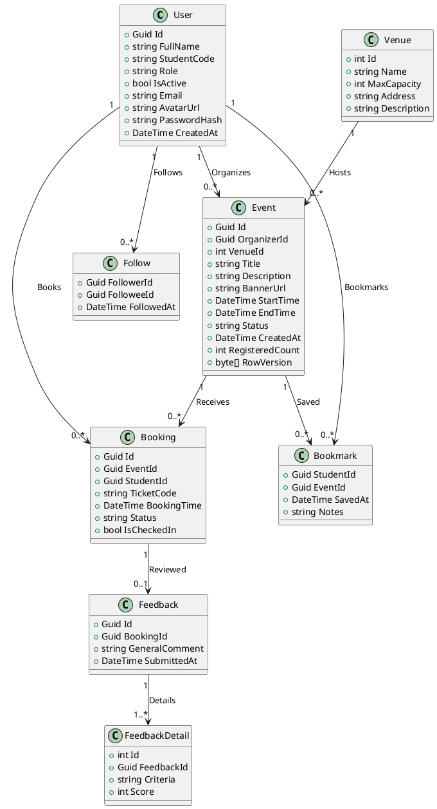
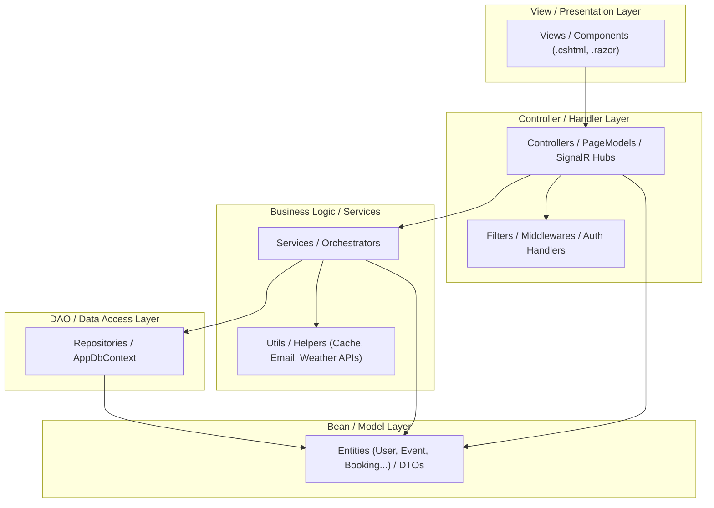

# SYSTEM CONTEXT SNAPSHOT - UNIEVENT HUB PROJECT

> **Instruction for AI Reader:** This document contains the complete structural, behavioral, and architectural snapshot of the **UniEvent Hub** system. Use this data to generate detailed software specifications, design reports, or Microsoft Word documents (.docx) as requested by the user.

---

## 1. PROJECT OVERVIEW & ARCHITECTURE
* **System Name:** UniEvent Hub
* **Platform:** .NET 8 / C# 12
* **Architectural Pattern:** Clean Architecture (Modular Layers)
* **Identity & Authentication:** Single Sign-On (SSO) sharing a `.EventHub.Auth` cookie across MVC, RazorPages, and Blazor projects using EF Core Data Protection key persistence.
* **Database Engine:** SQL Server LocalDB via Entity Framework Core.

### 1.1. Physical Folder Mapping
```text
EventHub/
│
├── BusinessObjects/             # Shared Domain DTOs
│   └── DTOs/                    # Data Transfer Objects (EventDTO, BookingDTO, etc.)
│
├── DAL/                         # Data Access Layer
│   ├── Data/                    # AppDbContext.cs, DbInitializer.cs
│   ├── Entities/                # C# Entity models (15 core tables)
│   ├── Configurations/          # EF Core Fluent API (Cascade limits, composite keys)
│   └── Repositories/            # Generic & specific repositories (IRepository<T>)
│
├── BLL/                         # Business Logic Layer (Services)
│   ├── Services/                # EventService, BookingService, FollowService, etc.
│   └── DependencyInjection.cs   # Feature-based Service registrations
│
├── RazorPages/                  # Student & Organizer portal (Explore, Event CRUD)
├── MVC/                         # Identity, Admin Portal, SSO Controller
└── Blazor/                      # Live interactivity (Ticket Booking, Dashboard)
```

---

## 2. COMPLETED MODULE STATUS & BUSINESS LOGIC
1. **SSO Identity (`MVC` & `RazorPages` & `Blazor`)**: Auth cookie validates active status on database. Force logout via `CookieAuthenticationEvents.OnValidatePrincipal` when user account is deactivated.
2. **Explore & Search (`RazorPages`)**: Form-based filtering with LED statuses, seat availability urgency indicators, and AJAX page loading.
3. **Bookmarks (`RazorPages`)**: Async AJAX bookmarking for students.
4. **Weather Forecast (`RazorPages`)**: wttr.in weather API integrated with MemoryCache + SemaphoreSlim double-checked locking protection. Parses address location dynamically.
5. **Event CRUD (`RazorPages`)**: Complete event management with DTO validation (`StartTime < EndTime`). Eager loading configured in Repository.
6. **Live Ticket Booking (`Blazor Server`)**: Glassmorphism UI, real-time ticket reservations with SignalR, concurrent transaction protection using SQL Serializable transaction levels.
7. **Live Dashboard (`Blazor Server`)**: Live activity feed, SVG Area Trend charts and SignalR real-time seats progress bars.
8. **Feedback Analytics (`Blazor Server`)**: PLINQ `.AsParallel()` analytics on memory, grouping multiple feedback criteria with details modal.
9. **Event Requests (`RazorPages`)**: Ideation submission workflow for students with Admin approval/rejection panel.
10. **Follows System (`RazorPages`)**: Allows students to follow organizers with dynamic follower counts.
11. **Background Email Worker (`BLL`)**: BackgroundService delivering email reminders to students 1 day before event starts. Handles multi-instance locking via DB transaction state checks.

---

## 3. COMPLETE DATA DICTIONARY (15 TABLES)

### 3.1. `Users`
* **Id** (`uniqueidentifier`, PK, Default: `NEWID()`): Unique user identifier.
* **FullName** (`nvarchar(max)`, Null: No): Full name of the user.
* **StudentCode** (`nvarchar(max)`, Null: Yes): Student ID code (Student role only).
* **Role** (`nvarchar(max)`, Null: No): User role (`Admin`, `Organizer`, `Student`).
* **IsActive** (`bit`, Null: No, Default: `1`): User account status.
* **Email** (`nvarchar(max)`, Null: No): Login email address.
* **AvatarUrl** (`nvarchar(max)`, Null: Yes): Link to profile picture.
* **PasswordHash** (`nvarchar(max)`, Null: No): Hashed password.
* **CreatedAt** (`datetime2`, Null: No): Account creation timestamp.

### 3.2. `Venues`
* **Id** (`int`, PK, Identity): Unique venue ID.
* **Name** (`nvarchar(max)`, Null: No): Name of the venue.
* **MaxCapacity** (`int`, Null: No, Constraint: `> 0`): Maximum seating capacity.
* **Address** (`nvarchar(max)`, Null: No): Full location address.
* **Description** (`nvarchar(max)`, Null: Yes): Venue details.

### 3.3. `Events`
* **Id** (`uniqueidentifier`, PK): Unique event ID.
* **OrganizerId** (`uniqueidentifier`, FK -> `Users(Id)`, Delete: Restrict): Organizer user ID.
* **VenueId** (`int`, FK -> `Venues(Id)`, Delete: Restrict): Venue location ID.
* **Title** (`nvarchar(max)`, Null: No): Event title.
* **Description** (`nvarchar(max)`, Null: No): Description content.
* **BannerUrl** (`nvarchar(max)`, Null: No): Image link.
* **StartTime** (`datetime2`, Null: No): Event start time.
* **EndTime** (`datetime2`, Null: No): Event end time.
* **Status** (`nvarchar(max)`, Null: No, Default: `Draft`): Status (`Draft`, `Pending`, `Approved`, `Rejected`).
* **CreatedAt** (`datetime2`, Null: No): Creation date.
* **RegisteredCount** (`int`, Null: No, Default: `0`): Tickets claimed.
* **RowVersion** (`timestamp`, Null: No): Optimistic concurrency token.

### 3.4. `Categories`
* **Id** (`int`, PK, Identity): Category ID.
* **Name** (`nvarchar(max)`, Null: No): Name of the category.
* **Description** (`nvarchar(max)`, Null: Yes): Detailed explanation.

### 3.5. `EventCategories` (Many-to-Many Bridge)
* **EventId** (`uniqueidentifier`, PK, FK -> `Events(Id)`, Delete: Cascade).
* **CategoryId** (`int`, PK, FK -> `Categories(Id)`, Delete: Restrict).

### 3.6. `Tags`
* **Id** (`int`, PK, Identity): Tag ID.
* **Name** (`nvarchar(max)`, Null: No): Tag name.
* **Description** (`nvarchar(max)`, Null: Yes): Tag description.

### 3.7. `EventTags` (Many-to-Many Bridge)
* **EventId** (`uniqueidentifier`, PK, FK -> `Events(Id)`, Delete: Cascade).
* **TagId** (`int`, PK, FK -> `Tags(Id)`, Delete: Restrict).

### 3.8. `EventRequests` (Ideation Management)
* **Id** (`int`, PK, Identity): Proposal ID.
* **StudentId** (`uniqueidentifier`, FK -> `Users(Id)`, Delete: Restrict).
* **Topic** (`nvarchar(max)`, Null: No): Main topic.
* **Description** (`nvarchar(max)`, Null: No): Details.
* **Status** (`nvarchar(max)`, Null: No, Default: `Pending`): State (`Pending`, `Approved`, `Rejected`).
* **SubmittedAt** (`datetime2`, Null: No): Date of submission.
* **ResponseMessage** (`nvarchar(max)`, Null: Yes): Approval/rejection notes.

### 3.9. `Bookmarks`
* **StudentId** (`uniqueidentifier`, PK, FK -> `Users(Id)`, Delete: Restrict).
* **EventId** (`uniqueidentifier`, PK, FK -> `Events(Id)`, Delete: Cascade).
* **SavedAt** (`datetime2`, Null: No): Time bookmarked.
* **Notes** (`nvarchar(max)`, Null: Yes): Student notes.

### 3.10. `Bookings`
* **Id** (`uniqueidentifier`, PK): Unique booking ID.
* **EventId** (`uniqueidentifier`, FK -> `Events(Id)`, Delete: Restrict).
* **StudentId** (`uniqueidentifier`, FK -> `Users(Id)`, Delete: Restrict).
* **TicketCode** (`nvarchar(max)`, Null: No, Constraint: Unique Index): QR code representation.
* **BookingTime** (`datetime2`, Null: No): Reservation timestamp.
* **Status** (`nvarchar(max)`, Null: No): Reservation state.
* **IsCheckedIn** (`bit`, Null: No, Default: `0`): Event attendance status.

### 3.11. `EventComments` (Live Q&A)
* **Id** (`uniqueidentifier`, PK): Comment ID.
* **EventId** (`uniqueidentifier`, FK -> `Events(Id)`, Delete: Cascade).
* **UserId** (`uniqueidentifier`, FK -> `Users(Id)`, Delete: Restrict).
* **ParentCommentId** (`uniqueidentifier`, FK -> `EventComments(Id)`, Delete: Restrict): Self-referential join.
* **Content** (`nvarchar(max)`, Null: No): Body content.
* **CreatedAt** (`datetime2`, Null: No): Creation date.

### 3.12. `EventReminders`
* **EventId** (`uniqueidentifier`, PK, FK -> `Events(Id)`, Delete: Cascade).
* **ScheduledTime** (`datetime2`, Null: No): Notification date.
* **IsEmailSent** (`bit`, Null: No, Default: `0`): Status flag.
* **SentAt** (`datetime2`, Null: Yes): Dispatch date.

### 3.13. `Follows`
* **FollowerId** (`uniqueidentifier`, PK, FK -> `Users(Id)`, Delete: Restrict).
* **FolloweeId** (`uniqueidentifier`, PK, FK -> `Users(Id)`, Delete: Restrict).
* **FollowedAt** (`datetime2`, Null: No): Date followed.

### 3.14. `Feedbacks`
* **Id** (`uniqueidentifier`, PK): Feedback ticket ID.
* **BookingId** (`uniqueidentifier`, FK -> `Bookings(Id)`, Delete: Restrict, Constraint: Unique 1-1 relationship).
* **GeneralComment** (`nvarchar(max)`, Null: Yes): Text reviews.
* **SubmittedAt** (`datetime2`, Null: No): Review date.

### 3.15. `FeedbackDetails`
* **Id** (`int`, PK, Identity): Detail row ID.
* **FeedbackId** (`uniqueidentifier`, FK -> `Feedbacks(Id)`, Delete: Cascade).
* **Criteria** (`nvarchar(max)`, Null: No): Rated item (Sound, Quality, content, etc.).
* **Score** (`int`, Null: No, Constraint: `1-5`): Rating score.

---

## 4. ARCHITECTURAL PACKAGE MAPPING (BEAN, VIEW, CONTROLLER, DAO, FILTER, UTIL)

* **Bean (Domain & Entities):** Models in `DAL/Entities/` and transfer objects in `BusinessObjects/DTOs/`.
* **DAO (Data Access Object):** Repository implementation in `DAL/Repositories/` and `AppDbContext.cs`.
* **Controller (Execution layer):** PageModels in `RazorPages/Pages/`, MVC `Controllers/`, and Blazor SignalR Hubs (`EventHub.cs`).
* **View (Presentation):** UI files `.cshtml` (MVC/RazorPages) and `.razor` (Blazor Components).
* **Filter (Cross-Cutting Concerns):** ASP.NET Authorization handlers, Middleware exceptions, SSO principal validation checks.
* **Util (Common Utilities):** External clients like `WeatherService`, background execution threads (`EmailReminderService`).

---

## 5. UML DIAGRAMS CODE (PLANTUML / MERMAID)

### 5.1. Class Diagram (PlantUML)


### 5.2. Package Layering (Mermaid)

