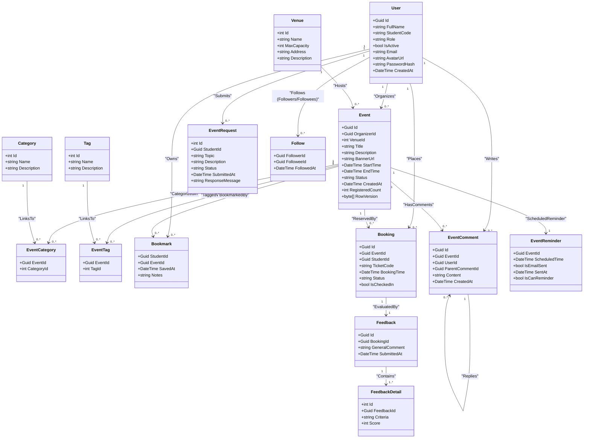
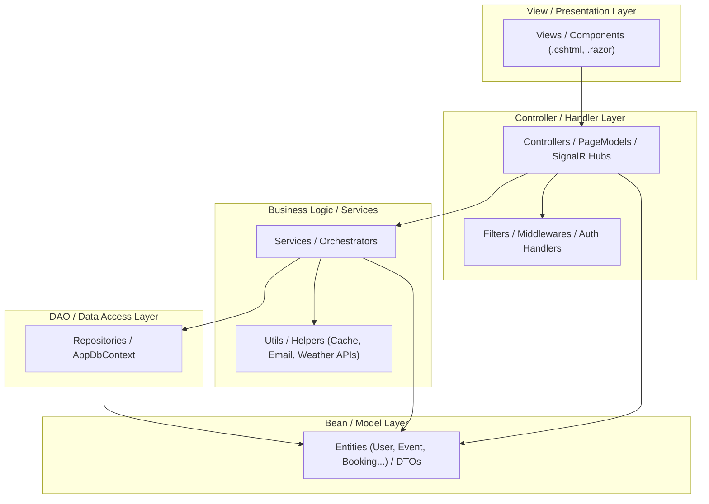

# ĐẶC TẢ THIẾT KẾ CẤU TRÚC VÀ DỮ LIỆU - UNIEVENT HUB

Tài liệu này đặc tả chi tiết cấu trúc dữ liệu và thiết kế kiến trúc phân tầng cho hệ thống UniEvent Hub.

* **Tác giả:** QuiNC
* **Trạng thái:** A

---

## 1. DATA DICTIONARY (CHI TIẾT 15 BẢNG DỮ LIỆU)

### 1.1. Bảng `Users` (Người dùng)
Lưu trữ thông tin tài khoản của các vai trò trong hệ thống (Admin, Organizer, Student).

| Tên Cột | Kiểu Dữ Liệu | PK/FK | Nullable | Ràng buộc / Giá trị mặc định | Mô tả |
| :--- | :--- | :---: | :---: | :--- | :--- |
| `Id` | `uniqueidentifier` | PK | No | `NEWID()` | Định danh duy nhất của người dùng |
| `FullName` | `nvarchar(max)` | - | No | - | Họ và tên đầy đủ |
| `StudentCode`| `nvarchar(max)` | - | Yes | - | Mã số sinh viên (chỉ dành cho Student) |
| `Role` | `nvarchar(max)` | - | No | - | Vai trò (`Admin`, `Organizer`, `Student`) |
| `IsActive` | `bit` | - | No | `1` (True) | Trạng thái hoạt động của tài khoản |
| `Email` | `nvarchar(max)` | - | No | - | Email đăng nhập |
| `AvatarUrl` | `nvarchar(max)` | - | Yes | - | Đường dẫn ảnh đại diện |
| `PasswordHash`| `nvarchar(max)` | - | No | - | Mật khẩu đã mã hóa hash |
| `CreatedAt` | `datetime2` | - | No | - | Thời điểm tạo tài khoản |

### 1.2. Bảng `Venues` (Địa điểm)
Lưu trữ thông tin các hội trường, phòng ban tổ chức sự kiện.

| Tên Cột | Kiểu Dữ Liệu | PK/FK | Nullable | Ràng buộc / Giá trị mặc định | Mô tả |
| :--- | :--- | :---: | :---: | :--- | :--- |
| `Id` | `int` | PK | No | Identity(1,1) | Định danh tự tăng của địa điểm |
| `Name` | `nvarchar(max)` | - | No | - | Tên địa điểm |
| `MaxCapacity`| `int` | - | No | `> 0` | Sức chứa tối đa của địa điểm |
| `Address` | `nvarchar(max)` | - | No | - | Địa chỉ chi tiết (kèm Campus Name ở cuối) |
| `Description`| `nvarchar(max)` | - | Yes | - | Mô tả thông tin địa điểm |

### 1.3. Bảng `Events` (Sự kiện)
Lưu trữ thông tin chi tiết các sự kiện được tổ chức.

| Tên Cột | Kiểu Dữ Liệu | PK/FK | Nullable | Ràng buộc / Giá trị mặc định | Mô tả |
| :--- | :--- | :---: | :---: | :--- | :--- |
| `Id` | `uniqueidentifier` | PK | No | `NEWID()` | Định danh duy nhất của sự kiện |
| `OrganizerId`| `uniqueidentifier` | FK | No | Liên kết `Users(Id)` (Restrict) | Khóa ngoại trỏ tới người tổ chức |
| `VenueId` | `int` | FK | No | Liên kết `Venues(Id)` (Restrict) | Khóa ngoại trỏ tới địa điểm |
| `Title` | `nvarchar(max)` | - | No | - | Tiêu đề sự kiện |
| `Description`| `nvarchar(max)` | - | No | - | Nội dung mô tả sự kiện |
| `BannerUrl` | `nvarchar(max)` | - | No | - | Đường dẫn hình ảnh banner sự kiện |
| `StartTime` | `datetime2` | - | No | - | Thời gian bắt đầu sự kiện |
| `EndTime` | `datetime2` | - | No | - | Thời gian kết thúc sự kiện |
| `Status` | `nvarchar(max)` | - | No | `Draft` | Trạng thái (`Draft`, `Pending`, `Approved`, `Rejected`) |
| `CreatedAt` | `datetime2` | - | No | - | Thời điểm tạo sự kiện |
| `RegisteredCount`| `int` | - | No | `0` | Số lượng vé đã được đặt |
| `RowVersion` | `timestamp` | - | No | - | Concurrency Token để chống tranh chấp đặt vé |

### 1.4. Bảng `Categories` (Danh mục)
Lưu trữ thông tin phân loại sự kiện.

| Tên Cột | Kiểu Dữ Liệu | PK/FK | Nullable | Ràng buộc / Giá trị mặc định | Mô tả |
| :--- | :--- | :---: | :---: | :--- | :--- |
| `Id` | `int` | PK | No | Identity(1,1) | Định danh tự tăng của danh mục |
| `Name` | `nvarchar(max)` | - | No | - | Tên danh mục sự kiện |
| `Description`| `nvarchar(max)` | - | Yes | - | Mô tả chi tiết danh mục |

### 1.5. Bảng `EventCategories` (Danh mục Sự kiện)
Bảng trung gian thiết lập quan hệ Many-to-Many giữa `Events` và `Categories`.

| Tên Cột | Kiểu Dữ Liệu | PK/FK | Nullable | Ràng buộc / Giá trị mặc định | Mô tả |
| :--- | :--- | :---: | :---: | :--- | :--- |
| `EventId` | `uniqueidentifier` | PK, FK | No | Liên kết `Events(Id)` (Cascade) | Khóa ngoại trỏ tới sự kiện |
| `CategoryId` | `int` | PK, FK | No | Liên kết `Categories(Id)` (Restrict) | Khóa ngoại trỏ tới danh mục |

### 1.6. Bảng `Tags` (Nhãn dán)
Lưu trữ thông tin các thẻ hashtag gắn liền với sự kiện.

| Tên Cột | Kiểu Dữ Liệu | PK/FK | Nullable | Ràng buộc / Giá trị mặc định | Mô tả |
| :--- | :--- | :---: | :---: | :--- | :--- |
| `Id` | `int` | PK | No | Identity(1,1) | Định danh tự tăng của nhãn dán |
| `Name` | `nvarchar(max)` | - | No | - | Tên nhãn dán |
| `Description`| `nvarchar(max)` | - | Yes | - | Mô tả chi tiết nhãn dán |

### 1.7. Bảng `EventTags` (Nhãn dán Sự kiện)
Bảng trung gian thiết lập quan hệ Many-to-Many giữa `Events` và `Tags`.

| Tên Cột | Kiểu Dữ Liệu | PK/FK | Nullable | Ràng buộc / Giá trị mặc định | Mô tả |
| :--- | :--- | :---: | :---: | :--- | :--- |
| `EventId` | `uniqueidentifier` | PK, FK | No | Liên kết `Events(Id)` (Cascade) | Khóa ngoại trỏ tới sự kiện |
| `TagId` | `int` | PK, FK | No | Liên kết `Tags(Id)` (Restrict) | Khóa ngoại trỏ tới nhãn dán |

### 1.8. Bảng `EventRequests` (Đề xuất ý tưởng sự kiện)
Lưu trữ các đề xuất ý tưởng sự kiện do sinh viên gửi lên.

| Tên Cột | Kiểu Dữ Liệu | PK/FK | Nullable | Ràng buộc / Giá trị mặc định | Mô tả |
| :--- | :--- | :---: | :---: | :--- | :--- |
| `Id` | `int` | PK | No | Identity(1,1) | Định danh tự tăng của đề xuất |
| `StudentId` | `uniqueidentifier` | FK | No | Liên kết `Users(Id)` (Restrict) | Sinh viên gửi đề xuất |
| `Topic` | `nvarchar(max)` | - | No | - | Chủ đề ý tưởng |
| `Description`| `nvarchar(max)` | - | No | - | Chi tiết nội dung ý tưởng |
| `Status` | `nvarchar(max)` | - | No | `Pending` | Trạng thái duyệt (`Pending`, `Approved`, `Rejected`) |
| `SubmittedAt`| `datetime2` | - | No | - | Thời gian gửi đề xuất |
| `ResponseMessage`| `nvarchar(max)` | - | Yes | - | Phản hồi từ người duyệt (Admin/Organizer) |

### 1.9. Bảng `Bookmarks` (Sự kiện lưu trữ)
Lưu trữ danh sách các sự kiện sinh viên đánh dấu để theo dõi.

| Tên Cột | Kiểu Dữ Liệu | PK/FK | Nullable | Ràng buộc / Giá trị mặc định | Mô tả |
| :--- | :--- | :---: | :---: | :--- | :--- |
| `StudentId` | `uniqueidentifier` | PK, FK | No | Liên kết `Users(Id)` (Restrict) | Khóa ngoại trỏ tới sinh viên |
| `EventId` | `uniqueidentifier` | PK, FK | No | Liên kết `Events(Id)` (Cascade) | Khóa ngoại trỏ tới sự kiện |
| `SavedAt` | `datetime2` | - | No | - | Thời điểm đánh dấu bookmark |
| `Notes` | `nvarchar(max)` | - | Yes | - | Ghi chú cá nhân của sinh viên |

### 1.10. Bảng `Bookings` (Đặt vé sự kiện)
Lưu trữ các giao dịch đăng ký/đặt vé tham gia sự kiện.

| Tên Cột | Kiểu Dữ Liệu | PK/FK | Nullable | Ràng buộc / Giá trị mặc định | Mô tả |
| :--- | :--- | :---: | :---: | :--- | :--- |
| `Id` | `uniqueidentifier` | PK | No | `NEWID()` | Định danh duy nhất lượt đặt vé |
| `EventId` | `uniqueidentifier` | FK | No | Liên kết `Events(Id)` (Restrict) | Khóa ngoại sự kiện |
| `StudentId` | `uniqueidentifier` | FK | No | Liên kết `Users(Id)` (Restrict) | Khóa ngoại sinh viên |
| `TicketCode` | `nvarchar(max)` | - | No | Unique | Mã vé quét QR Code |
| `BookingTime`| `datetime2` | - | No | - | Thời điểm đặt vé thành công |
| `Status` | `nvarchar(max)` | - | No | - | Trạng thái (`Confirmed`, `Cancelled`) |
| `IsCheckedIn`| `bit` | - | No | `0` (False) | Xác thực đã tham gia sự kiện (Check-in) |

### 1.11. Bảng `EventComments` (Bình luận sự kiện)
Lưu trữ bình luận và luồng trao đổi hỏi đáp (Q&A) trong sự kiện.

| Tên Cột | Kiểu Dữ Liệu | PK/FK | Nullable | Ràng buộc / Giá trị mặc định | Mô tả |
| :--- | :--- | :---: | :---: | :--- | :--- |
| `Id` | `uniqueidentifier` | PK | No | `NEWID()` | Định danh bình luận |
| `EventId` | `uniqueidentifier` | FK | No | Liên kết `Events(Id)` (Cascade) | Khóa ngoại sự kiện |
| `UserId` | `uniqueidentifier` | FK | No | Liên kết `Users(Id)` (Restrict) | Người bình luận |
| `ParentCommentId`| `uniqueidentifier`| FK | Yes | Liên kết `EventComments(Id)` (Restrict)| Bình luận cha (cho phép lồng nhau) |
| `Content` | `nvarchar(max)` | - | No | - | Nội dung bình luận |
| `CreatedAt` | `datetime2` | - | No | - | Thời điểm tạo bình luận |

### 1.12. Bảng `EventReminders` (Nhắc nhở sự kiện)
Quản lý trạng thái lập lịch gửi email nhắc nhở trước sự kiện.

| Tên Cột | Kiểu Dữ Liệu | PK/FK | Nullable | Ràng buộc / Giá trị mặc định | Mô tả |
| :--- | :--- | :---: | :---: | :--- | :--- |
| `EventId` | `uniqueidentifier` | PK, FK | No | Liên kết `Events(Id)` (Cascade) | Khóa ngoại sự kiện (Quan hệ 1-1) |
| `ScheduledTime`| `datetime2` | - | No | - | Thời gian lập lịch gửi email nhắc nhở |
| `IsEmailSent`| `bit` | - | No | `0` (False) | Trạng thái đã gửi email thành công |
| `SentAt` | `datetime2` | - | Yes | - | Thời gian thực tế gửi email đi |

### 1.13. Bảng `Follows` (Theo dõi ban tổ chức)
Lưu trữ thông tin sinh viên theo dõi ban tổ chức sự kiện.

| Tên Cột | Kiểu Dữ Liệu | PK/FK | Nullable | Ràng buộc / Giá trị mặc định | Mô tả |
| :--- | :--- | :---: | :---: | :--- | :--- |
| `FollowerId` | `uniqueidentifier` | PK, FK | No | Liên kết `Users(Id)` (Restrict) | ID của Student theo dõi |
| `FolloweeId` | `uniqueidentifier` | PK, FK | No | Liên kết `Users(Id)` (Restrict) | ID của Organizer được theo dõi |
| `FollowedAt` | `datetime2` | - | No | - | Thời điểm nhấn theo dõi |

### 1.14. Bảng `Feedbacks` (Đánh giá sự kiện)
Lưu trữ phần đánh giá tổng quan sau khi sinh viên tham gia sự kiện.

| Tên Cột | Kiểu Dữ Liệu | PK/FK | Nullable | Ràng buộc / Giá trị mặc định | Mô tả |
| :--- | :--- | :---: | :---: | :--- | :--- |
| `Id` | `uniqueidentifier` | PK | No | `NEWID()` | Định danh phiếu khảo sát feedback |
| `BookingId` | `uniqueidentifier` | FK | No | Liên kết `Bookings(Id)` (Restrict) | Khóa ngoại liên kết 1-1 với Vé đặt |
| `GeneralComment`| `nvarchar(max)`| - | Yes | - | Ý kiến đóng góp chung |
| `SubmittedAt`| `datetime2` | - | No | - | Thời điểm nộp feedback |

### 1.15. Bảng `FeedbackDetails` (Chi tiết đánh giá)
Lưu trữ điểm số đánh giá theo từng tiêu chí cụ thể của sự kiện.

| Tên Cột | Kiểu Dữ Liệu | PK/FK | Nullable | Ràng buộc / Giá trị mặc định | Mô tả |
| :--- | :--- | :---: | :---: | :--- | :--- |
| `Id` | `int` | PK | No | Identity(1,1) | Định danh tự tăng của dòng chi tiết |
| `FeedbackId` | `uniqueidentifier` | FK | No | Liên kết `Feedbacks(Id)` (Cascade) | Khóa ngoại liên kết phiếu khảo sát |
| `Criteria` | `nvarchar(max)` | - | No | - | Tiêu chí đánh giá (Âm thanh, Nội dung...) |
| `Score` | `int` | - | No | `1-5` | Điểm số đánh giá từ 1 đến 5 |

---

## 2. CLASS DIAGRAM (SƠ ĐỒ LỚP CHI TIẾT TẦNG DAL)

Sơ đồ thể hiện cấu trúc lớp thực thể Entity và quan hệ khóa ngoại tương quan trong Cơ sở dữ liệu:

---

## 3. PACKAGE DIAGRAM (PHÂN TẦNG KIẾN TRÚC MẪU)

Ánh xạ kiến trúc Clean Architecture thực tế của Solution `.NET 8` sang các tầng phân gói logic chuẩn (**Bean, View, Controller, DAO, Filter, Util**):

### 3.1. Mô tả chi tiết Ánh xạ Gói (Package Mapping)

1. **Bean (Domain Models / Entities / DTOs):**
   * *Thành phần thực tế:* Toàn bộ các Class nằm trong dự án `DAL/Entities/` (ví dụ: `Event.cs`, `User.cs`, `Booking.cs`) và các đối tượng DTO trong `BusinessObjects/DTOs/`.
   * *Nhiệm vụ:* Định nghĩa cấu trúc dữ liệu thuần túy và làm vật chứa dữ liệu truyền tải giữa các tầng.

2. **DAO (Data Access Object / Repository Layer):**
   * *Thành phần thực tế:* `DAL/Repositories/` (ví dụ: `EventRepository.cs`, `BookmarkRepository.cs`) kế thừa qua `IRepository<T>` và `AppDbContext.cs`.
   * *Nhiệm vụ:* Trực tiếp truy vấn dữ liệu từ cơ sở dữ liệu qua EF Core.

3. **Controller (Controller / Execution PageModel Layer):**
   * *Thành phần thực tế:* `RazorPages/Pages/**/*.cshtml.cs` (PageModels), `MVC/Controllers/`, và Blazor `Hubs/` (ví dụ: `EventHub.cs`).
   * *Nhiệm vụ:* Tiếp nhận request từ client, điều phối dịch vụ tầng BLL và quyết định trả về View tương ứng.

4. **View (Presentation Layer):**
   * *Thành phần thực tế:* `RazorPages/Pages/**/*.cshtml`, `MVC/Views/`, và Blazor `Components/` (.razor).
   * *Nhiệm vụ:* Hiển thị thông tin trực quan cho người dùng cuối và gửi tương tác về Controller.

5. **Filter (Interceptors & Middleware):**
   * *Thành phần thực tế:* Custom Action Filters, ASP.NET Middlewares, Authorization Handlers.
   * *Nhiệm vụ:* Xử lý cắt ngang (Cross-cutting Concerns) như Authentication/Authorization kiểm tra token, Force Logout người dùng bị khóa (`OnValidatePrincipal`), và kiểm soát ngoại lệ tập trung.

6. **Util (Utilities & Helper Services):**
   * *Thành phần thực tế:* `WeatherService.cs` (WTTR weather client), `EmailReminderService.cs` (Background Email Worker), cache helpers.
   * *Nhiệm vụ:* Cung cấp các hàm bổ trợ dùng chung độc lập, kết nối dịch vụ bên thứ ba.
